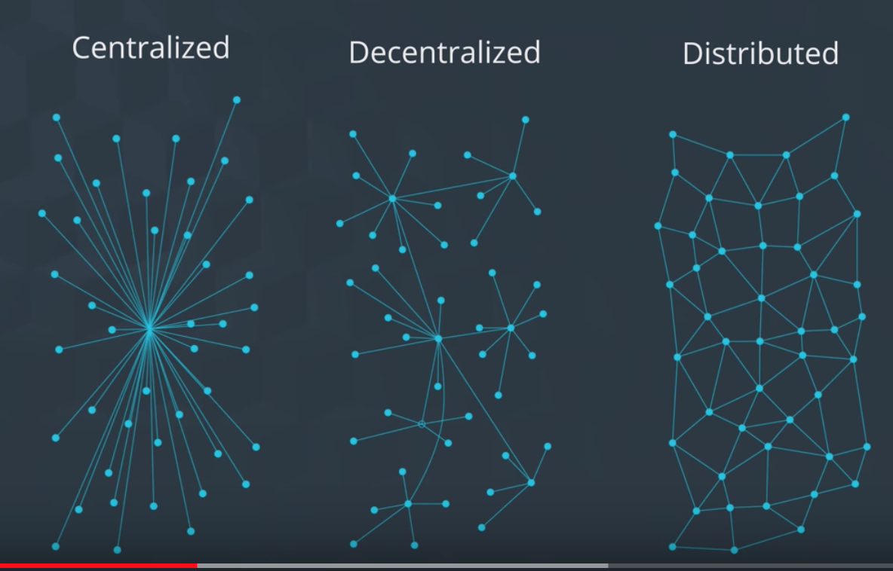
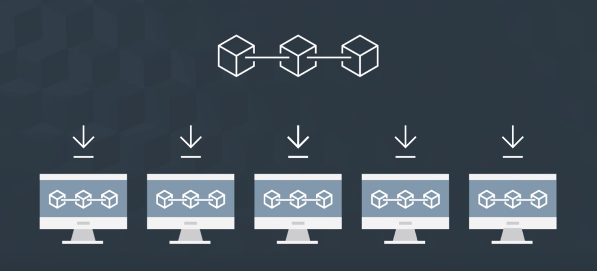

## Distributed 와 P2P 를 나누어 생각하자

> Peer 2 Peer Network: A network of computers that allows information to be shared across users
> - 각 사용자는 *Node* 라고 불리며, 중앙의 권한자 없이도 노드들은 서로 데이터를 주고받을 수 있다.
> - 노드들이 서로 직접적으로 연결하는 것

> Distributed Network: A network that allows information to be spread out across many users

P2P는 *사용자 간에* 개방적인 통신을 말한다면, 분산이란 각 유저가 "통신에 사용되는 *데이터를* 함께 소유한다"는 것을 의미

블록체인이 분산화된 네트워크를 사용하는 것은 그것이 가장 좋아서가 아니라, 블록체인은 의도적으로 분산화된 네트워크를 지향하였기 때문
=> 중앙화된 네트워크의 문제점을 해결하기 위함

> 도서관을 떠올려보자

### Centralized

- 시스템 중앙의 단일 소스가 모든 데이터를 공급하고 관리
- 통제 단위가 단 하나이므로, 아주 효율적이고 흔한 모델

> 단 하나 존재하는 도서관을 떠올려보자.

#### 문제
- 도서관이 파괴되면 모든 책이 날라감 (복구 불가)
- 항상 도서관까지 가야 함 (시간이 걸림)

### Decentralized

- 중앙을 중심으로, 데이터의 복사본을 가진 다른 서버가 더 존재

> 지역 도서관 체인을 생각해보자.

- 한 도서관이 파괴되더라도 다른 도서관을 통하여 복구가 가능
- 사용자 위치에 따라 가까운 곳의 데이터를 이용 가능 (시간 절약)

### Distributed

- 탈중앙화된 시스템을 극한까지 적용한 모델
  - everyone gets a copy of the information with the same *access and control as anyone else*
- 모든 사람이 도서관의 모든 책에 대한 복사본을 다 가지고 있음
- 따라서 정보의 중심이라는 것이 없음. 모두가 공평.

> 개개인이 도서관의 책들을 모두 자신의 책장에 가지고 있는 셈

----

## 블록체인은 분산 네트워크 기반의 시스템이다

즉, 모든 노드들이 모든 정보를 다 가진다 -> 어떻게??
=> 모두가 블록체인에 대한 데이터를 자신의 로컬 노드에 유지한
=> 따라서, 데이터를 따로 관리하거나, 조회해줄 중앙의 누군가가 없어도 됨. *내가 직접 알아볼 수 있으니까!*

따라서, 각 노드 간에 자유롭게 서로 데이터를 주고 받으면서, 데이터를 모두와 함께 동일하게 공유하는 네트워크 시스템!
