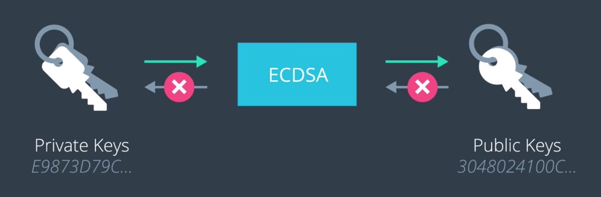
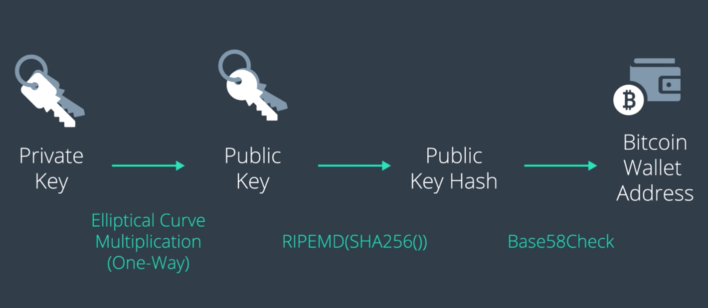

Blockchain Identity는 마치 신분증의 주민등록번호, 운전면허증의 면허번호, 학번 등과 같이
블록체인 상에서 사용자 스스로를 식별시켜주는 수단이다.

## Blockchain Identity의 목표

- 특정 누군가만이 화폐를 소유하고, 사용할 수 있어야 한다 (권한 측면)
- 한편, 우리의 거래가 추적당해선 안 된다 (신원 밝히기 불가능해야)
- 이러한 Identity를 타인과 공유할 수 있어야 한다. 그래야 남들이 우리에게 거래를 맺을 수 있다.

=> 비트코인의 경우, Bitcoin Wallet을 통하여 이를 구현한다.

> ### Wallet Address: A unique identifier for your wallet
> - => 이를 통하여 이 지갑의 소유자를 공개적으로 고유하게 식별할 수 있다
> - => 이를 통하여 사람들은 해당 지갑의 소유자에게 코인을 주고 받을 수 있다.

----

내 지갑의 주소는 일종의 개인정보인데, 이것을 거래 내역에 공개하는 것이 보안상 괜찮을까?
- => 블록체인을 통하여 전세계에 공개된다...
- 이렇게 해도 내가 추적당하지 않을까? => **안 그런다.**

----

그 이유는? **[ 비밀키 -생성-> 공개키 -생성-> 지갑 ]**

> ### Private Key(secret key): A secret number that allows you to spend bitcoin from your wallet
> - => 즉, 이것으로 *유일하게 나만이 비트코인을 지불할 수 있다.*
> - => ~~비밀키는 지갑이 임의로 생성해내는 값. (역연산은 불가)~~
> - => ~~지갑은 하나 이상의 비밀키를 생성해낼 수 있는데, ***유출되면 안 된다!***~~

> ### Public Key: Publicly sharable key that cannot be used to spend bitcoin
> => 공개키로는 송금만 가능
> => 비밀키를 사용하여 생성한다. (역연산은 불가)

- 공개키는 비밀키에 대한 보안 걱정없이 뿌려도 된다. (역연산 불가)
- 비밀키는 공개키와 연결되어서 추적할 수 있어야 한다.
- 사용되는 암호화 알고리즘은 ECDMA
  - *하나의 비밀키로 다수의 공개키를 만들 수 있다는 것이 중요 (추적 불가하도록)*
- 지갑은 이러한 [비밀키:공개키] 조합(1:N)을 사용하여 거래 내역을 추적한다.

(전략: 시시때때로 공개키를 변경해가면서 사람들에게 공개)

-----

하지만... 문제가 있다.
공개키로는 사용자를 추적할 수 없지만, 거래 내역은 여전히 추적할 수 있다.
(여러 내역에 걸쳐서 공개키가 존재할 테므로)

## 지갑 주소의 생성

- => 사용자의 공개 키를 활용하여 생성 [ 비밀키 -> 공개키s -> 지갑 주소s ]
- => 여기서 사용되는 것은 SHA256과 RIPEMD
- => 그마저도 너무 길어서 Base58Check로 더 간소화
- 역연산은 모두 적용 안 된다.

(전략: 지갑 주소를 주기적으로 다시 생성)

*(지갑 주소만 사람들에게 알려주면 이건 어떤 식으로 이용되는걸까...)*
