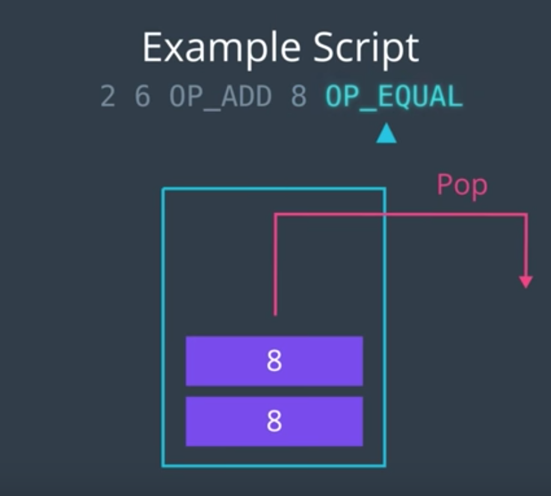
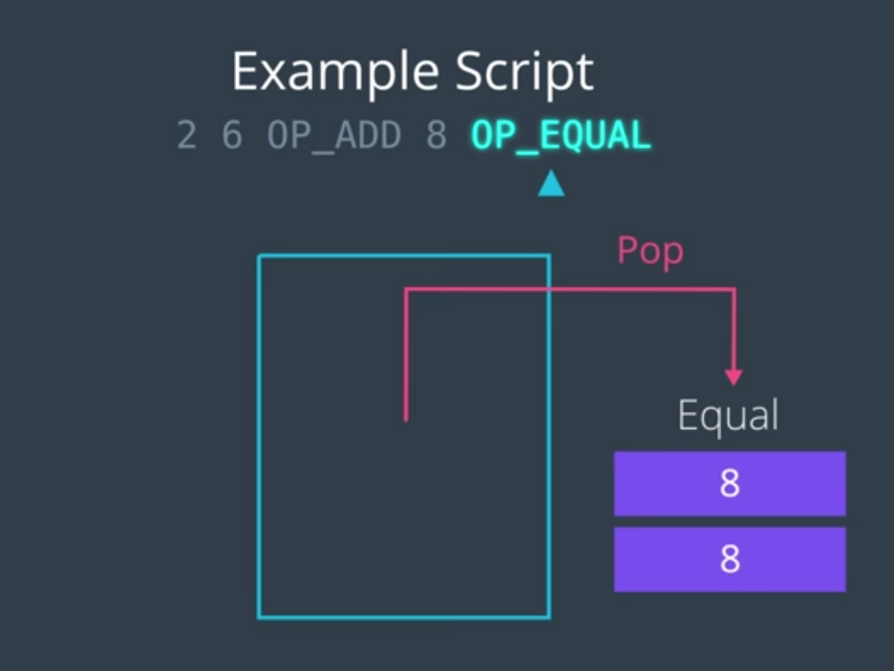
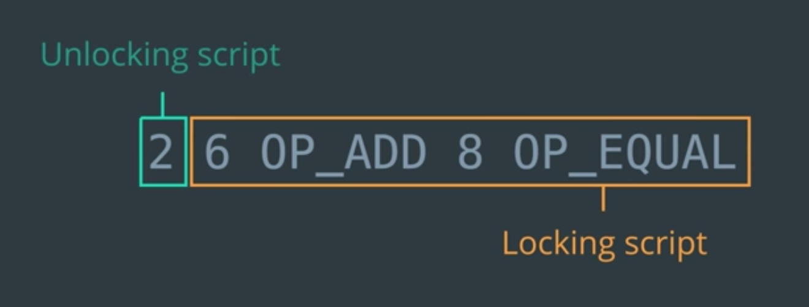

80가지 종류의 Opcode가 존재

----

- Script는 스택 기반의 언어이며, Opcode를 사용하면 스택 상의 데이터들과 상호작용할 수 있다
- 왼쪽 -> 오른쪽 으로 읽는다.

- SML 생각하면 될듯?

- 입력 측의 Unlocking Script에서 제공하는 값에 대하여 Locking Script의 실행 결과가 true이면, 해당 TX는 유효!
- 위의 예시에서는, Unlocking Script를 통하여 `2`를 제공할 수 있는 사람은 누구나 해당 UTXO를 사용할 수 있는 셈.

## 보다 현실적인 예시

----

[Script Opcode list](https://en.bitcoin.it/wiki/Script)
