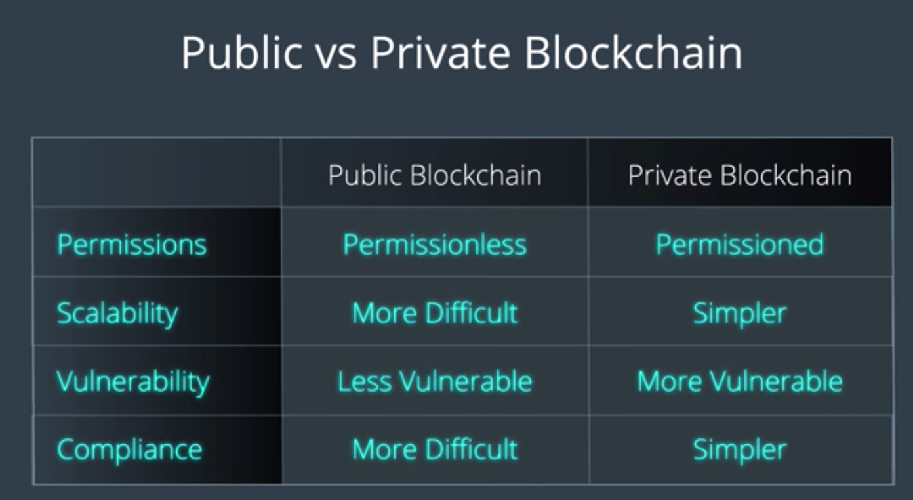

블록체인은 개개인의 식별(Identity), 인터넷 사용자에게 각자의 데이터에 대한 통제권 부여, 집단적 노력 강화에 대한 민주적 해답
그런 맥락에서 Public Blockchain은 누구나 참여할 수 있도록 만드는 권한 없는 디자인으로 인하여 *혁명의 최전선* 에 있다고 말할 수 있다.
  - Bitcoin Testnet은 대표적인 Public blockchain으로, 누구나 아무 권한 없이라도 데이터를 더할 수 있다.
  - 그렇다면... *Private* Blockchain은 무엇일까?

----

## (1) Permissions

### Public Blockchain

- Open and Permissionless
  - 프로토콜을 준수하는 클라이언트와 통신이 있다면, 누구나 제한 없이 데이터를 주고 받을 수 있다
  - 특별한 생태계라는 것을 각자 구축할 필요가 없는 개방적인 환경
  - 이러한 특성에 힘입어 다양한 플랫폼이 파생 - Etherium 등의 2세대 블록체인 플랫폼들

### Private Blockchain

- Closed and Permissioned
  - 특정 접근을 하려면 권한을 요구하며, 중앙화된 통제 아래에서 작동한다.

## (2) Scalability

### Private Blockchain

- 확장성과 의무적인 요구사항(Regulatory Compliance)에 있어서 (Public보다)훨씬 효율적.
- 하지만, 중앙화된 통제의 취약성으로 말미암아, 악의가 있는 참여자에 의하여 데이터셋이 조작될 수 있으므로 네트워크가 취약성을 갖는다는 단점

- 투명성이 낮지만, 즉 일반 대중에게 데이터가 노출되는 것을 제한하고 있지만, 블록체인 자체의 무결성을 유지하기 위하여 *제한된 Private Network* 에 의존한다.

### Public Blockchain

- 반면, Public Blockchain은 말 그대로 Permissionless 이므로, 충분한 컴퓨팅 파워를 확보한 누군가에 의하여 유지된다.
- 또한 모두에게 공개되는 완전한 투명성으로 인하여 블록 내부의 데이터가 모두에게 공개된다.

- Public Blockchain의 가장 큰 단점은 그 확장성과 요구사항 충족에서 드러난다 (Private와 정 반대)
  - 예를 들어 Bitcoin Core의 경우, 블록을 체인에 추가하는 데에 항상 10분이 걸리도록 설계되어있다.
  - 이는 보안과 화폐 공급에 대한 통제를 강화하는 한편, 단위 시간 내 거래량의 확장은 불가능한 설계. (반드시 10분 걸리니까)
  - 또한, 요구사항 충족은 전혀 어려운데, 중앙화된 통제라는 것이 없기 때문. 그래서 새로운 규칙/제안이 등장해도 강제 적용할 방도가 없음.

----

각 플랫폼 별의 특성과 차이를 제대로 이해하려면 역시 각 플랫폼 별 개발 문서를 읽어보는 것이 가장 좋다.
