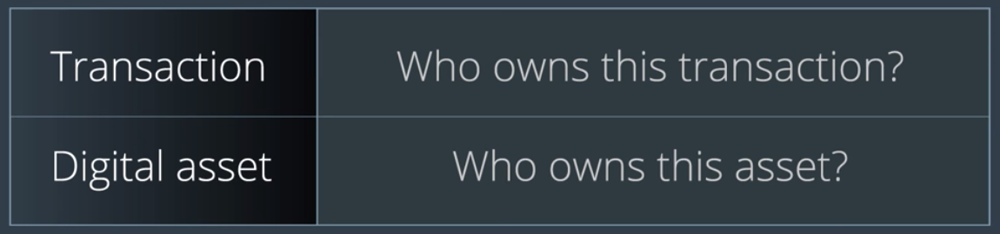

## 이번 절에서 배울 것

- Digital Asset이 무엇인지
- 왜 이것이 중요한지
- 이것이 블록체인과 무슨 관련이 있는지

> 단순 거래 이외의 다른 유형의 데이터도 다룰 수 있는 블록체인 기반 어플리케이션을 만들려면??
> - 음악, 동영상, 각종 문서 등...

----

## Digital Assets

- 다양한 것들을 두고 디지털 자산이라고 부를 수 있다.
- 보통의 경우, *디지털 형태로 보관되는 컨텐츠 또는 개인이 소유한 온라인 계정* 을 가리킨다.
  - Digitally stored content or an online account owned by an individual

----

## 디지털 자산이 중요한 이유는, 서적, 노래, 영상 등을 온라인 상에서 접근할 수 있도록 해주기 때문이다.

- 반드시 물리적으로 우리가 어떤 대상을 소유할 필요가 없어지는 것이다.
- 재미있는 것은, 디지털 자산에는 *계정(Account)* 도 포함된다는 것이다.
  - 은행 계좌, 구독권, 회원권 등

## 디지털 자산이 무엇인지 이해하고, 디지털 자산을 프로그래밍적으로 어떻게 다루는지 제대로 아는 사람은 별로 없다!

- 디지털 자산은 흔함에도 불구하고...

- 디지털 자산을 온라인 상으로 전송하려면, 일반적인 경우 해당 자산(파일)은 압축되거나 전송에 최적화된 형태로 처리한다.
- 압축 알고리즘은 *빠른 전송률* 또는 *작은 용량* 을 달성하기 위하여 필요한 알고리즘들을 말한다.
  - 디지털 자산을 저장, 불러오기, 전송하는 등의 작업을 위하여 사용하게 될 것

## 하지만, 그럼에도 불구하고 블록체인은 *디지털 자산 보관* 에 좋은 공간이 아니다.

- 가능은 하지만, 속도도 느리고 비용이 많이 들 것.

## 블록체인이 잘 할 수 있는 것은, 바로 *디지털 자산에 대한 소유권 관리*!

- 지난 수년간 여러 산업에서 잘 해내지 못했던 분야 - 저작권 관련...
- 디지털 자산 또한 라이센스, 저작권 등의 문제에서 자유로울 수 없기 떄문...
  - 디지털 저작권과 관련하여 절도, 지불, 로열티 등의 문제
- 우리의 Private Blockchain을 사용하여 *디지털 자산의 소유권 관리* 를 해내보자.
