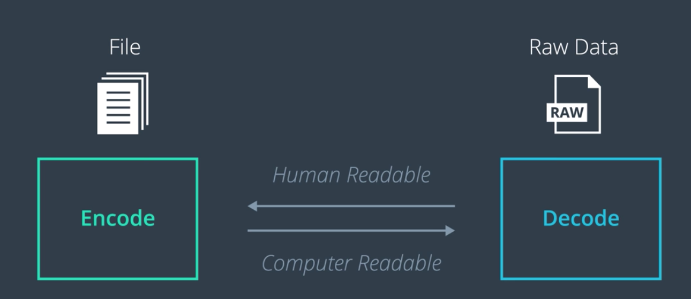
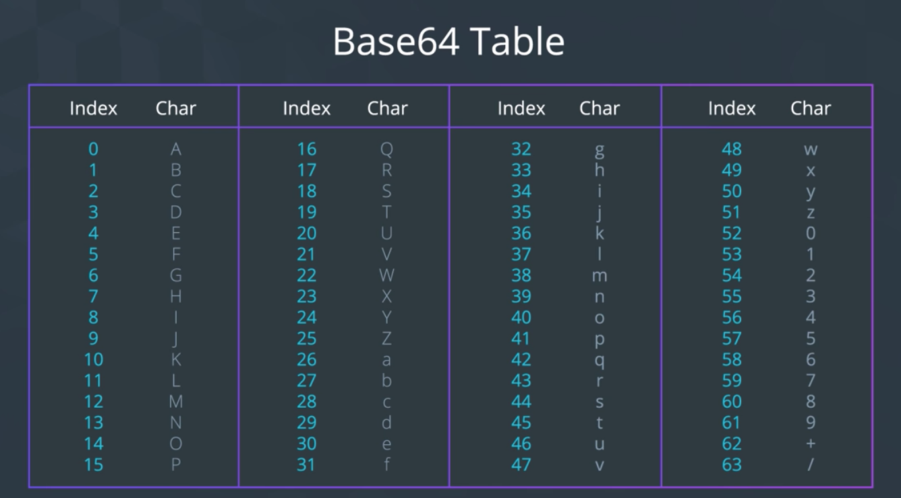

이번 절에서는 디지털 자산에 대한 여러 개념들을 모두 엮어보고, 블록체인에 적용해본다!
사람과 컴퓨터 간에 커뮤니케이션을 용이하게 하기 위하여 디지털 자산이 어떻게 Encode 및 Decode되는지 알아보자.

----

## 보다 본질적인 질문

- 디지털 자산은 어떻게 작동하는가?
  - 좀 더 구체적으로, *컴퓨터는 파일의 내용을 어떻게 이해하는가?*, 그리고 *컴퓨터는 어떻게 그 내용을 인간에게 전달하는가?*
- 이러한 질문을 제대로 이해하고, 이러한 *커뮤니케이션* 이 어떻게 이루어지는지에 대한 해답을 찾으면, 우리는 디지털 자산을 블록체인에 저장할 준비가 된 것이다.

## Encoding과 Decoding은 정보를 *생산하고*, *해석하는* 과정

- 컴퓨터 과학에서는 주로 데이터의 송/수신을 용이하게 하는 목적으로 사용된다.
- 메시지를 *사람이 읽을 수 있는 형태* 와 *컴퓨터가 읽을 수 있는 형테* 사이에서 변환하는 것.
- 우리는 어떤 정보를 *Raw data로 Encode* 하여 *컴퓨터가 이해할 수 있는 형태* 로 정보를 주고 받을 수 있도록 해준다.
- 이후, Encoding된 정보는 *사람이 이해할 수 있는 형태* 로 *Decode* 되어 우리에게 제공된다.

## Encoding

- Process of putting a sequence of characters into a specialized format for efficient transmission or storage
  - 핵심은, *전송 또는 저장에 효율적인 형태*
- Encoding의 목적은 *서로 간에 메시지를 주고 받기 편하도록 만드는 것*
> - 예를 들어, 같은 언어를 사용하는 사람끼리는 의사소통이 그렇지 않은 사람끼리보다 훨씬 용이하다
> - 그런데, 만약 이 경우에 *컴퓨터를 통한 채팅* 을 한다고 치자. 그러면 의사소통의 중간에 컴퓨터가 자리하게 되는 것이다.

- 어떤 Encoding Scheme을 사용하든, 핵심은 *사람이 이해할 수 있는 정보를 컴퓨터가 이해할 수 있는 Raw data의 형태로 변환* 한다는 것.
  - 그러고 나면 다른 컴퓨터 간에 서로 주고받을 수 있는 것.

## Encode와 Encrypt는 엄연히 전혀 다르다

### Encrypt

- 되돌릴 수 없는 방식으로 Secret Key를 만들고, 오직 키의 소유자만이 해당 암호화된 데이터에 접근 가능

### Encode

- 전송 또는 저장이 편리하도록 *형태* 만 바꾸는 것

## Encode는 또한 Compress와도 다르다

### Compress

- 크기를 작게 만드는 것이 핵심
- 반면, Encode를 하면 크기가 커질 수도 있다. 단, 읽기 또는 전송 속도가 더 빨라지는 것이 중요.

## Decoding

- Takes encoded, raw, unreadable files, and converts them back into human readable format.
- Encode에 대한 역연산

----

## Types of encoding and decoding

### ASCII

- American Standard Code for Information Interchange
- 글자를 숫자로 나타낼 수 있다는 간단한 아이디어

### Hexadecimal

- More concise and human readable representation of binary

### Base64

- Encoding Scheme meant to represent data as numbers in a string format
- ASCII와 유사한 것
