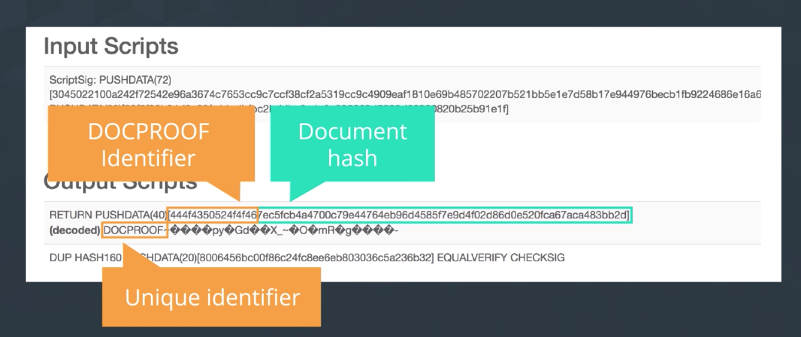

디지털 자산과 인코딩/디코딩에 대하여 배웠다.
디지털 자산이 어떻게 저장되는지 배웠다면,
*저장된 디지털 자산은 어떻게 공증될까?*
  - 즉, *해당 문서가 존재한다는 사실을 증명하고 싶다.* [참고](https://www.proofofexistence.com/)

----

## Verify the integrity of digital assets

- Check the integrity of the digital asset to confirm that it contains the "correct" sequence of bytes and has not been wrongfully accessed or altered.
- 즉, 저장된 데이터가 원본에 비교했을 때 *달라진 것이 없는지* 검사한다! -> Integrity!
  - 이것은 해당 데이터를 신뢰할 수 있는지와는 상관 없다.
- 여기서 사용되는 것이 Proof Of Existence
  - 여러가지 방법이 존재하는데, 여기에서는 SHA256과 MD5에 대하여 알아본다.

----

## Proof Of Existence

- A concept (and a service) that publicly proves and authenticates any digital asset on the blockchain by verifying its hash
  - 해시값을 확인하는 것을 통하여 수행

### 공증의 비교

- 과거의 경우, 어떤 물건 또는 문서를 공증받으려면 *권한을 가진 누군가* 를 찾아가서 검증 또는 서명을 받고, 인증필 도장을 받는다.
  - 이 작업이 끝나고나면, 해당 문서는 *공증되었다* 고 주장할 수 있는 것이다.
- 이와 유사하게, POE는 블록체인 상의 어떤 문서가 존재함(authenticity)를 검사한다.
  - 이때, 블록체인 상에는 해당 문서의 *해시값* 만이 저장되고, 문서는 네트워크 상에 공개되지 않는다
  - 이렇게 하면 문서 내용은 보호받을 수 있으면서도 무결성을 확인할 수 있다.
  - 해당 문서의 해시는 **문서가 전송된 시간** 과 함께 저장된다. 그러면 나중에, 해당 시각에 데이터가 확실히 존재했음을 입증할 수 있다.

----

## POEX.io를 사용해보는 PoE 예시

비트코인 블록체인 기반의 온라인 공증 서비스
- [POEX.io](https://poex.io)
- 이를 통하여 생성된 거래를 보면, Locking Script에 OP_RETURN이 사용되어있다. 즉, 화폐 기능이 아닌 것.

## How POEX validates digital assets

1. Digital asset is hashed via SHA256
2. That hash is appended to an identifier (i.e. 0x444f4...) (시간과 결부된 고유값)
3. The hash + identifier is put into a generated tx.
4. The Tx is marked with OP_RETURN so it's unspendable

----

## Why do we need POE

Before trying to use this for ourselves, here’s a few quick ideas over why you might even want to to do this in the first place.

### Helps you demonstrate data ownership without revealing actual data.

- This is useful for things like copyrighted material or patents.

### Checks for the integrity of your digital asset. Any proof of existence will recognize your document FOREVER.

- Even the slightest difference will be recognized allowing you to be sure your asset hasn’t changed.

### Provides document Time stamping. You can use this to prove certain information existed at a certain time.

- This can be useful in cases where you want to prove who was the original owner of the document.

### Certifies the existence of the document without the need for a central authority.

- Similar to many blockchain concepts this decentralized proof can’t be erased or modified by anyone.

----

## POE Algorithms

There are a different of algorithms to demonstrate Proof of Existence. The two we have chosen to focus on here are SHA256 and MD5.

They both serve the same purpose. They’re a way to hash a digital asset so it can be embedded in a transaction in the blockchain. This allows people to verify that a document existed at a certain point in time.

### SHA256

This is an algorithm we’ve seen already in several different parts of the Bitcoin network. It’s used in mining as part of the proof of work algorithm.

It’s also used to create secured bitcoin addresses.

SHA256 stands for Secure Hash Algorithm. It is a one-way hashing function that takes in any piece of data and produces a unique hash.

This is the algorithm POEX uses to secure their digital documents.

### MD5

Next, the MD5 algorithm is a hash function that takes in a String input and produces a 128-bit hash value. This value is usually shown as a 32-character hexadecimal number that humans can read.

## Goals of POE Algorithms

While each method does things a bit differently, the important thing to remember is their purpose.

They hash digital assets to hide the actual content. Once the hashed data is embedded in a transaction in the blockchain, the existence of that transaction in the blockchain proves that the document existed at the time the transaction got included into a block.
