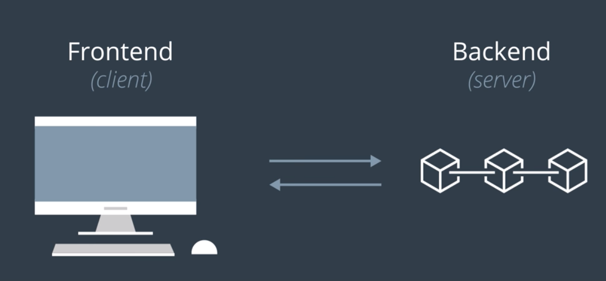

이번 절부터는 Blockchain Data를 제3자 어플리케이션 또는 웹으로 제공하는 법을 다룬다.
이 코스는 Node.js 또는 서버 수업이 아니므로 REST를 구축하는 법을 따로 다루지는 않겠지만, 웹 서비스를 구축하는 법은 아주 중요한 주제이다.

----

## Blockchain as a Database (BaaD)

- 블록체인을 서버에서 자료구조와 같이 사용할 수 있다 (MVC의 Model)
- 그렇지만, 블록체인을 웹과 연동하는게 필수일까?
  - 이번 절에서는, 만약 내 서비스가 블록체인을 내부적으로 사용할 경우, 블록체인을 Web과 연동하는 것이 필요한지에 대한 몇가지 고려할 점을 제시한다.

----

## YES if

- 사용자들이 어플리케이션과 상호작용할 UI가 필요할 때
  - REST를 통한 데이터 CRUD가 필요
- 모든 사용자(브라우저, 앱 등)가 앱 인스턴스와 통신해야 할 때
- 중앙 서버가 없어야 할 때 (DB가 터지는 것을 막아햐 하는 경우)

## NO if (꼭 웹을 통하지 않아도 잘 작동하는 구조)

- 웹 Interface 이외에 다른 방법을 사용해도 되는 경우 i.e. Contract Execution
- 기존의 블록체인 플랫폼과 직접 상호작용하는 모바일 어플리케이션인 경우

----

## 정말로 블록체인이 필요할까요?

### Problem of Value Identification

- Is there a need to share information, credentials or value with others?
- Is trust a critical requirement to the process?
- Do you need to prove to others you are transacting/reporting accurately?
- Is there potential to monetize the data or digital asset in the value chain?
- Who owns the problem? Individual or industry wide challenges?

### Stakeholders buy in

- Is there a network of stakeholders (i.e. more than 2)?
- Is there a dependency on others for information?
- Does more than one participant need to update the data?
- Is there scope to open up the ecosystem to ancillary parties in the future?
- Are you working with other industry players on any activities?

### Technical considerations

- Is there any ongoing need or future requirements for high data throughput?
- Do you rely or use public data sources to make decisions?
- Do you need to store a particularly rich/complex data structure?
- Do you need to digitize assets in your value chain?
- Do you need transaction privacy? Do you need anonymity?
