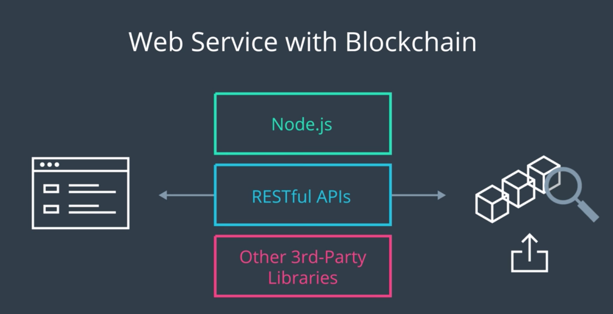

현재 우리의 Blockchain은 Private and isolated 하므로,
이에 대하여 통제를 하려면 Backend 서버가 필요하고, 서로 통신하기 위한 Interface가 필요
- 데이터 입력, 검사, 열람 등

----

## Private Blockchain과 만날 수 있는 Web Service!

### Upcoming plan to build web service with private blockchain

- Configure API web service with GET/POST endpoints
  - Build and deploy local web service with Node.js
  - Configure API endpoints with static mock data for testing
    - GET - Block by ID
    - POST - New Block
- Migrate your private blockchain to your API web service
  - Configure API endpoints to interact with your private blockchain
    - GET - Block by ID
    - POST - New Block
  - Create a method to validate blockchain health
