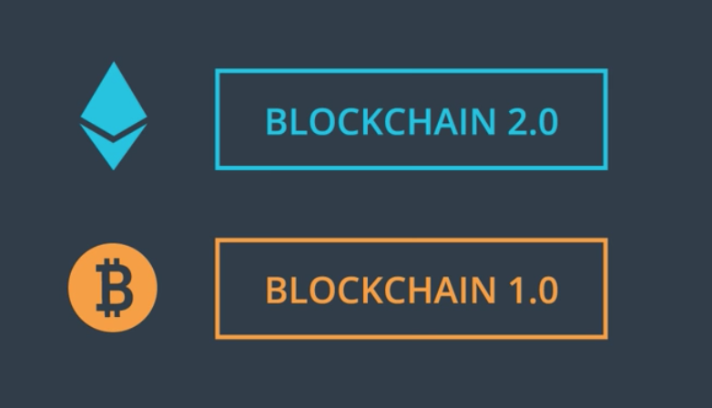
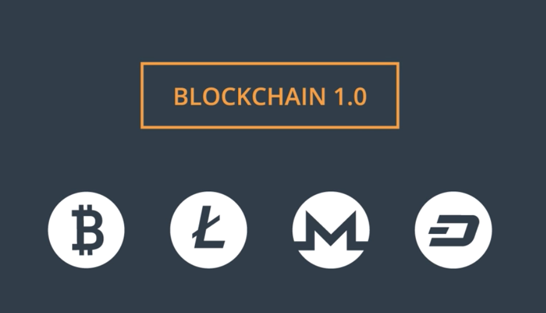
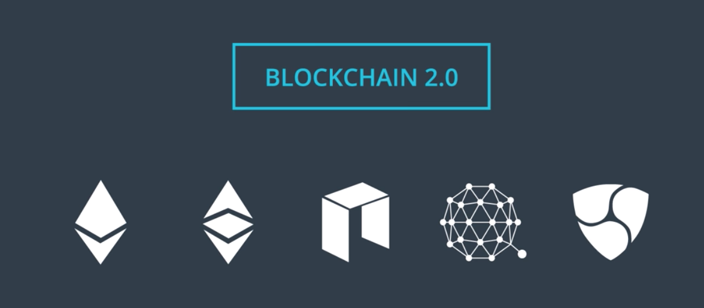
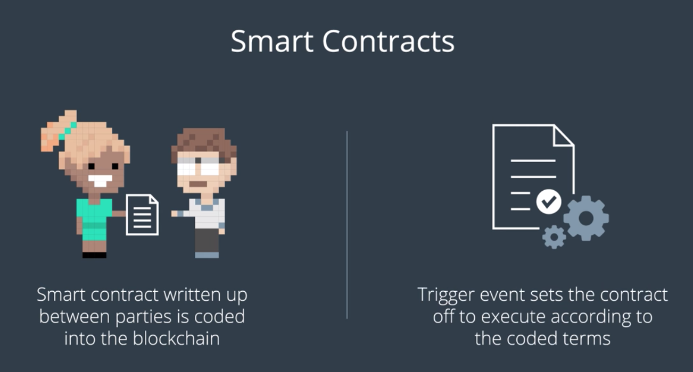

이제까지는 Blockchain Fundamental을 배웠고,
다음 장부터는 이번 장에서 배운 기반 지식을 Ethereum 을 이해하는 데에 쏟아부울 것.

## 왜 Bitcoin Blockchain을 배운 것일까? (역 사)

- 비트코인은 종종 1세대 블록체인으로 불린다
- *Smart Contract* 라는 개념이 2세대 블록체인에서 등장하기 시작
  - 이더리움이 소개
  - 이것을 통하여 디지털 자산을 다루는 다양한 기회들이 생겨나기 시작
- 이번 장에서는 *디지털 자산 관리* 가 두 플랫폼 간에 어떻게 다르게 양상을 보이는지 고수준에서 알아본다

----

## 1세대 블록체인 - Bitcoin, Litecoin, Monero 등

- 가치의 이동, 장부 유지 및 기록, 이상적인 지불 시스템 등에 큰 관심

## 2세대 블록체인 - Ethereum, Ethereum Classic, NEO, Quantum 등

- *블록체인에 거래를 기록한다* 는 기본 로직에 살을 붙이기 시작한다.
- 이에 따라 프로그램을 실행하고, 각 데이터와 관련된 로직을 실행하는 기능을 추가
  - 이러한 프로그램을 *Smart Contract* 라고 부른다.
- 이더리움이 그 시초

## Smart Contract는 거래를 커스터마이징 할 수 있게 해준다.

- 이러한 특성은, 각 거래와 관련있는 사람이 원하는 요구를 개발자가 실현시킬 수 있도록 해준다
  - 돈, 가치, 자산 등을 교환하기
- 1세대와 마찬가지로, 이러한 다양한 작업을 하되 투명하고, 충돌이 없으며, 제3자 신뢰기관이 필요없는 방식을 하고 싶었다

- Smart Contract는 코드 상에서 실행되는 합법적인 계약과 같은 것
- Event는 스마트 컨트랙트 안에 포함된 코드가 실행되도록 하는 역할
- 코드를 담을 수 있는 스마트 컨트랙트를 통하여 다양한 새로운 형태의 앱이 등장하고 있다
  - *Decentralized App*

## 1,2세대 블록체인의 공통점

- *Identity로 지갑 주소를 사용한다.* (거래이든, 서비스이든)
- 두 블록체인 모두 Public Database 역할을 한다
- 임의의 사용자가 블록체인에 접근하여 값을 더할 수 있고, 나머지 사람들은 이를 검증하는 구조

## 2세대에서는, 거래를 다루는 대신에 *디지털 자산* 을 다루게 된다!
