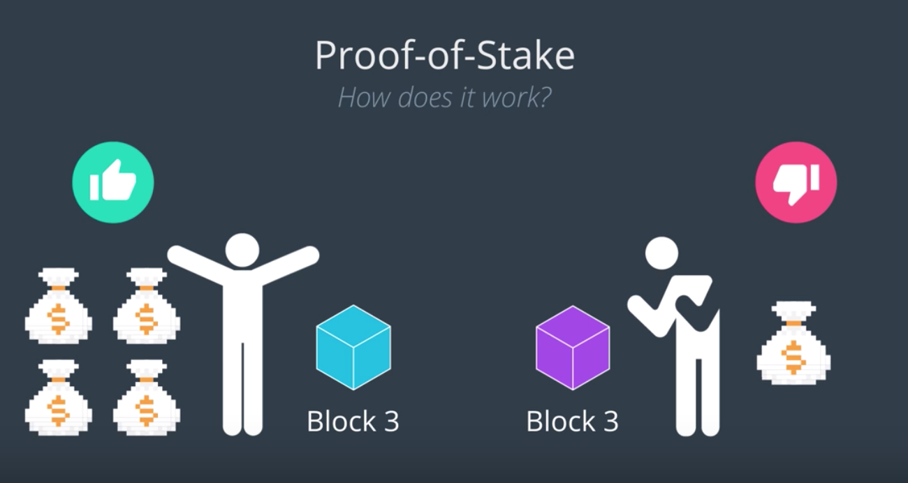
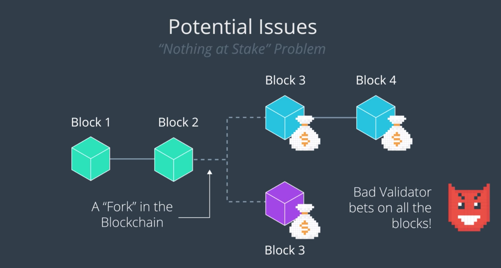

# 2. 지분 증명

> Proof of Stake: Seeks to achieve consensus by giving votes to those with stake in the system
> - Stake in the system means those who have the most investment in a positive outcome for this system

----

각 사용자가 보유하고 있는 지분의 양을 근거로 합의를 도출하는 합의 알고리즘.
여기서 지분(Stake)이란, 시스템이 생산해내는 "긍정적인 산출물"에 대한 투자량을 가리킨다.
=> 위 정의대로의 *지분* 이 높을수록, 시스템을 발전시키거나 순영향을 미칠 가능성이 높다는 예측

PoS에는 채굴자가 없다.
대신, Validator(**검증자**)가 있다. (주주(Stakeholder)라고 불리기도 한다)
검증자들은 PoW와 달리 채굴을 위하여 투자하지 않아도 된다. *코인은 처음부터 존재하기 때문.*
Validator의 역할은 **어떤 Block이 블록체인에 포함되는지를 결정하는 것.**

거래와 블록을 검증하기 위하여 검증자들은 자신이 보유하고 있는 코인을 주식과 같이 투자한다. (마치 내기를 하듯)
=> 이때, 검증자들이 코인을 걸었던 블록 또는 거래가 허위로 밝혀지면,
   자신들이 걸었던 코인을 잃고, 이후 검증 작업에 참여할 권리도 상실하게 된다. (...정말?)
이론적으로는 이런 방식의 검사를 통하여 *오직 믿을만 한 거래 또는 블록만 검증하도록* 시스템에 인센티브 제도를 형성한다.

여기서, 검증자가 가지고 있는 코인의 개수가 많을수록, 블록을 유효화하는 데에 필요한 영향력도 비례하여 상승한다.
또한 이 과정을 통하여 블록이 생성되었을 때, 검증자들은 자신들이 내건 코인의 양에 비례하여 코인으로 보상을 받는다.

## 의문: 악의적인 검증자가 모든 블록에 죄다 지분을 걸면 어떻게 막지? 이 검증자는 모든 블록에 대한 통제권을 갖는 셈인데.
=> 검증하는 데에는 직접적인 코인이 필요한 것이 아니라, "얼마만큼의 지분이 있다"는 자격만 있으면 되므로.

### Nothing at Stake 문제

블록체인이 분기되는 경우를 떠올려보자 (Fork 상황)

ex) 한 노드에서 블록을 만들고 있는 사이, 다른 노드에서는 별개의 블록을 만들었고 분기된 블록체인을 이어가고 상황
=> 여러 블록이 경합하고 있을 때, 돈많은 어떤 검증자가 각 블록에 대하여 모두 Stake를 걸면,
   어떤 블록체인이 선택되든 이 검증자는 항상 영향력을 행사할 수 있게 된다.

=> 지분 투자에 "한계 비용"이 없이 무제한적으로 영향력을 행사할 수 있다
   말 그래도, "Nothing at Stake" (걸은 것이 없다)

### 해결: Slasher

검증자가 여러 블록에 *동시에* 지분을 걸지 못하도록 제한.

### 해결: Punisher

잘못되거나 틀린 블록 체인에 지분을 걸 경우 제재

## PoS를 채택하는 블록체인 플랫폼

- 이더리움 (PoW에서 PoS로 전환중)
