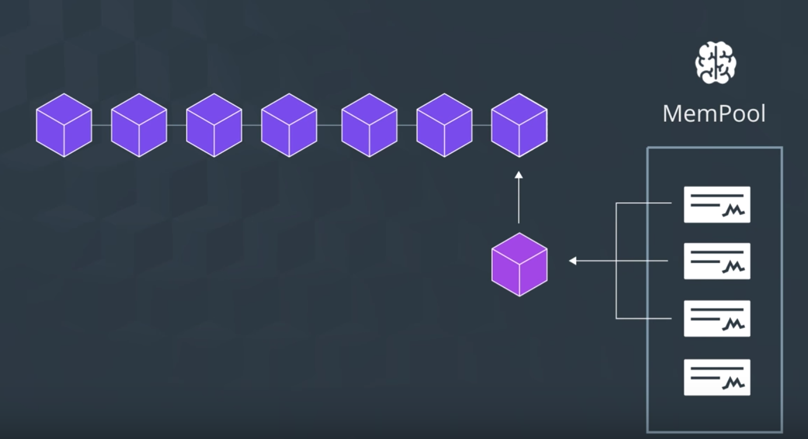

모든 거래는 블록에 들어가기 앞서서 *Memory pool* 에 들어가게 된다.

> Memory Pool: also known as `mempool`, the waiting place for transactions before they enter into blockchain. The blockchain can only handle so much information at once, and the backlog of information goes here.
> - 대기 큐와 같은 것

----

사람들이 거래를 진행함에 따라 거래가 즉시 생성되지만, 네트워크가 그 거래들을 한번에 모두 다 처리할 수 있다는 것은 아니다. 네트워크 상에서 한번에 처리할 수 있는 거래의 양을 생성되는 거래의 양이 초과하면, 대기줄이 형성된다. 이 대기줄을 Memory pool 이라고 부른다.

> Memory Pool: Waiting place for all unconfirmed transactions before they are added to the blockchain.
> - confirm되었다는 것은, *블록에 추가되었다* 는 것.
> - Mempool이라는 이름이 붙은 이유는, transactions sit in the *RAM Memory of all nodes in the Bitcoin network*.
> (그런가...? 불일치가 있을 텐데)

한번에 아주 많은 거래들이 생성되므로, 모든 거래들이 일시에 처리될 수 없고 아직 처리되지 않은 거래들은 mempool에서 대기하게 된다. 거래를 처리하는 것은 Minor들의 역할.

> Blockchain.com에서 unconfirmed tx 확인할 수 있다. 소름;;

각 트랜잭션은 hash로 구별된다. (txid)
거래에 적힌 것들은 비트코인 지갑의 주소로, 수신자와 송신자를 표시. (두 사람의 공개키를 표시)

## 그런데, Mempool에 있던 거래가 Mempool을 떠나게 되는 이유가 단지 블록에 포함되기 때문만은 아니다.

그러면 또 무엇이 있을까?

- Mempool에 거래가 들어온지 2주 이상 지났는데도 처리되지 않았을 때 (무효 처리)
- Mempool이 꽉 찬 상태에서 수수료가 높은 거래가 들어와버려서 밀린 경우
  - 수수료는 모든 거래에서 자유롭게 설정될 수 있다...
- 이중 지불
  - 검사 결과 이미 블록 내에 존재하는 utxo이면, 거래는 무효화되어 날라간다

----

- 블록에 등록
  - 블록에 등록되기 앞서서, Mempool에 있는 모든 거래들은 각 거래가 유효한지 검사받고 통과(confirm)해야 한다.
    *아무 문제 없이 6번 이상 confirm되면 합의 알고리즘에 의거 적법한 것으로 인정하는 것.*
  - 블록에 추가된 뒤 뒤에 블록이 하나 이어질 때마다, 또 한번의 confirm을 받은 것으로 간주한다 (conflict가 없었으므로)

=> 물론, 위에서 취소된 거래는 없어지는 것이 아니라, 다시 Mempool로 돌아온다. 지갑에 의해서.

## Mempool을 사용하는 궁극적인 이유?

블록체인에 보안과 신뢰를 더하기 위하여.
- 한번 검사를 통과한 거래 내역은 되돌릴 수 없다.
