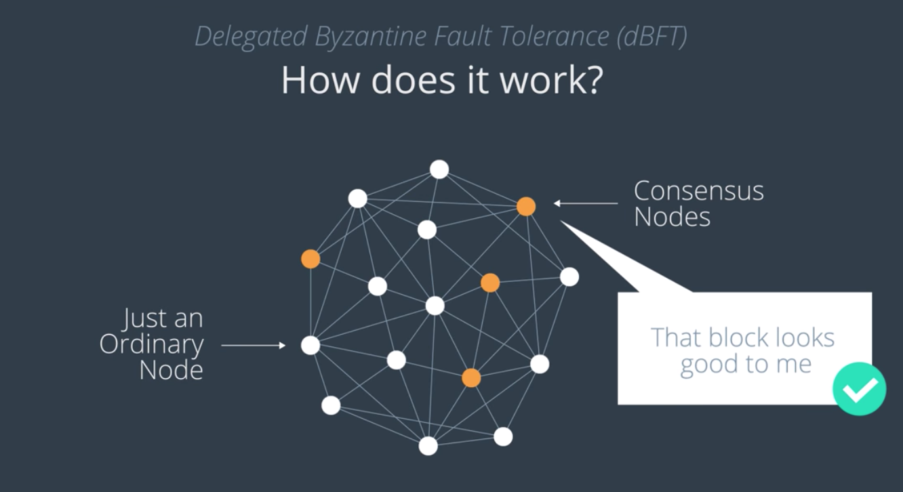
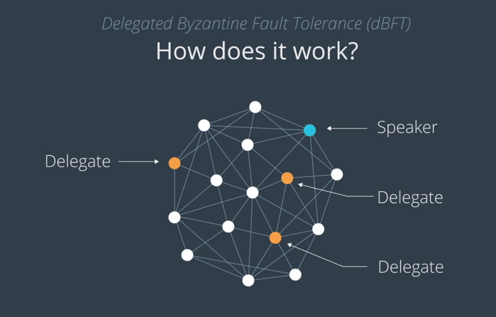
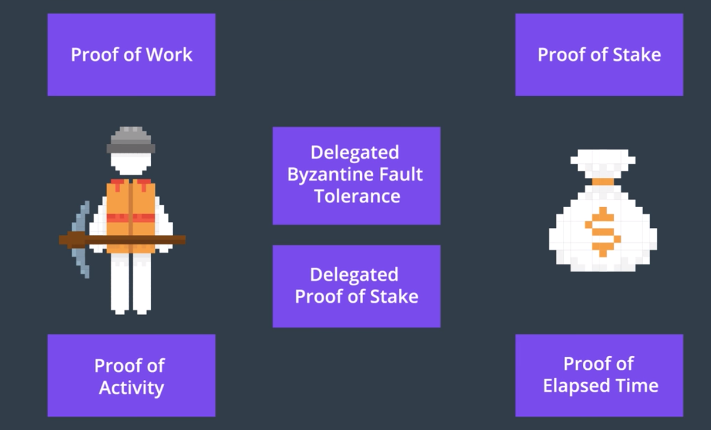

# 3. DBFT

> Delegated Byzantine Fault Tolerance

Unlike proof of work or proof of stake, DBFT tries to achieve consensus by assigning roles to nodes to help coordinate consensus.
=> 노드의 역할을 다르게 부여한다

DBFT에도 Miner가 존재하지 않으며, 각 노드들은 두 가지 종류로 분류된다:
- Ordinary Node
- Consensus Node

대다수의 노드들은 Ordinary "CITIZEN" Node로 자산을 교환하는 일만 수행하고 블록 검증에는 참여하지 않는다.
반면 Consensus Node는 블록체인에 기록되는 각 노드들을 검증할 수 있고, 따라서 네트워크 상의 다른 노드들을 "대표"한다.

> 현실에서의 정치인과 시민들의 관계를 생각해보자.

일반 노드가 합의 노드가 되려면 조건을 만족시켜야 한다 (플랫폼마다 상이)
=> 특별한 장비 소지, 전용 인터넷 라인 구비, 일정 이상의 지분 소유 등

-----

## 블록 선정 및 편입 방법

각 합의 노드는 체인에 추가되게끔 제안된 블록들을 모두 추적한다.
그리고 블록 체인의 마지막에 새로 추가될 블록을 결정해야 할 때,
여러 합의 노드 중 하나가 랜덤하게 선정되고, 이 노드는 Speaker라고 불린다.
Speaker 이외의 나머지 합의 노드들은 Delegate라고 불린다.

Speaker는 다음 블록을 선정하고, Delegate의 2/3 이상이 해당 블록에 대하여 Prove하는 데에 성공하면, 해당 블록은 Accept된다.
만약 Speaker가 선정한 블록이 Proven되지 못하면, 다른 Delegate를 Speaker로 만든 뒤 작업을 반복한다.

----

## 특징 또는 장점

- 전력 소모가 덜하다 (경쟁적이지 않음; PoS와 마찬가지)
- 어려운 수학적 퍼즐을 풀지 않아도 된다
- Fork에 대하여 취약하지 않다
  - 동시에 단 하나의 블록만이 존재하고, 단 하나만이 진실로 간주되므로, 분기에 따른 복잡한 시나리오가 벌어지지 않는다.

## 잠재적 위험

### Dishonest Speaker

Speaker가 오작동하거나, 거짓을 말하는 경우에도
Delegate의 2/3이 이 Speaker에 동조하지 않길 기도해야 한다
사용자들은 철저하게 스스로 선택하여 Speaker에 대하여 투표하기 때문.

### Delegate에 대한 시나리오

앞서 말한 것처럼 대다수의 Delegate들이 정상적이고 건전하게 투표할 수 있도록
일부 플랫폼들은 Delegate들에 대한 데이터를 제공한다. (판단 근거 제공)

## DBFT를 사용하는 대표

- NEO

------

PoW, PoS, DBFT 이외에도 다양한 알고리즘과 방법론이 존재.
대세는 PoW, PoS이지만, 계속해서 새로운 것들이 등장하고 있다.
각자가 다 장단점이 있다.
