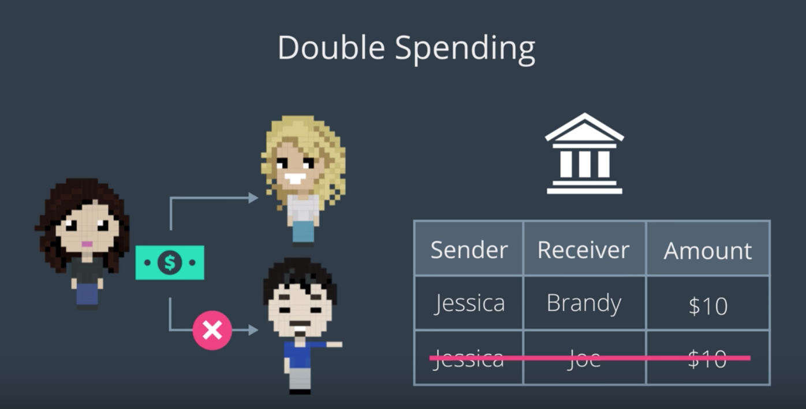

블록체인은 금융 거래에서 발생하는 문제를 해결하고자 등장하였다. 여기서 말하는 금융 거래란 무엇인지, 블록체인이 제시하는 해결책이란 무엇인지 알아보자.

## 금융 시스템이 생겨난 이유

두 사람 A, B가 있다. A는 쌀을, B는 고기를 가지고 있다. 두 사람은 이제 자신이 가지고 있는 것 이외에 다른 사람의 물건을 갖고 싶다.
문제는, 두 사람 간에 거래(Transaction)의 방법이 존재하지 않으므로 거래가 성립될 수 없다는 것이다.
어떻게 해야 할까?

### 대안 1: 물물 교환

자신이 가지고 있는 물건을 토대로 다른 사람과 교환한다.
A는 쌀을 가지고 B의 고기를 얻는 식이다.

여기서의 문제는 무엇일까? 쌀과 고기를 어떤 비율로 교환할 것인가,
즉, 각자가 가진 물물에 대한 본질적 가치(Intrinsic Value)를 어떻게 측정/책정할 것인가의 문제가 발생한다.
따라서 이러한 물물 교환의 형태에는 필연적으로 협상(Negotiation)이 뒤따른다.

사회가 복잡해지고 물건이 많아질수록 이러한 가치를 매기는 일은 어려운 일이 될 것이다.
물물 교환에서 보편적으로 사용될 수 있는, 본질적인 가치를 지닌 물질이 있다면 좀 더 편해지지 않을까?

### 대안 2: 금본위

금은 모두에게 기준으로 사용될 수 있는 가치를 지닌 물질이다.
따라서, 예를 들어, 쌀 100g은 금 0.01g 만큼의 가치가 있다는 식으로 각 물건의 가치를 금을 기준으로 매긴다면
모든 물건의 가치를 금을 기준으로 일관되게 매길 수 있을 것이다.

여기서 파생되고 정립된 것이 화폐(Currency)이다.
금 또는 (자신이 팔) 물건을 들고다니는 대신, 화폐를 들고 다니면 되는 것이다.

### 은행의 탄생

이러한 화폐를 기반으로 사람들이 거래를 한다면,
거래의 흐름을 파악하고 제어 및 관리할 수 있는 누군가가 필요할 것이다.
그것이 바로 은행(Bank)이다.
(이것은 블록체인이 제시하는 해결책과 동일한 방향성을 가진다는 것을 염두에 두자)

은행은 모든 거래를 추적하여, 화폐가 안전성과 신뢰성을 유지하도록 관리한다.
즉, 은행은 제3의 신뢰기관(Trusted 3rd Party) 역할을 맡고 있는 것.

> Trusted 3rd Party: Entity that facilitates interactions between 2 parties
(이 용어는 블록체인에서 자주 등장한다)
> 제3의 신뢰가관을 통하여 두 당사자 간에 오고가는 화폐와 이로써 성립되는 두 당사자 간의 거래는 보안과 안전이 형성된다.

매일마다 수많은 거래가 발생한다. 은행은 거래를 어떤 식으로 관리할까?

### Ledger

> - Ledger: List of transactions record
> - 화폐의 수신자, 송신자, 거래의 발생일시, 거래액수 등을 기록.

레저를 통하여 은행은 은행이 현재 관리하고 있는 화폐에 대한 정보를 모두 파악할 수 있다.
  - 누가 얼마를 가지고 있는지, 현재 화폐가 얼마나 존재하는지...
이를 통하여, 서로 모르는 사람들이라도 믿고서 거래를 진행할 수 있게 된다.
레저를 통하여 이중 거래(Double-Spend) 문제를 해결할 수 있다.

> - Double Spending: When someone spends the same money more than once

가진 돈이 $10뿐이 없는데도 $10을 두번 사용할 수 있게 된다면 이것은 심각한 문제일 것이다.
이 경우, 레저를 갖고 있는 은행은 두번째 거래를 무효화할 수 있게 된다.

### 대안 3: Blockchain...?

위의 방식은 지금까지 전통적인 금융 시스템에서 사용해오던 방식이다. 하지만 블록체인을 사용하면, 이같은 방식을 개선시킬 수 있다는 것이다.

Double Spending 문제에만 집중해서 생각해보자. 더 좋은 방법이 어떤 것이 있을까?

----

Joe passes money to his Bank; Joe's Bank passes money to Brandy's Bank; Brandy's Bank passes money to Brandy

What are potential flaws with this system?

Your reflection
1. Ledger may not work as properly, for example, as so many transactions occur simultaneously, some transactions may be omitted.

2. Someone may try to corrupt the ledger and modify as he or she wants, which results in the change of ledger without permission.

(Things to think about)
Thanks for your response.

Potential Answer 1: No easy way to see if transactions have been tampered with

Potential Answer 2: Transaction time is dependent on the banks to validate the transactions

----

## 블록체인의 대안: 새로운 제3의 신뢰 기관

현재 은행은 모든 거래 기록을 독점적으로 소유하고 있고,
은행은 사용자가 어떤 기록에 접근할 수 있는지를 선택한다.

이러한 방식이 효율적일까?
모든 사용자가 모든 기록에 제한없이 접근할 수 있다면 어떨까?

### Shared Ledger

즉, 은행이 독점적으로 보유하고 관리하는 레저 대신,
*사용자 모두가 공유하는 레저를 만들고, 모두가 접근할 수 있도록 하는 것.*
그러면 모든 사용자가 각자가 가진 정보에 대하여 완전한 통제를 가질 수 있을 것이다.

그렇다면, 이렇게 공유된 레저를 사용하면 기존의 은행이 제공하던 수준의 신뢰와 안전성을 확보할 수 있을까?
(명확히 답을 하지는 않은듯. 다음 이야기로 뭔가 부자연스럽게 넘어갔다...)

### 줄어드는 중간 과정

오늘날 사용하는 신용 카드, 전자 결제 등은 은행과는 별개의 결제 과정이다.
즉, 우리가 전자 결제를 하면, 전자 결제를 담당하는 회사는 우리에게서 거래 정보를 전달 받아 은행에 다시 넘겨줘야 한다.

이 과정에서 시간이 지연되고
또한 중간 과정 발생으로 인한 수수료가 발생한다.

공유 레저를 사용하면 이러한 시간과 비용의 낭비를 줄일 수 있다.

## 중요한 것: 이것은 정립된 해결책이 아니다.

여전히 연구중. 다만, 진전이 계속해서 일어나고 있다.
또한 우리가 그 연구의 일부분에 참여할 수 있는 기회가 많다는 것이 좋은 일.

----

## Wrap Up

Now we have a better idea of what the financial industry is trying to solve, and how the blockchain thinks it can improve on some of these ideas. Some of these ideas may seem pretty familiar, and that's great! When starting off we just want to make sure we're on the same page about the high level goals and solutions that the blockchain provides.

As we dive into the details, keep these solutions in mind. The blockchain is developing rapidly with TONS of new tools and ideas coming out all of the time. Having a firm grasp of what the goals are, you'll be able to better decide for yourself what's a useful tool, what's potentially successful solution to these problems, and how you can solve entirely new problems for yourself.
