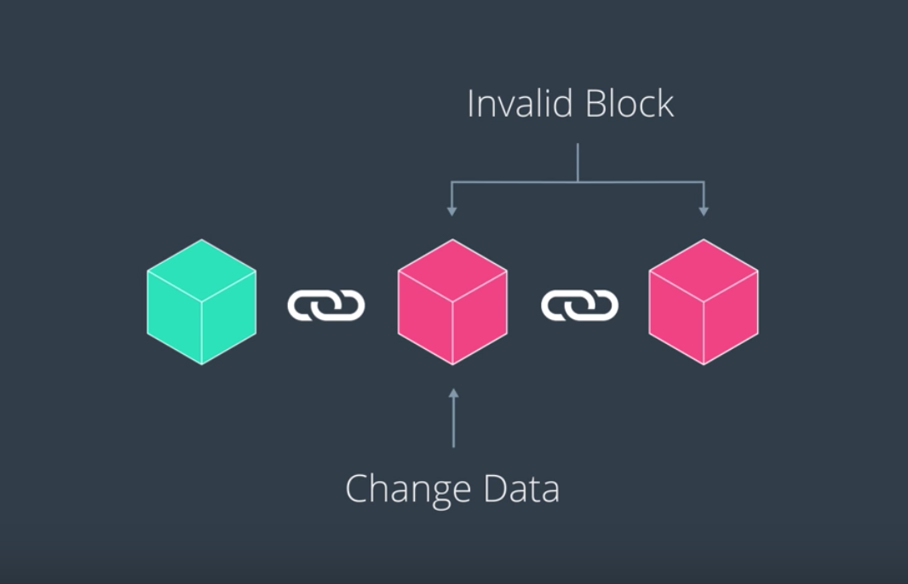

## there's a lot more to the blockchain than just "THE BLOCKCHAIN".

- 블록체인은 *데이터가 저장되는 곳* 이다.
- 블록체인을 구성하는 그 외의 요소들은 이러한 블록체인의 시스템이 유지될 수 있도록 도와주는 요소들이다.

> Blockchain: Digital ledger that contains the entire history of transactions made on the network
> - 블록체인은 해시 값을 통하여 연결된 블록들의 누적이다.

블록체인 내부에 들어있는 값은 바꿀 수 없다. Permanent, immutable하다.

## 블록체인을 구성하는 두 가지 주요 오소: Block, Hash value

- 해시를 통하여 구현된 연결 리스트로 전후 관계가 immutable하게 구현된다
  - 값이 조금이라도 바뀌면, 기존에 valid했던 블록 해시가 아닌 다른 블록 해시가 출현
  - 한 블록의 변화는 그 뒤로 이어진 블록으로 연달아 *연쇄적인 propagation* 을 발생시킨다

- 각 블록마다 index와 같이 번호가 있어서 고유하게 식별할 수 있다.
- 맨 첫번째 블록은 Genesis block이라고도 부른다.

----

블록체인에 대한 개념은 이것이 다이지만,
블록체인을 복잡하게 만드는 것은 *이러한 시스템을 효율적이고 효과적으로 지원하려면 어떻게 할까* 라는 고민들.
  - 다양한 기술들이 사용된다...
