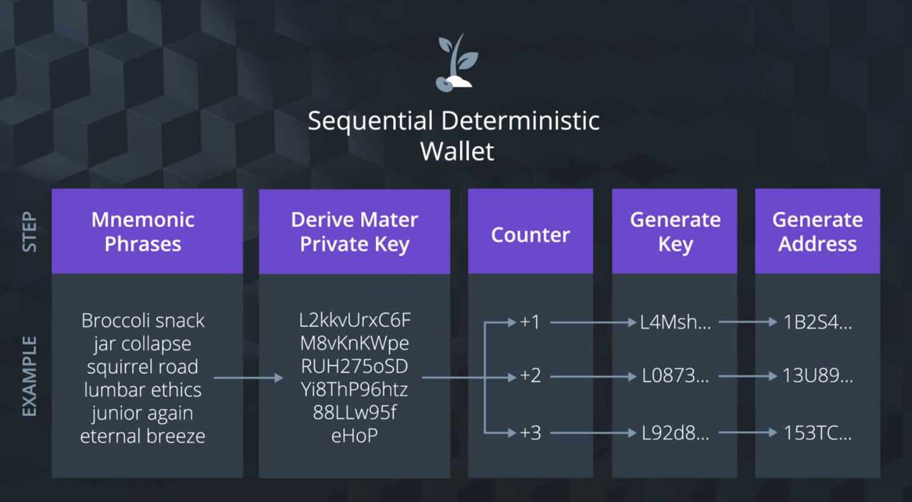
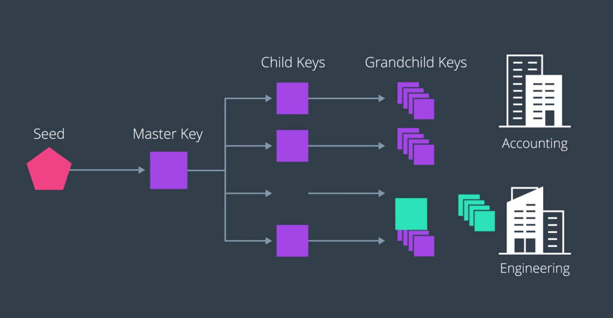
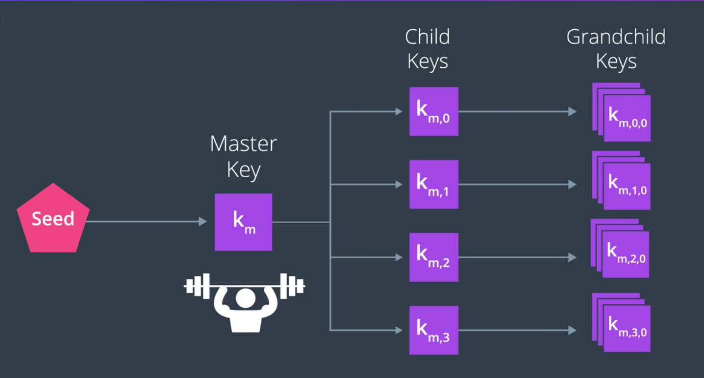
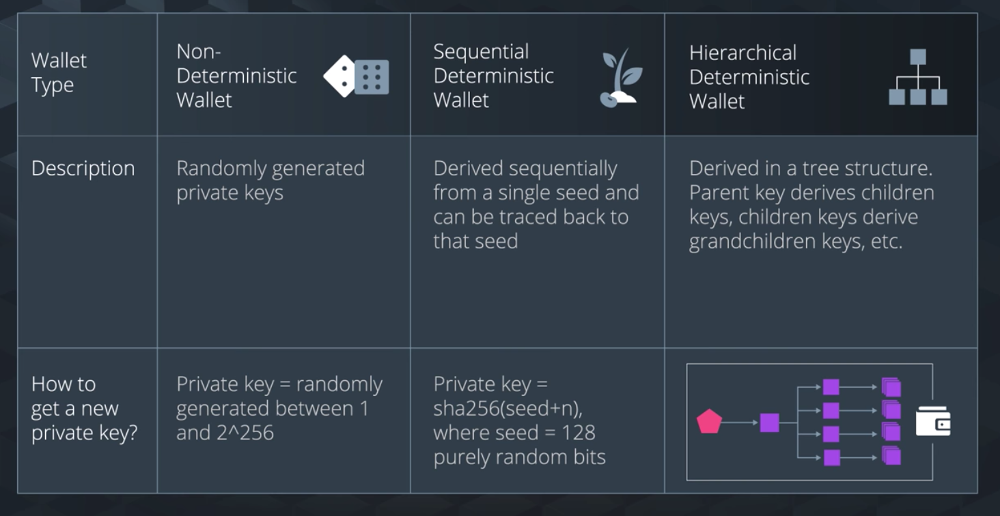

두 지갑 타입, *Deterministic* 과 *Non-deterministic* 지갑의 차이점을 살펴보자. 이를 통하여 두 지갑 종류의 특징을 이해하자.

## Non-Deterministic Wallet

- 비트코인 클라이언트를 맨 처음 구현할 때에 사용된 방식.
- 여기서는 모든 키가 절대적으로 *임의적으로* 생성된다.
  - Non-deterministic wallets can be thought of as a collection of randomly generated private keys that have no association with each other

- 보안을 위하여, 각 거래에 대하여 매번 *새로운 지갑 주소* 를 생성하는 것이 가장 좋다.
  그래야 누군가가 여러 거래 내역의 주소들을 살피며 연관성을 살피는 시도를 할 수 없을 것.
- 이 방식대로라면 새로운 키가 생성될 때마다, 새로운 비밀키, 공개키, 지갑 주소 등을 항상 백업해야 한다.
  그러지 않으면 실수로 유실해버릴 수도 있는 것이다.
  => 이거 상당히 귀찮아 보이네...

### 이런 상황인데 왜 non-deterministic?

백엔드 단에서는 *seed로 생성하지 않는 키를 사용하여 지갑을 생성* 하는 경우도 있다.

이것과 반대가 바로 결정론적 지갑. Seed가 있으면 비밀키, 공개키를 모두 추적할 수 있다.

## Deterministic Wallet

두 종류가 있다. Sequential / HD

### Sequential Deterministic Wallet

- 처음 사용된 것은 Electrum

- 임의의 숫자 또는 문자(열)이 Seed Value로서 입력되면,
  이것을 사용하여 Master Private Key를 생성하는데, 이것이 연속된 수(Sequential)로 결정(Deterministic)된다.
  여기에 +1 한 뒤 Private Key를 만드는 식으로 임의의 Private key를 만들어낸다.
- 따라서, Seed를 갖고 있으면 Private Key를 여러번 만들어낼 수 있는 것.
  이렇게 만든 Key만으로도 충분히 무한하게 사용할 수 있으므로, Seed만 알면 되므로 지갑 Backup이 필요 없음.
- 게다가 지갑의 가져오기/내보내기 를 하는 데에도 충분하므로, 여러 *Wallet Implementation* 간에 키를 이동(migration)하는 것도 간단

### Hierarchical Deterministic Wallet

- 가장 *세련된* 스타일.
- Seed > Master Key > Child Keys > Grandchild keys
  - 트리 스타일. 이런 식으로 끝없이 depth를 만들어낼 수 있다.
- 공개키/비밀키 모두 이러한 위계를 형성해낼 수 있다.
- 비트코인 향상 제안 32번에서 등장(BIP32)

- *HD 지갑은 일부 또는 전체가 다른 시스템에서 공유될 수 있다. 여기서 각 시스템은 코인을 소모할 수도 있고, 아닐 수도 있다.*
  - HD 지갑에서는 Public Key 로부터 Sub Public keys를 만들어내거나, Private Key로부터 Sub Private Keys를 만들어낼 수 있다.
  - ECDMA를 그대로 이용하는 것: Master를 이용하여 여러 Sub를 만들어내기
  - 이런 방식을 사용하면, **전체 트리 구조** 의 일부분만 공유하는 것이 가능해진다.
    => **특정 depth의 private key와 public keys만을 공유하자!**
    - 그러면 Root Master에 종속된, Key 트리의 일부분만 공유할 수 있게 된다.
    public key가 아주 많이 필요할 때, private Key는 하나만 유지하면서도 무한한 수의 public key를 만들어낼 수 있게 되는 것.
    public key가 여러 개이므로, 각 거래 내역에서 공개된 부분은 사람들이 보게 할 수 있지만, 여전히 private key가 필요한 부분은 은닉 가능.

- 이처럼 HD 지갑은 특정 Sub tree Keys에 대하여 철저한 모듈화를 가능하게 해주므로 편리하다.
- 하지만, Root Master Key가 털리면 다 털림...

----

각 종류의 지갑마다 특성이 다르고, "이게 가장 좋다"라는 건 없으므로,
필요와 경우에 따라 적절한 것을 사용하는 것이 중요.

??(Master Private으로 만든 Public과, 그 Public으로 만든 여러 Sub public 이 있다고 하면, public들로 만든 건 Master로 무조건 다 열 수 있는거?)??

==============

Q1. I want to create paper wallets derived from one master key so I can store and recover all of them deterministically. Which wallet is used to achieve this?

=> Sequential Deterministic Wallet

Q2. I’m creating a web server that sells widgets and want to generate an unique transaction address for every customer and every address and track it independently. I want to be able to take a master public key and generate a sequence of sub-public keys, each associated with a transaction and put it on a public web server and make sure the web server has no private keys.

=> HD Wallet
마지막에, *make sure the web server has no private keys.* 에 주목하자.

Q3. A shoe supply chain is being audited. The auditors are given a public key so they can see all the transactions of the sub tree but they can’t unlock it. Which wallet is used to achieve this?

=> HD Wallet
각 거래 내역을 열람만 할 수 있고, 내역 내부의 정보들을 unlock하거나 사용하는 것은 할 수 없다.

Q4. A blockchain social media website uses private keys to secure personal user data. It uses wallets for backend services that use private keys that are not derived from a seed. Which wallet is used to achieve this?

=> Non-deterministic Wallet
