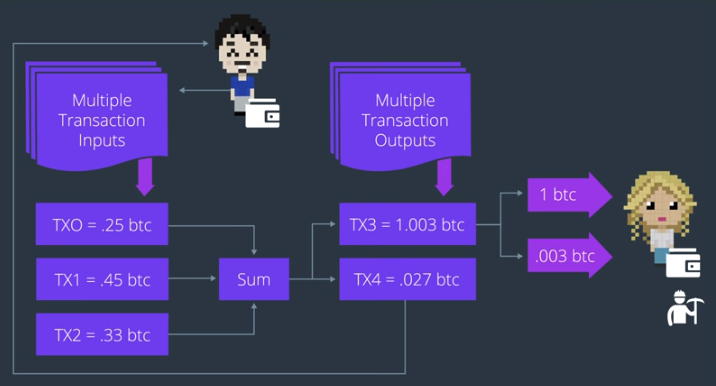

지갑이 생겼으면 이제 거래를 할 수 있다!
그렇다면, 거래는 어떻게 안전하게 이루어지는 걸까?

2가지 의문:
1. 이 거래가 유효한 건지 어떻게 알까?
2. 이 거래의 소유자(즉, 화폐인 경우 이 거래증에 적힌 금액의 최종 소유자)는 누구일까?

거래를 검증하고, 소유권을 부여하는 과정은 *디지털 서명* 이라는 과정을 통하여 이루어진다.

----

## Digital Signature

> Signature: Establishes proof of ownership for each transaction on the blockchain

지갑이 신뢰성을 담보한다는 것은 알겠다. 하지만 그것만으로는 부족하다.
그 내부에 들어있는 거래들은 신뢰할 수 있는가?

지갑이 어떤 거래를 *서명* 할 때에 비로소 거래는 네트워크 상으로 broadcast된다.
즉, 비트코인에서는 네트워크 상에 거래를 전송하기 전에, 송신자(본래 소유자)가 서명할 것을 요구한다.
=> 송신자가 서명을 하도록 하여 소유자를 확실히 할 수 있는 것.

송신자의 지갑 주소는 비밀 키를 사용하여 서명되고, Transaction message 내에 기록되어 전송된다.
이러한 Transaction을 *UTXO(Unspent Transaction Output)* 이라고 한다.

오로지 *아직 사용되지 않은 거래* 만이 거래의 입력으로서 인정받을 수 있다.
각 UTXO는 소유권을 증명하는 것과 관련하여 조건을 갖게 된다. => 소유자의 비밀 키로부터 나온다.

?? 출력은 서명을 통하여 증명하는데, 입력은 어떻게 증명하지 ??
  - 입력: 이게 기존에 사용이 안 된 것인지
  - 출력: 이게 보낸 사람의 소유였던 것이 맞는지

----

## Transaction Input / Output

거래의 입력은 나의 지갑으로 들어오면서 잔액을 형성해주는 지불을 뜻한다.
누군가에게 송금을 하고싶다면, 우선 transaction input을 통하여 잔액이 확보되어야 한다.

각각의 거래 입력은 저마다 증명을 위한 조건을 가지고 있어서, 내가 사용하고자 할 때마다 거래 출력으로 변환되어야 한다.
거래 출력에는 당연히 *나의 비밀 키로 소유권을 증명할 것* 이라는 조건을 가지고 있다.
나의 비밀 키를 사용하면 나의 거래를 서명할 수 있고, 이를 통하여 *입력 거래를 가지고 있는 지갑 주소가 나의 것* 이라는 소유권을 증명할 수 있다.

(출력할 때에 서명이 이루어지고 체인 상에 잘 올라갔다면, 입력은 증명할 필요 없이 믿고 사용해도 되는 논리인거겠지)

유효한 거래 출력을 만들어내려면 반드시 지갑에 잔액이 있어야 한다.
여러 *거래 입력* 이 합쳐져서 잔액을 형성한다. (마치 지폐 거스름돈처럼)

> 거래 출력을 만들어내려면, 당신이 송금하려는 양보다 크거나 같은 양의 입력 거래의 합을 보유하고 있어야 한다.

또한, 반드시 거래 출력에는 *수수료* 가 포함되어야 한다. 그래야 블록체인에 포함될 확률이 올라간다.

한번에 여러 거래 입/출력을 생성할 수도 있다.
내가 송금하고자 하는 것보다 더 보내게될 수도 있다. 그런 경우, 수신자에게서 다시 나에게 거스름돈을 보내게 된다.

여기서 0.027 btc는 원래 없던 거래 입력이어서, 새로 출력으로 생성된뒤 송신자에게 반환된다.

----

이 거래는 원래 내 거였는데, 이번에 수신자에게 보내준거야.
어떻게 증명하냐고? 내 비밀키로 서명했고, 검증도 통과해서 블록체인 상에 올라갔어. 믿고 쓰라구.
(=> 이걸 받은 수신자는 마음 놓고 해당 거래 결과를 잔액에 반영할 수 있다.)

----

## 정리

1. Prove address ownership by signing with private key
2. transaction life cycle from sender to receiver
3. Unspent Transaction Input (UTXO)

----

Q1. Which of these are valid reasons why signing a transaction is important?

=> Prevents fraud
Prevents fraud is the main reason for signing a transaction is important :)
