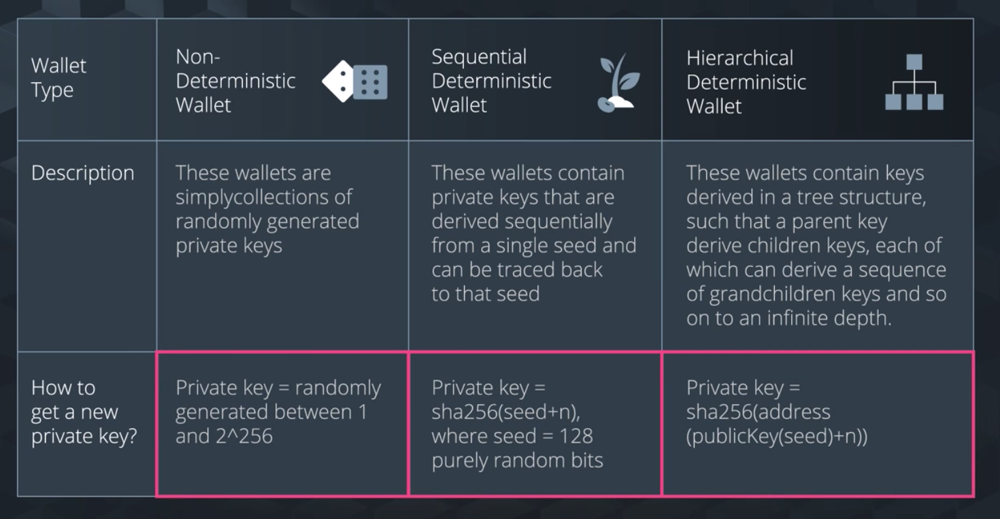
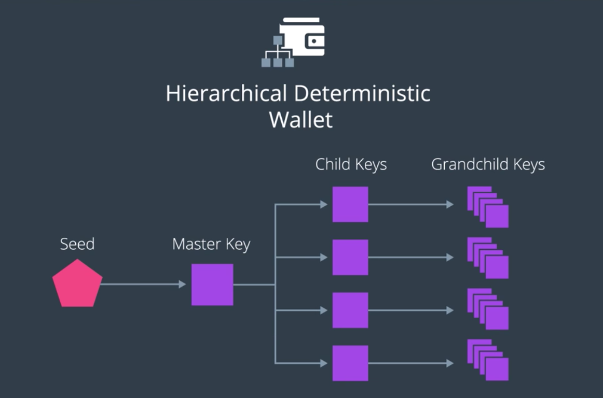

앞서 밝힌 지갑, 비밀키와 공개키, 지갑 주소 등을 구현하는 방법은 다양하다.
다양한 방법에 따라 다양한 지갑이 존재한다.

- 비결정론적 지갑
- 결정론적 지갑
  - 계층적 결정론적 지갑

- 모두 다 SHA256을 기반으로 한다.

## 1. Nondeterministic Wallet (Random wallet)

비밀키, 공개키, 지갑 주소 모두 랜덤하게 생성된다

## 2. Deterministic Wallet

- 비밀키, 공개키, 지갑 주소 모두 Seed 문자에 의하여 고정된다
  - 역연산이 안되는 건 동일하지만, Seed 문자를 알고 있다면 비밀키, 공개키 등을 모두 다시 동일하게 얻어낼 수 있다는 게 가장 큰 차이

> Seed word: A list of words that store all the information needed to recover a wallet
> => 처음 지갑을 만들 때 함께 생성되는 값.

- Seed word를 사용하면 랜덤하게 생성되는 비밀키 등등 보다 기억하기 쉽다. (패스워드 생각하면 될 듯)

## 3. Hierarchical Deterministic Wallet

- 가장 진보한 형태의 결정론적 지갑
- HD 지갑에서 각 키들은 트리 형태를 보인다
  - 이러한 계층 구조를 활용하면 보다 체계적으로 키들을 관리할 수 있다.

----

결론: 블록체인 거래에 있어 *지갑* 은 Identity를 제공하므로 아주 중요한 구성 요소이다.
