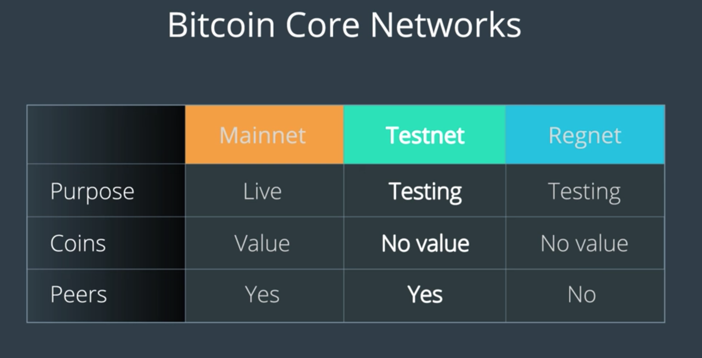

비트코인 생태계에서는 3가지 네트워크를 개발자에게 제공:

- Mainnet
- Testnet
- Regnet

용도와 목적에 따라 각각을 적절하게 선택하자

## Bitcoin Mainnet
- Primary network where live transactions take place
- 여기서는 실제 거래가 발생한다. 교환되는 화폐도 실제 가치를 갖는 것들.

## Bitcoin Testnet
- Alternative Bitcoin blockchain that provides a test environment for applications
- 여기서 테스트하면, mainnet을 느리게 만드는 등의 일 없이 테스트를 진행할 수 있다.
- 또한, 가치가 없는 코인이 지급되고 사용할 수 있으므로 맘놓고 테스트 가능
- 단, 여기는 네트워크가 이루어지고, PoW나 Validation도 네트워크를 통해야 하므로 조금 느리다

## Bitcoin Regnet (Regression Test Network)
- Alternative test network for testing bitcoin applications
- 네트워크가 일절 없고 로컬로 이루어지므로, 블록을 즉시 만들 수 있고 환경에 대한 완전한 통제를 갖는다.
