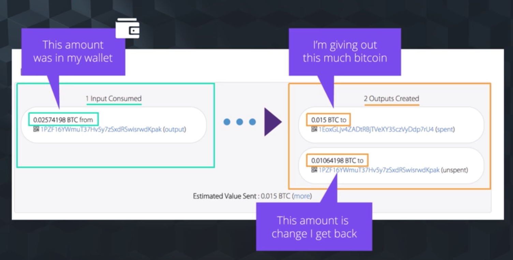
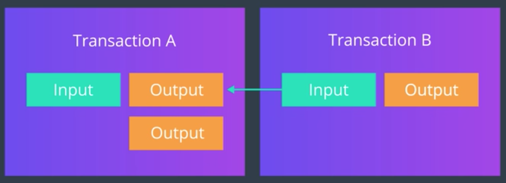
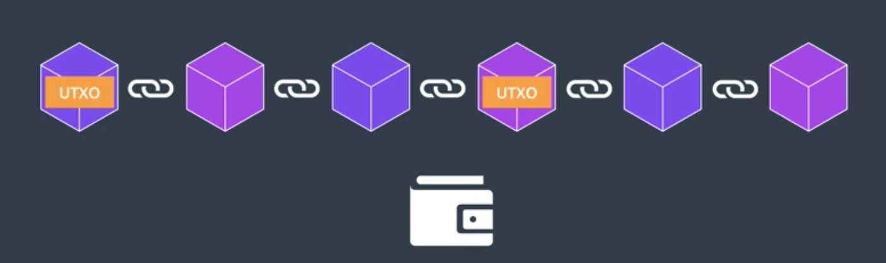
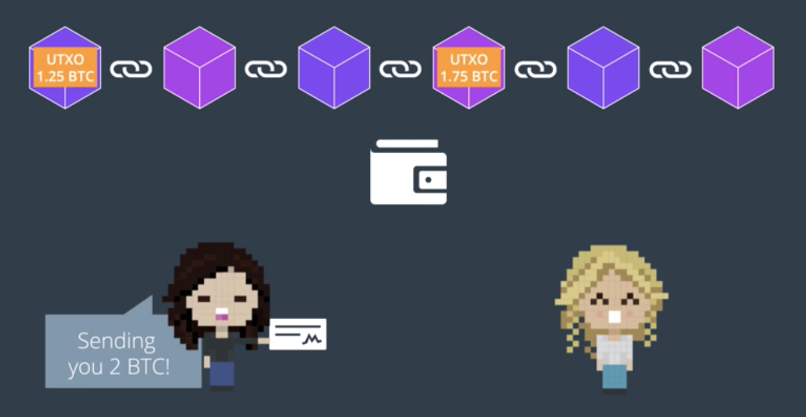
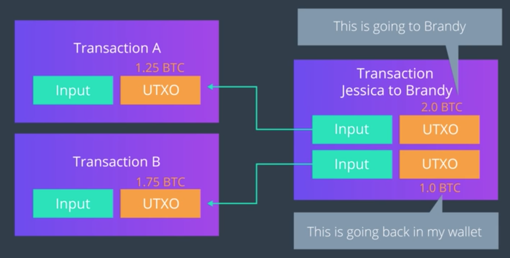

Transaction은 블록 체인의 핵심! - 데이터가 형성되는 기본 단위
블록체인 시스템은 거래가 생성되고, 네트워크로 전파되고, 유효성을 검증하고, 마지막에는 네트워크에 등록되는 과정을 보장하도록 디자인된다.

우리가 고유한 블록체인 시스템을 만들어내려면, 거래에 대한 기본 개념을 잘 숙지하고 있어야 한다.

----

## Transaction

- A data structure that encodes a transfer of value from a source of funds called an "input" to a destination called an "output".
- 즉, 두 지점 사이에서 발생하는 값의 이동을 코드화하는 자료 구조.

하나의 거래는 *입력을 사용* 하여 *출력을 생성* 해낸다.

- 한 사람으로부터 다른 사람에 대한 *지불(Payment)*
- 이 경우, 지불하는 사람에게 거스름 돈이 발생하는 경우가 많다 (액수가 정확히 안 맞으므로)
- 여기서 입력은 어디서 오고, 그럼 출력은 어디로 가는 것일까?

---

## 한 거래의 입력은 다른 거래로부터 생겨났으나 *아직 사용하지 않은* 출력(Unspent Output)

- Inputs are the unspent output from another transaction. *All inputs reference back to an output.*
- 포인터를 떠올려보자. 입력을 타고 이전 거래로 거슬러 올라가는 행위가 가능한 것이다.
- 사용자가 비트코인을 수신받을 경우, 그 코인의 수량은 *Unspent Output* 으로서 **블록체인에 기록된다.**
- 이러한 사용하지 않은 출력을 Unspent Transaction Output, *UTXO* 라고 부른다.

- 즉, 만약 사용자가 여러 거래를 통하여 비트코인을 받았을 경우, 각 출력들은 저마다 각각의 거래 내역에 흩어져서 기록되있을 것이다.
- 그러다가 사용자가 UTXO를 사용할 상황이 오면,
  - 지갑 클라이언트는 블록체인 전체를 스캔하여, 해당 사용자에게 귀속된 UTXO들을 모두 모은 뒤 잔고(Balance)를 계산한다
    (수신자의 지갑 주소와 자신이 일치하는 것을 찾으면 되겠죠?) + (UTXO만 관리하는 파일이 블록체인 시스템에 존재 - utxo set)
  - 즉, 비트코인 네트워크에는 *저장된 잔액값* 이라는 개념이 없다. 단지 특정 사용자에게 귀속된 상태로 블록체인 상에 흩어져 있는 UTXO 들이 존재할 뿐이다.

## UTXO의 값은 바꿀 수 없다.

- 처음 출력이 생성될 때에는 임의의 수가 모두 사용될 수 있으나, 한번 생성된 UTXO의 값은 그대로 고정이다.
  - 마치, 동전을 반으로 쪼갤 수 없듯이...
- 그래서 값이 딱 떨어지지 않는 거래의 경우, 받는 사람이 거스름돈에 해당하는 UTXO를 생성하여 전송해준다.

> Transaction: Sum(Inputs) - Sum(Outputs) = Transaction Fees
