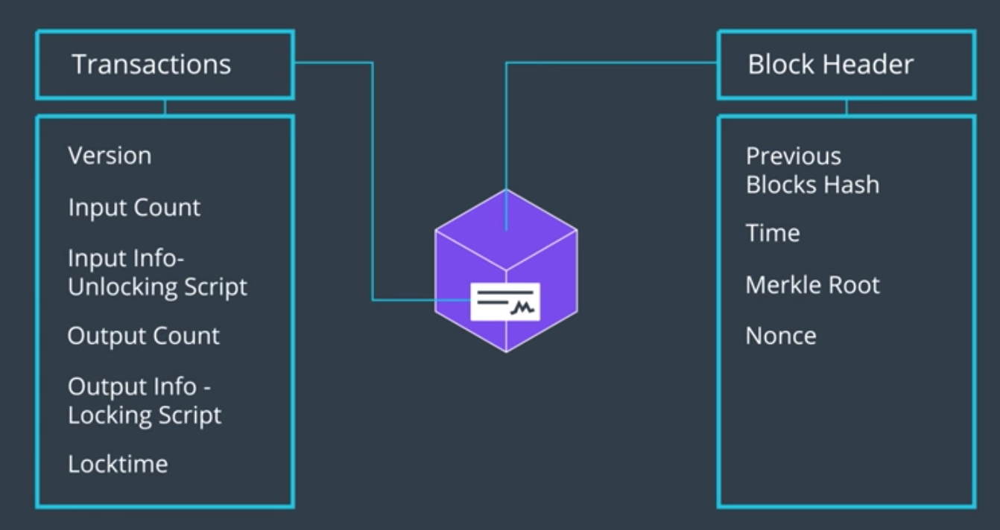
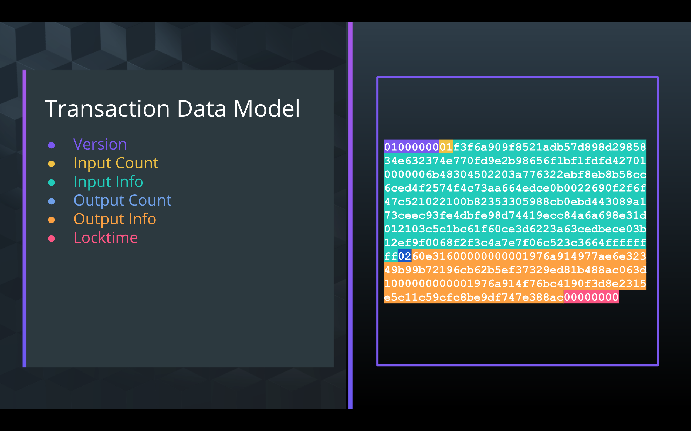

거래는 결국 *입력* 과 *출력* 으로 이루어져 있다.
하지만 데이터는 binary로 이루어져 있다. 그 내부는 어떤 구조일까?

## 블록체인에서 모든 거래는 SHA256 Hash를 2번 수행한 뒤의 형태로 저장된다.

> - 정확히는, 거래의 ID가 SHA256을 2번 수행한 결과이다([Why hashing twice?](https://crypto.stackexchange.com/questions/50017/why-hashing-twice))

블록체인 네트워크에게 *거래의 Raw content(즉, 구체적인 거래 관련 정보들)* 를 달라고 요청한다면,
16진수 형태의 긴 데이터를 돌려받게 된다. => JSON 객체로 변환할 수 있다

복호화 하기 어려울 것처럼 보이지만, 규칙이 있다.

- 위의 예시에 대한 자세한 거래 정보는 [여기](https://live.blockcypher.com/btc/tx/b138360800cdc72248c3ca8dfd06de85913d1aac7f41b4fa54eb1f5a4a379081/)에서 확인 가능

- Version: 비트코인 버전. 버전에 따라 거래 구조의 프로토콜이 다를 수 있다.
- Input count: 해당 거래에 몇개의 입력이 사용되었는지
- Input Information: 해당 거래에 대한 세세한 데이터들
  - 입력이 어디로부터 온 건지(송신자에 대한 것; 주소?)
  - 입력이 유효한지; 사용할 수 있는지
  - 등등
- Output Count: 해당 거래가 몇개의 출력을 만들어내는지
- Output Information:
  - 총 얼마의 BTC가 출력되는건지
  - 이후에 소비되기 위하여 필요한 조건들
- Locktime: 해당 거래가 블록체인에 추가된다고 할 때, 추가될 수 있는 가장 이른 블록 또는 시간에 대한 정보
  - 0 < locktime < 500만: 이 경우 locktime은 높이, 즉 블록에 대한 정보
    - 즉, 해당 거래가 블록에 추가되려면, 해당 블록의 height가 적어도 locktime보다는 커야 한다는 의미
  - 500만 < locktime: Unix Timestamp; 1970년 1월 1일 이후 몇초가 지났는지.
  - 보통은 0을 가지며, 이말은 즉 ASAP로 추가하라는 의미

## Input/Output Information 에는 무엇이 들어있는가?

- 각 거래가 어떻게 서명되어야 하는지에 대한 스크립트를 담고 있다. (이것 *도* 포함된다는 뜻인듯)
- 거래가 유효한지 여부를 판단하기 위하여 필요한 프로그램/스크립트
  - Input 부분에는 Unlock과 관련된 스크립트,
  - Output 부분에는 Lock과 관련된 스크립트
- 거래가 유효하다는 것은, Unlocking script가 Locking script의 요구 조건을 Unlock하는 요구조건을 모두 갖추고 있다는 의미

## cf) Smart Contract

- 어떤 동작이 이루어지기 위하여 충족되어야 하는 조건들과, 각 조건을 만족시키는 데에 필요한 매개 변수들의 연속
- 위에서 언급한 스크립트들은 이와 유사한 것.
- 스크립트를 통하여, 각 거래가 블록체인 상에서 어떻게 동작해야 하는지를 통제할 수 있는 힘을 가질 수 있다.
