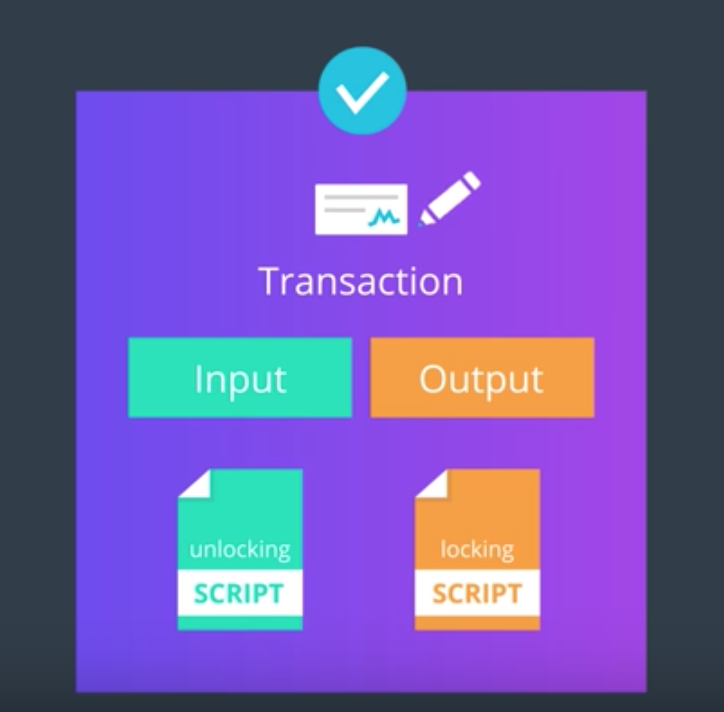
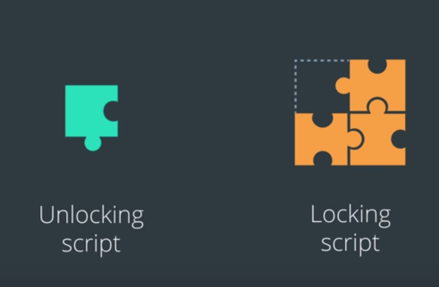
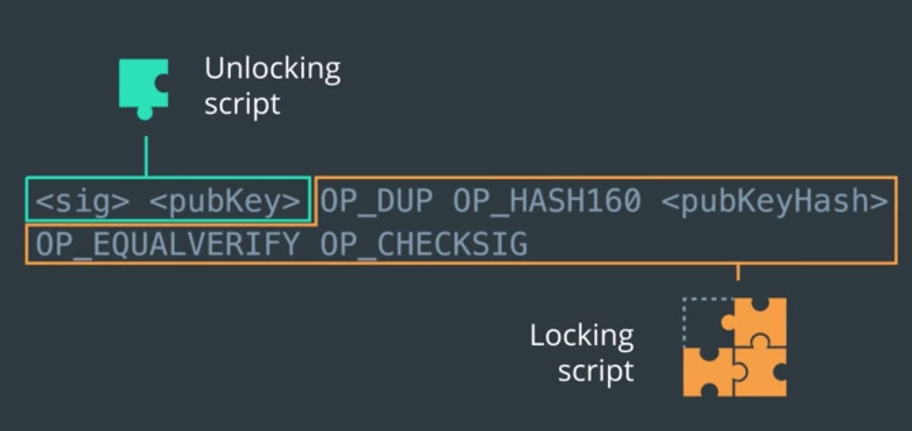
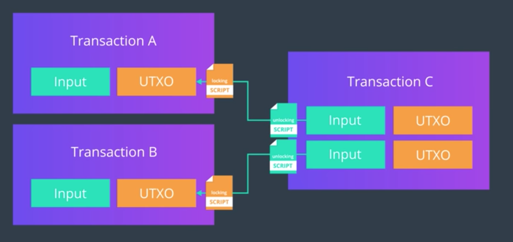
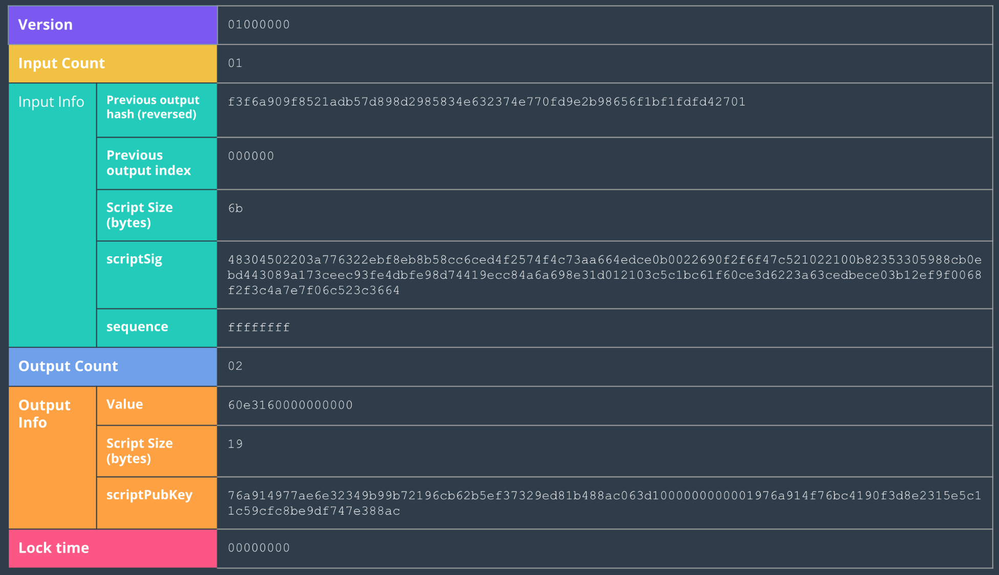

어떤 플랫폼을 사용하든, Transaction에는 해당 네트워크가 작동하기 위한 핵심 정보들이 들어있다.
[Block Explorer](https://www.blockcypher.com/) 등을 사용하면 이걸 확인할 수 있다.
이와 더불어, 거래 상에는 Scripts 라고 불리는 코드 더미가 들어있고, 거래는 이것을 처리해야 한다.

이번 절에서 배울 것:

1. Bitcoin Scripts Basics
2. Unlocking and Locking Scripts
  - 이걸 왜 쓰는건지?
  - 어떻게 작동하는지?
  - (거래의) 어디서 이걸 확인할 수 있는지?

----

## Scripts

- A list of instructions recorded in each transaction that when executed determines if the transaction is valid and the bitcoins can be spent.
- 즉, 해당 거래와, 해당 거래에 연관된 화폐가 사용가능한지 (아니면 이미 사용이 끝난 화폐인지) 알 수 있게 해주는 스크립트

## Script

- **고유 명사임!!**
- The name of Bitcoin's transaction scripting language

## Scripting Language

- A simple, lightweight language designed to be limited in scope and executable on a range of hardware
- 우리가 소위 말하는 스크립트 언어

----

## 비트코인 스크립트는 Stack-based Language이다.

- 즉, 여기서 사용되는 데이터들은 Stack 이라는 간단한 자료 구조 상에서 저장된다는 것.
- 이 스택에는 숫자(데이터 상수)가 저장된다
- 이 스택 상의 정보들은 *opcode* 라고 하는 연산자를 사용하여 다룬다
  - Push, Pop, Act ...
- 왼쪽에서 오른쪽으로 읽어가며 작동한다

----

## 왜 Unlock/Lock Script를 사용할까?

- 앞서 다루었듯 거래 내의 Input/Output Section에는 이러한 스크립트가 들어있다
- 이 스크립트들은 거래가 Valid한지 여부를 결정하기 위하여 실행된다
  - Valid하다면, 거래는 서명될 수 있고, 거래를 사용해도 된다.

## 이 스크립트들은 같이 맞물려서 작동한다. 마치 퍼즐과 같다.

- 어떤 거래가 Valid하려면, *Unlocking Script가 Locking Script를 Solve하면 된다.*

- Locking script is like a puzzle that specifies the conditions that must be met before the Bitcoins can be spent.
- Unlocking Script에는 Locking Script가 true로 평가되도록 만드는 올바른 솔루션이 들어있다.

> ### Example of Bitcoin Script
> 

## Scripts가 서로 작동하는 방식 (3:05 ~ 6:02)

- 한 거래의 입력은, 그 이전 거래의 출력을 참조할 수 있음을 기억하자
- *유효성 검증 소프트웨어* 는, 각 입력이 참조하는 UTXO를 가져온다
  - 여기서 각 UTXO는 Locking Script를 가지고 있고, 이 스크립트에는 해당 UTXO를 소비하기 위하여 필요한 요구 조건이 들어있다.
  - 즉, 각 UTXO에는 해당 UTXO를 입력으로서 사용하기 위하여 완성해야 하는 퍼즐 조각이 들어있는 것
  - *Locking Script의 요구 조건을 만족해야 입력으로서 사용할 수 있다*
- 거래가 유효한지 확인하기 위하여, 유효성 검증 소프트웨어는 입력이 소유한 Unlocking Script를 가져온다. 그리고 이 Unlocking Script가 Locking Script를 풀어낼 수 있는지 확인한다.

### 주의: 현재 거래의 입력은, 이전 거래의 출력과 상호작용한다.

- 헷갈리지 말자.
- 즉, 같은 거래 내의 스크립트들은 서로 연동하지 않는다.
  - **현재 거래의 입력** 이 가지고 있는 **Unlocking Script**
  - 이에 대응하는 **직전 거래의 출력** 이 가지고 있는 **Locking Script**
- 현재 거래의 출력은 차후 미래의 거래 내역 내의 입력과 연동될 것.

## Locking Script의 작동 방식

- 미래에 해당 출력을 소비하기 위하여 반드시 충족되어야 하는 조건을 명시하는 것으로 스스로에게 Lock을 건다.

> 예: 이 UTXO는 A의 공개 키로 복호화할 수 있는 서명을 제시하는 사람만이 사용할 수 있다
> - A의 지갑만이 이러한 조건을 만족시킨다.
> - 즉, A만이 이 출력을 사용할 수 있는 것. A에게 보내준 돈!

### scriptPubKey

- 과거에 비트코인 클라이언트 소스 코드 상에서 Hash Locking Script가 저장되어있는 변수 이름
  - 여기에는 Public Key 또는 Bitcoin wallet address 가 들어있었음
- 하지만 이제는 Locking Script라는 좀 더 포괄적인 이름으로 변경

## Unlocking Script의 작동 방식

- 위에서 비유에 대응하자면, *퍼즐을 풀기 위한 해답*
- Locking Script의 조건을 충족하고, 출력의 사용을 허용시킨다.
- Unlocking script의 전형적인 구현은 Locking Script를 Unlock할 수 있도록, *정해진 사용자의 비밀 키를 사용하여 만든 전자 서명* 을 가지도록 하는 것.

### scriptSig

- 과거에 비트코인 클라이언트 소스 코드 상에서 Hash Unlocking script가 저장되어있는 변수 이름
  - 여기에는 보통 디지털 서명이 들어있었음
- 하지만 모든 Unlocking Script가 디지털 서명을 가지는 것은 아니므로 (구현에 따라...) 더 포괄적인 이름인 Unlocking Script로 용어 변경

----

## 이러한 정보는 Transaction의 어디에서 확인할 수 있을까?

----

#### Version
- All transactions include information about the Bitcoin Version number so we know which rules this transaction follows.

#### Input Count
- Which is how many inputs were used for this transaction

### Data stored in Input information:

#### Previous output hash

- All inputs reference back to an output (UTXO). This points back to the transaction containing the UTXO that will be spent in this input. The hash value of this UTXO is saved in a reverse order here.

#### Previous output index

- The transaction may have more than one UTXO which are referenced by their index number. The first index is 0.

#### Unlocking Script Size

- This is the size of the Unlocking Script in bytes.

#### Unlocking Script

- This is the hash of the Unlocking Script that fulfills the conditions of the UTXO Locking Script.

#### Sequence Number

- This is a deprecated feature of bitcoin, currently set to ffffffff by default.

#### Output Count

- which tells us how many outputs were produced from this transaction.

### Data stored in Output Information:

#### Amount

- The amount of Bitcoin outputted in Satoshis (the smallest bitcoin unit). 10^8 Satoshis = 1 Bitcoin.

#### Locking Script Size

- This is the size of the Locking Script in bytes.

#### Locking Script

- This is the hash of the Locking Script that specifies the conditions that must be met to spend this output.

#### Locktime

- The locktime field indicates the earliest time or the earliest block a transaction can be added to the blockchain. 
- If the locktime is non-zero and less than 500 million, it is interpreted as a block height and miners have to wait until that block height is reached before attempting to add it to a block. If the locktime is above 500 million, it is read as a UNIX timestamp which means the number of seconds since the date January 1st 1970. It is usually 0 which means confirm as soon as possible.
