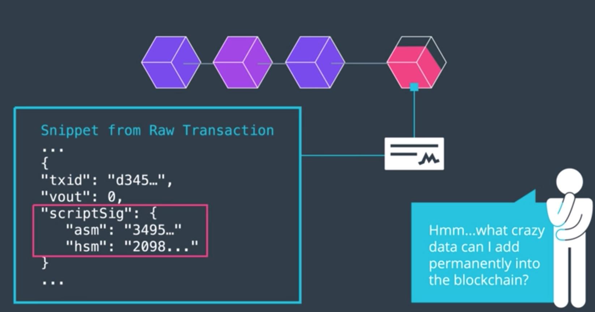
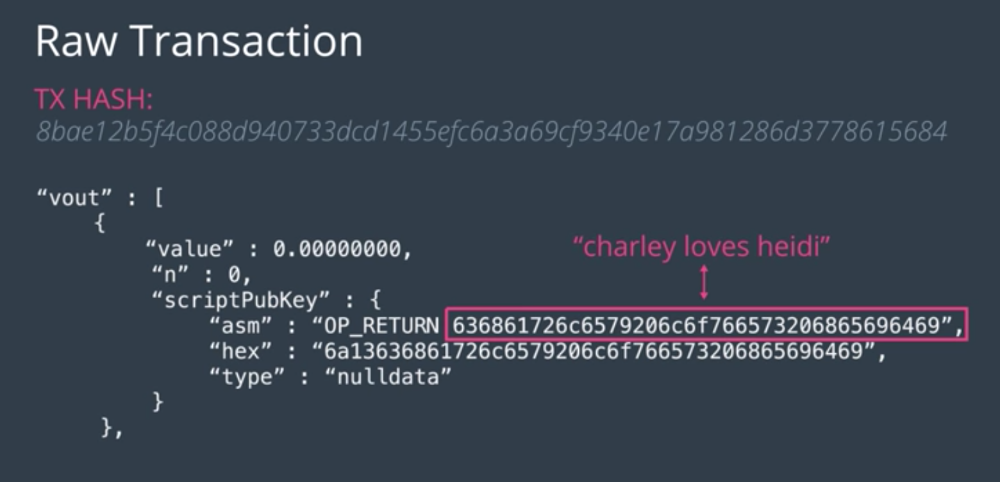

## 블록체인의 불가역성을 이용하여 데이터를 저장하는 좋은 방법이 무엇일까???

- 거래의 `scriptSig`에 값을 저장하여, 최종 Unblock 결과를 바꾸지 않으면서도 값을 저장하는 방법을 알아냄!!

## 부작용

- 하지만... 이렇게 하면 블록 내의 데이터들이 너무 무거워진다는 비판도 있었다.
  - "왜 다른 노드에까지 스토리지 부담을 지게 하냐!"
- 게다가, 어떤 UTXO는 Unlock될 수 없는 Locking Script를 갖게 되는 경우도 있었다.
  - 이 경우, 해당 UTXO는 제거도 소비도 할 수 없으므로, 그냥 그대로 UTXO Set과 Mempool 상에 방치되는 것이다. (메모리 점거)
- 그래서 `OP_RETURN` 이라는 새로운 Opcode가 소개되었다.
  - 소비가 목적이 아닌 UTXO가 사용할 수 있는 명령어. 최대 40바이트짜리 데이터를 저장할 수 있다.
  - 블록 상에 저장만 되고, mempool과 utxo set은 거치지 않는다.
- `OP_RETURN`이 들어있는 거래의 내용을 확인하고싶다면, 해당 거래를 가지고서 `getrawtransaction` 명령어를 실행해보자.

- 물론, 이딴 짓을 해도 되는지는 논쟁거리.
