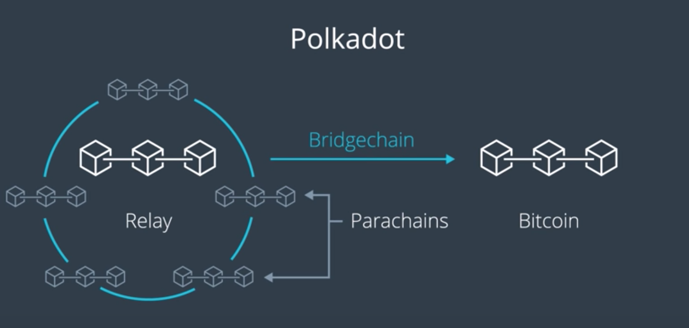

Permissioned and Permissionless Blockchain의 커다란 차이점으로 인하여, 언뜻 보기에는 Private and Public Blockchain 간에 상호작용을 하는 것은 불가능한 것처럼 보인다.
하지만 이것이 가능하다는 것을 이해하기 위하여, *Public Blockchain의 데이터를 Private Blockchain 내에 저장하는 예시* 를 살펴보자.

## 상황 1: Bitcoin 거래 활동을 기록하는 Private Blockchain

- Public Chain의 블록마다 들어있는 거래들은 Private Chain에 하나씩 기록된다.
- 이때, Public과 Private 간에는 *TX Hash* 를 통하여 연결된다.

- 반대로, Private Chain의 데이터를 Public Chain 내에 저장하고자 한다면, 플랫폼 문서를 참조하여 사용가능한 방법을 확인해야 할 것
  - 여기서는 Bitcoin Core를 사용. (아래 참조)

### OP_RETURN 활용

- 블록에 해시값이 아닌 다른 값을 저장하도록 해주는 명령어.
  - 이 명령어를 사용하여, 해당 거래와 관련된 데이터 대신 *Private Chain의 데이터셋을 참조* 하는 해시값을 저장하도록 설정
    (????)
  - 여기서 해시는 마치 DB의 Primary Key와 같은 역할을 하는 것
  - *즉, 거래가 Unique ID를 만들어내는 역할도 해내는 셈*

## 결론: 해시값의 Uniqueness를 활용하여 두 블록체인 간에 데이터를 참조하고 연결

----

## Cross Chain Functionality

- Allows a series of protocols that work in harmony to deliver decentralized applications
- 성격이 다른 두 체인 간에 연결을 맺고 데이터를 주고 받는 것
- 이제 새로 생겨나는 프로젝트들은 여러 체인 간에 상호작용하는 작업을 다룰 수 있는 Cross-chain protocol을 개발하는 방법에 집중하게 되는 그러한 시대로 접어들고 있다.

----

## 예시: Polkadot

- 다중 체인 접근방식 채용
  - Private Chain인 *Relay* 를 통하여 두 체인 간에 합의와 거래 전달을 중재한다.
  - 또한, 2번째 체인인 *ParaChain* 을 통하여 거래를 모으고 처리한다.
  - 이 두개의 체인은 외부의 Public chain에 연결될 수 있도록 Bitcoin 또는 Ethereum이 지원하는 합의 방식을 통하여 Bridge를 형성.
