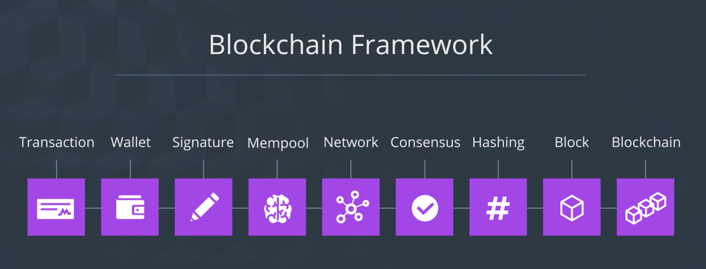
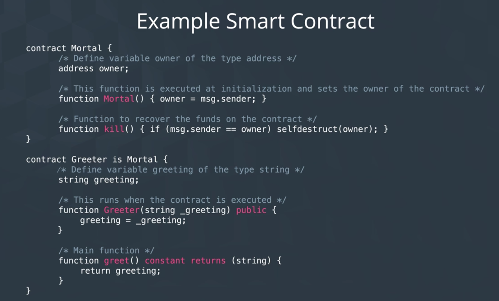

이번 절에서 배울 것:
- 이더리움이 블록체인 프레임워크(큰 구조와 구성 요소)와 무슨 관련이 있는지
- 이더리움을 시작하기 위하여 알아야 할 기본적인 용어들
- 이더리움 웹 사이트 방문해보고, 기본적인 가치들 알아보기

- 기존에 우리가 학습한 블록체인 프레임워크의 대부분 구성요소가 그대로 이더리움에서도 적용된다.
- 다만, 용어가 다소 낯설 것이다.

----

## Ethereum

- An open source, programmable public blockchain platform
  - 여기에는 내부에서 사용되는 스크립트 언어인 *Solidity* 가 포함되며, 그 외에 전혀 다른 성격의 도구들이 사용된다.

## Ethereum Virtual Machine (EVM)

- Capable of executing logic, algorithms, and processing data inputs
  - 비트코인에서는 정해진 명령어 집합만 사용할 수 있었지만, (Opcodes)
  - 이더리움에서는 개발자가 직접 원하는 스크립트를 작성할 수 있다.
    - 이에 따라 아주 다양한 종류의 탈중앙화된 어플리케이션 디자인이 등장하는 것이다.

## 이더리움은 튜링-완전하다

- Any software that is able to run code written by a developer or executed by end user
- 이더리움 플랫폼에서는 솔리디티로 작성된 스크립트가 EVM 상에서 실행된다.
  - 비트코인 스크립트는 사용 용도가 제한적이었던 것과는 대조적
- [튜링 완전에 대한 글](https://decenter.kr/NewsView/1VE1PVFSZQ/GZ05)

## Smart Contract

- A contract written in code
  - 이더리움에서는 두 거래 당사자 간에 이루어지는 협상에서 프로그래밍적으로 규칙을 부여하기 위하여 작성되는 코드이다.
- More specifically, it is an object on the Ethereum blockchain that contains EVM code functions
- 데이터를 저장하고, 분기를 통하여 결정을 내리고, 다른 스마트 컨트랙트와 통신하거나, 이더리움 화폐를 송신하는 등
  - 블록체인 상에 업로드된 스마트 컨트랙트는 해당 시스템이 종료되지 않는 한 무한히 계속하여 실행되며, 정지할 수도 없다.
  - 정지하려면, 스마트 컨트랙트 상에 *Kill Switch* 가 존재하여서 작동하는 경우에만 가능하다.

## Solidity

- High level language for coding and deploying smart contracts
- C++, Javascript, Python 등에 영향을 받았다고 한다
- 정적 타입 언어, 상속과 라이브러리 지원, 사용자 정의 타입 지원 등

## 이더리움의 궁극적 목표

- Ethereum to be a *world computer*
  - a digital computer that is decentralized globally, and executes p2p transactions and contracts
  - 이것을 구성하는 블록체인 플랫폼과 네트워크를 가리켜 *general-purpose world computer* 라고 부른다.
  - 마치 하나의 컴퓨터를 모두가 함께 나누어 사용하는 것처럼~

----

## Ethereum.org

- [build unstoppable applications, smart money smart wallet, issuing your own cryptocurrency](https://ethereum.org)
  - 이더리움이 추구하는 가치를 느껴보자.
