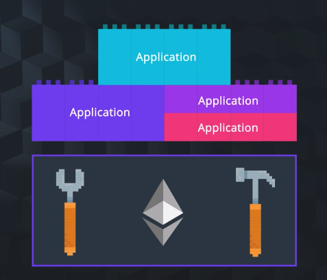
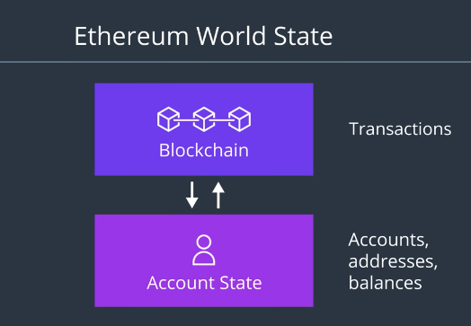
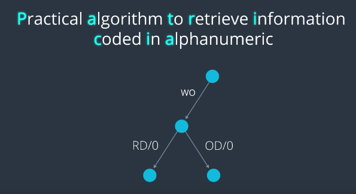
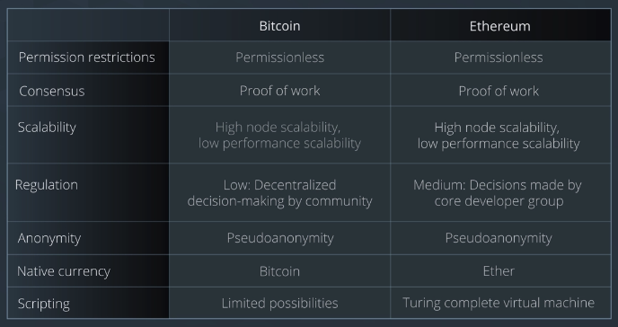
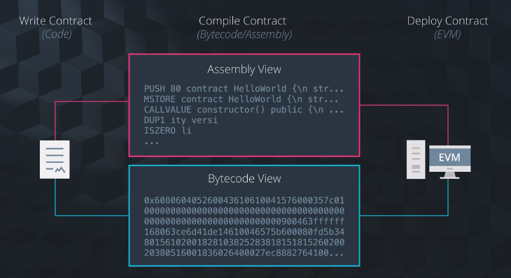

이번 절에서 배울 것:
- 이더리움이 왜 만들어졌고, 다른 플랫폼과의 차이점이 무엇인지
- 블록체인의 상태를 관리하는 데에 있어 비트코인과 이더리움의 공통점과 차이점
- 고수준에서의 비트코인과 이더리움의 차이점
- EVM이 무엇이고 왜 이것이 중요한지

----

## 이더리움의 탄생 배경

- 이더리움은 기존의 블록체인 플랫폼이 가지고 있던 문제점을 해결하고자 탄생.
- [이더리움 황서](https://github.com/ethereum/yellowpaper)를 통하여 알 수 있다. 이더리움의 Founder인 작성자는 본래 비트코인 잡지의 선임 작가였고, 비트코인의 문제를 해결하고자 하는 의도가 컸다. 그래서 의도적으로 비트코인과 달라지고자 하는 여러 가지 용어나 표현을 확인할 수 있다.

### Ethereum

- A decentralized platform that runs smart contracts: applications that run exactly as programmed without any possibility of downtime, censorship, fraud, or third-party interference
  - 왜 이더리움은 이러한 가치를 지향하게 되었을까?

### 여러 가지 용도로 사용될 수 있는 블록체인 프로토콜

- 기존의 블록체인은 Single-purpose machine과 같아서, 용도나 활용이 제한적이었다
  - 비트코인은 화페 기능을 대체하기 위한 용도, 다른 플랫폼은 저마다의 용도가 정해져있었다.
- 이더리움은 여러 가능성들을 수용하는 것을 추구했다.
  - *각자의 필요에 따라 변화할 수 있는 프로토콜*
  - 마치 *스위스 군용 칼* 처럼
- 문제는, 이렇게 되면 *새로운 기능을 추가할 때마다 개발자가 너무 힘들어진다*
  - 블록체인의 경우, 지원하는 거래의 종류를 늘리는 것이 확장이라고 볼 수 있다.
  - 새로운 거래 종류, 좋다! 그런데 이렇게 계속 확장해나가다보면, 시스템 복잡도가 너무 커진다...

### Generalized Platform that allowed others to develop on top of it

- 이더리움은 *범용적으로 사용할 수 있는 블록체인 관련 프로토콜을 제공*
  - 블록체인과 관련한 기본적인 함수나 기능은 프로토콜 차원에서 제공한다 (이건 변화하지 않는다)
  - 각 개발자는 각자의 비즈니스 로직이나 필요에 따라 각자의 앱을 개발하여, 플랫폼 상에서 사용한다 (여기가 달라지는 부분!)
- *운영 체제* 와 같은 시스템 디자인이라고 생각하면 된다
> An Operating System that gives you the tools to build many types of applications

- 이러한 이더리움이 제공하는 플랫폼 상에서 작동하는 어플리케이션을 만드는 데에 필요한 언어가 *Solidity* 인 것.
  - 공급 체인 관리, 게임, 데이터 관리 등 다양한 어플리케이션들의 개발이 가능

----

> 이 부분은 확실하게 이해가 안 된 듯 하니 다시 들어보자

## Blockchain의 State

- How a blockchain manages information within its data storage layer determines its state
  - 해당 프로토콜이 Transaction, key, fee 등의 정보를 어떻게 내부에서 관리하는가?

### Bitcoin blockchain의 State

- 비트코인에서 블록체인의 상태는 *UTXO* 가 (유일하게?) 대표한다.
- UTXO의 상태를 토대로, 블록체인과 관련된 여러가지 다른 *정보* 를 간접적으로 알 수 있는 것이다.
  - 예를 들어, `비트코인 네트워크 상에서 비밀 키를 소지한 사용자의 비트코인 잔액 = 해당 사용자에게 귀속되는 UTXO의 총합`
  - 이러한 데이터는 비트코인 네트워크 상에서 *명시적으로 관리하지 않는다*. 블록체인 상태(여기서는 UTXO의 총합)를 보고 추론할 수 있을 뿐.

### Ethereum blockchain의 State

#### 1. 이더리움 블록체인의 상태는 UTXO 이외에도 다양하다

- Account balance(개인 잔액), Nonce, Balance, Storage Hash, Code Hash, Ethereum Virtual Code 등
- 이 상태는 (해당 네트워크에서 활동하는) 모든 계정에 대한 명단을 보유하고 있고, (사용자의 지갑) 주소와 계정 간의 매핑을 제공한다.
  - 즉, 비트코인에서는 모든 데이터가 블록체인 상에 저장되지만, 이더리움은 그렇지 않다

#### 2. 블록체인과 분리된 Account State

- 블록체인의 State와 관련된 정보를 관리하는 Account State가 따로 존재
- 여전히, 거래는 모두 Ledger인 블록체인에 저장되지만, accounts, addresses, balances 등의 정보들은 State에 따로 저장되는 것.
- 이더리움에서는 블록체인과 State 간에 매핑을 지원하여, *특정 사용자의 계정 잔액* 과 같은 정보를 추적할 수 있도록 해준다.

#### 3. Patricia Tree

- Practical Algorithm To Retrive Information Coded In Alphanumeric
- 위에서 언급한 *블록체인과 Account State의 매핑* 을 지원할 수 있게 해주는 개념
  - It allows Ethereum to store values in a way that expands the state to include the account values we mentioned earlier

----

## Comparison: Bitcoin vs. Ethereum

- Performance에 있어서는 비트코인보다 관대해졌다. 블록 생성시간이 평균 약 15초.
- 의사결정권리가 모두가 아닌 일부로 제한됨.
  - 두 플랫폼 모두 오픈 소스로, 개선 제안은 열려 있음.
- 둘 다 Pseudoanonymity. 즉, 식별 가능한 익명성.

## Ethereum Virtual Machine

- 이더리움 플랫폼을 동작시키고 힘을 불어넣어주는 머신
  - 이더리움의 OS라고도 불린다.
- 전세계에 존재하는 수천개의 노드들을 작동시키는 존재
  - 각 노드들은 EVM을 동작시키며 거래를 검증한다 <- 이 노드들을 가리켜서 *World Computer* 라고 부른다.
- 이더리움과 관련된 대부분의 개념과 원리들은 EVM으로 인하여 가능해진다
  - State
  - EOAs, CAs
  - Transactions
  - Gas, Fees

> ### EVM
> - A virtual machine that excutes code.
> - A runtime environment for Smart Contracts
> - Stack-based Architecture

- EVM의 구현체가 Mainnet에 다양하게 존재한다 (마치 지갑처럼?)
  - 여러 언어에 따라 다양한 구현
- 우리는 Go-ethereum 을 사용

- 작성된 스마트 컨트랙트는 두가지 종류의 스크립트로 변환되어 EVM에서 실행된다.
- 또한, Testnet이 있어서 Mainnet에 배포하기 전에 이것저것 검증 및 실험해볼 수도 있다.
