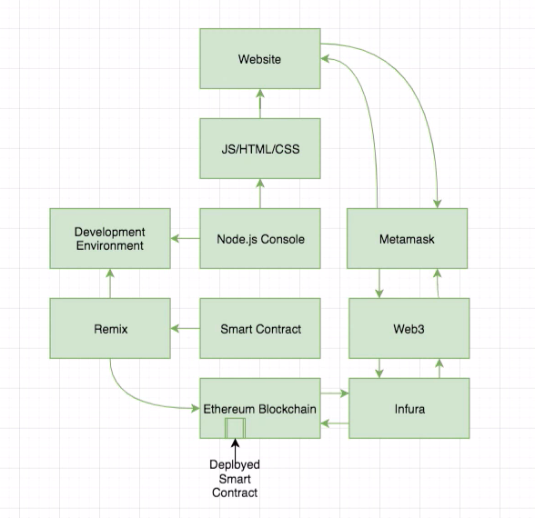

dApp을 빌드하고 이것과 상호작용하려면 Metamask를 사용하여 이더리움 블록체인과 dApp 간에 연결을 형성해야 한다.

이번 절에서 배울 내용:
1. 이더리움 어플리케이션을 위한 도구로서 Metamask의 중요성
2. Metamask 설치 및 사용
3. Ethereum Public Faucet으로 계정에 테스트 토큰 넣어보기
4. Ethereum Testnet에 컨트랙트를 배포하고, Etherscan을 사용하여 해당 거래를 조회해보기

------

## Metamask

- Metamask 라는 인터페이스를 통하여 브라우저와 블록체인 간에 데이터를 주고 받는다
  - 블록체인에 접근하기 위한 Identity 및 비용 형성, 연결 형성
  - 일종의... 브라우저용 Wallet Application 이라고 생각하면 될 듯
- Wallet은 Seed를 주입하면 생성되며 (Deterministic), 이 주소 데이터는 로컬에 저장되어 서버에 전송되지 않는다

- Metamask로는 일반적인 지갑처럼 이더 송수신을 할 수 있고
- 내가 직접 토큰을 발행할 수도 있다
  - 컨트랙트를 만들어 토큰을 발행하고, 해당 컨트랙트를 이더리움 블록체인에 배포하는 것이 가능
- Metamask를 통하여 블록체인에 데이터를 보낼 때에는, 내부적으로 Web3 API를 사용 (Metamask는 UI 역할)
- 네트워크 선택 가능
- 블록체인 네트워크와 동기화 시간이 사실상 없음; Metamask 서버에서 자체적으로 블록체인 노드를 운영하므로

## Metamask 설치

- Google Extension으로 설치

## Get Testnet Coins

- 네트워크에 따라 합의 방식이 다름
  - Mainnet과 Ropstein은 PoW, 나머지는 Proof of Authority
- test coin을 받아오려면 faucet.metamask.io 로 가면 된다
- faucet.rinkeby.io 도 존재 (Rinkeby 전용)

## 이더리움 Testnet에 앱 배포해보기

### Prerequisite

- Remix에 코드 존재 (MyMessage 컨트랙트)
- Metamask를 통하여 Rinkeby의 토큰을 가져온 상태

- Contract를 Deploy 하려고하면, Metamask가 실행되면서 거래 승인을 기다린다
  - 보내는 eth는 0. gas fee만 사용됨
  - Gas fee가 요구된다: 거래를 체결하는 데에 필요한 일종의 수수료
  - 컨트랙트 배포도 거래의 하나로 취급된다
- 배포 요청 직후에는 해당 거래(컨트랙트)의 해시값만 콘솔에 출력되고, 실제로 이러한 요청이 Confirm 되기까지 시간 간격이 다소 있다.
  - 네트워크 상에서 해당 거래가 승인되어야 하므로
  - 승인된 이후에는 콘솔에 승인 여부가 표시되며, Etherscan 에서도 확인 가능
  - 거래 링크를 누르면, Etherscan의 탐색기에서 확인 가능하고, 대응하는 컨트랙트 정보에 대한 링크도 함께 제공된다
    - 배포한 컨트랙트의 정보를 더 구체적으로 확인 가능 (Tx 내에서 거래의 *To Address*)
      - *Balance, Txs, 컨트랙트 제작자 등*
      - **컨트랙트, 즉 dApp가 하나의 계좌로서 기능함을 다시 기억하자.**
      - *Code* 탭에 들어가면, bytecode화된 코드들을 확인 가능. *Unverified* 상태이므로 별 의미는 없음

- 배포된 컨트랙트의 함수를 한번 실행할 때마다 *해당 컨트랙트에 대하여 거래를 발생시킨다.*
  - 매번 Gas fee가 필요
  - 즉각 실행되지도 않는다
- Mainnet에 배포하려면 실제 금전이 요구되고, 보안 문제를 해결하지 않고 배포하는 것은 문제가 있으므로 여기서는 크게 다루지 않음
