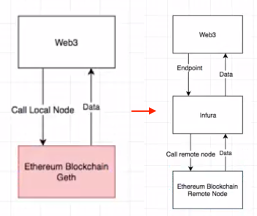

이더리움 네트워크와 연결하면, 커맨드라인 터미널을 통하여 입력하는 명령줄로 네트워크를 검색하고 데이터 CRUD를 할 수 있게 된다.
이러려면 연결을 형성해야 하는데, 여기에는 *Infura* 가 사용된다.
*Web3.js* 를 *Infura* 를 통하여 연결하게 되면, 웹 기반 인터페이스 상에서 Infura가 형성한 통신을 사용, 이더리움 네트워크와 데이터를 주고받게 된다.

이번 절에서 배우는 것들:
1. Infura의 중요성을 배우고, 이것이 DApp 개발에 어떻게 도움을 주는지
2. Infura 계정 생성
3. Web3와 이더리움 네트워크 간에 연결 형성
4. Web3-Infura 연결을 사용하여 이더리움 네트워크를 검색하는 기본적인 명령을 실행

------


## Infura는 이더리움 네트워크에 연결을 담당

- 안전하고 신뢰할 수 있는, 그리고 확장 가능한 연결을 제공하는 API와 개발자 도구 모음
  - 대상 네트워크는 Ethereum과 IPFS

### IPFS?

- Decentralized *storage*
- Ethereum은 decentralized *computer*

### Infura가 필요한 이유는?



- Web3.js 등과 같은 툴을 이용하여 블록체인과 데이터를 주고 받으려면 *연결* 이 필요!
  - Web3.js는 API만 제공할 뿐, *연결 자체는 제공하지 않음!*
- 이를 구현하는 하나의 방법은 직접 로컬 노드를 구현하는 것 - `Geth` 등을 사용
  - 전체 블록체인을 로컬에 다운로드 받아야 함. 용량이 너무 큼!
  - 지속적으로 네트워크 상의 블록체인과 동기화가 이루어져야 하고, 용량은 점점 늘어남. (650만 블록...)
- *Infura* 를 사용하면, 원격에 존재하는 노드들에 연결할 수 있는 수단을 제공받음
  - endpoint URL을 형성하고, 이를 Web3에 제공하여 마치 로컬 노드를 다루듯이 사용할 수 있도록 환경을 구성해줌
- 모든 노드를 PC에 다운로드받지 않고도, Full node에 접근하는 것과 동일한 결과를 만들어준다.
- 인터넷이 연결되어야 함.
- 기존의 대형 DApp들도 Infura를 많이 사용함. 검증됨.
  - 직접 로컬 노드를 사용하는 것에 비하여 확장성과 성능을 보장함.

## 계정 생성!

- [infura.io](infura.io)

## Web3와 Infura의 연결

```js
const Web3 = require('web3')
const url = `<API endpoint from Infura>`
const web3 = new Web3(url) // connection made
```

- 이렇게 연결을 형성했으면, 이제 생성된 `web3` 객체를 사용하여 Web3.js의 API들을 사용할 수 있게 된다

## 이더리움 계좌 읽기

```js
let address = `<ethereum account address>`
web3.eth.getBalance(address, (err, bal) => { console.log(bal) })
// '액수'
```

- Etherscan과 달리 여기서는 Wei 단위로 표시됨에 유의
- Web3.js의 Util 함수를 써서 변환 가능
