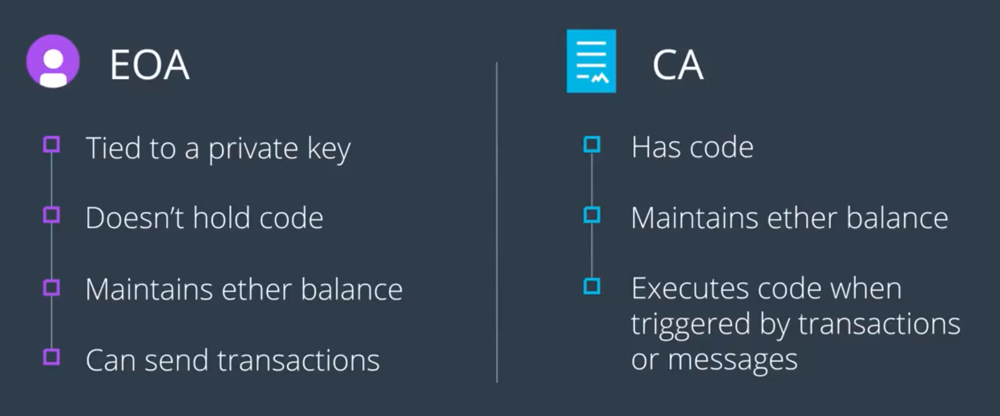

이더리움 계정(계좌)에 대하여 파헤쳐보자

이번 절에서 배울 것:
1. Externally Owned Account(EOA)와 Contract Account(CA)의 차이점 알기
2. Web3와 Infura를 사용하여 EOA의 계좌 잔고와 거래 내역 개수를 조회하기
3. Web3와 Infura를 사용하여 기존의 CA에 대하여 함수 사용해보기

----

## Account Types



### Externally Owned Accounts (EOA)

- 개인 키를 보유한 사용자는 모두 EOA를 가지게 된다
  - 이더리움 네트워크의 *사용자* 로서 보유하게 되는 것

#### 보유하는 Contents

- Account Balance
- Transaction Count: 해당 계좌로부터 발생한 거래의 개수

#### 가능한 행동

- Send transactions: 이더리움 네트워크 상으로
- Initiate a smart contract: 함수 호출
- Transfer value from its wallet to another account: 송금

### Contract Accounts (CA)

- accounts controlled by the code within a smart contract
  - ?? 즉, 누군가의 소유가 아니라, 정해진 코드에 의하여 행동하는 건가 ??
- CA는 EOA 또는 CA에 의하여 생성될 수 있다.

#### 보유하는 Contents

- Account Balance
- Transaction Count: *해당 컨트랙트가 다른 스마트 컨트랙트를 배포한 횟수*
  - EOA의 그것과 의미가 다르다
- *Smart Contract Codes*

#### 가능한 행동

- Send transactions: 이더리움 네트워크 상으로
- Initiate a smart contract: 함수 호출
- *Execute Smart Contracts / Manipulate Storage*: 다른 계좌 또는 사용자로부터 거래를 받았을 때에, 대응하는 코드가 실행된다. 경우에 따라서는 저장소를 조작할 수도 있다 (IPFS)

## Account State Variables

계좌가 가지는 여러 상태를 가리키는 값(field)들

### Nonce

- 해당 계좌에 대하여 발생한 거래의 횟수 (=Transaction counts)
  - 해당 계좌가 EOA인지 CA인지에 따라 의미가 달라진다

### Account Balance

- 해당 계좌에서 사용 가능한 Ether의 총 값 (Wei로 표기)

### Storage Hash

- Root node of the patricia tree
  - Patricia Tree: Ethereum이 사용하는 자료 구조
  - 이 트리 안에는 해당 계좌의 Content들을 사용하여 만든 해시값들이 들어있다

### Code Hash

- 스마트 컨트랙트의 코드에 대한 해시값
  - 해당 코드는 컨트랙트에 대하여 호출이 발생할 때마다 실행된다
- *다른 State Content와 달리, 이 해시값은 절대로 변할 수 없다*
- EOA는 스마트 컨트랙트를 갖지 않으므로, Code Hash도 빈 스트링이다.

### Account Storage
### EVM Code

## Demo: EOA의 정보 조회

9번 절에서 했던 것이 EOA를 다루는 것.
이번에는 동일 EOA에 대하여 다른 API를 써보자.

```js
web3.utils.fromWei(balance, 'ether')
// Wei 단위에서 Ether 단위로 변환
web3.eth.getTransactionCound(address).then(console.log)
// 결과가 promise에 포함되어 반환되는 경우 (callback 패턴이 아닌)
```

## Demo: CA의 정보 조회

CA에 대하여 API를 호출하는 것은 API를 방식이 다르다.
단순히 데이터를 조회하는 차원이 아니라, *현재 네트워크 상에 작동하는 스마트 컨트랙트를 실행시키는 것* 이다.

- 특정 컨트랙트의 정보 조회하기
  - 컨트랙트가 보유한 함수 조회하기
- 컨트랙트의 함수 실행해보기

### Contract address 가져오기

- Top 20 ERC tokens 페이지
- 아무거나 하나 고르기
- `Contract` 필드
- Code 탭에서 `Contract ABI` 가져오기
  - 이것을 통하여 컨트랙트 코드를 자바스크립트로 읽을 수 있다

```js
const abi = `<abi code>`
const contractAddress = `<contract address>`
const contract = new web3.eth.Contract(jsonInterface(abi, contractAddress))
// contract 객체를 통하여 원격에 존재하는 컨트랙트와 상호작용할 수 있게 되었다 + 각종 유틸리티 메서드도 존재
```

### 해당 컨트랙트가 가진 메서드 알아보기

```js
contract.methods
```

#### 혼동하지 말자

- `Infura`는 이더리움 네트워크와의 연결 형성 역할
- `Web3.js`는 연결을 기반으로 이더리움 네트워크을 조작하기 위한 API
- 위의 둘을 사용하여 `스마트 컨트랙트 상의 메서드`를 사용

```js
contract.methods.name().call((err, result) => { console.log(result) })
// 예시에서는 BAT 코인의 스마트 컨트랙트 중 name() 메서드 사용
// Basic Attention Token
```
