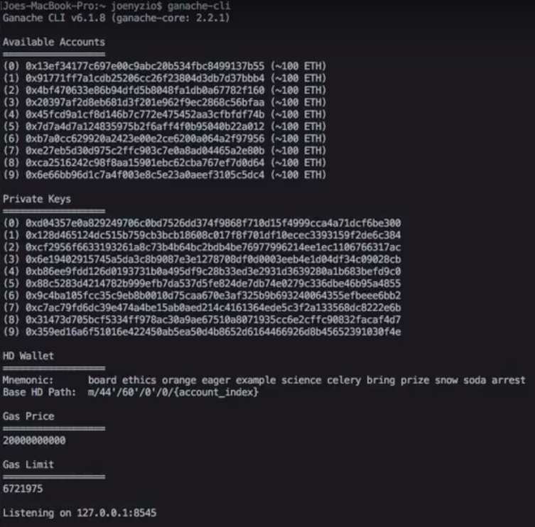

Infura를 사용하는 것은 결국 원격의 블록체인에 연결하는 것.
직전의 예시는 단순한 함수만 사용하였지만, 직접 DApp을 개발하게되고 거래가 많이 발생하는 스마트 컨트랙트를 작성하게 되면 이렇게 원격 블록체인과 상호작용하는 것은 너무 느릴 수 있다.
그렇다면, *로컬에서 블록체인을 만들어보자!*

이번 절에서 배우는 것들:
1. Ganache가 무엇인지 알아보고, Dapp을 만들 때에 이것이 왜 중요한지 알아보자
2. Ganache의 GUI 다뤄보기
3. Ganache의 CUI 다뤄보기

--------

## 기존과 같이, `Infura`를 사용하여 *개발* 을 할 경우 문제점

- 함수를 실행할 때마다 Gas Fee가 발생
- 테스트넷을 사용하면 되지만, 번거로움. 계속 충전해줘야 하고, 사용가능량이 단위시간당 한정되어있음.
- 여러 계좌에 대한 테스트를 해야할 때, 환경을 설정하는 것이 번거로움
  - ex) 5개 계좌가 모두 50 ETH 보유하고 있어야 실행할 수 있는 거래(컨트랙트 실행)
- 함수 실행 결과를 네트워크를 통하여 알 수 있으므로, 시간이 다소 지연된다

## Ganache를 쓰자!

- 100 ETH씩 10개 계좌가 미리 생성되어있다
  - Metamask에서 계좌를 새로 생성할 필요 없이, 이것들을 활용하면 중간 과정을 생략 가능!
  - **당연히, 이 계좌에 들어있는 Ganache가 만들어 준 블록체인에서만 사용할 수 있겠죠?**
- 거래가 즉시 체결된다
- 거래를 통한 함수 실행 결과를 즉시 GUI 또는 CUI로 확인할 수 있다

## 설치법

- 둘 다 기능과 결과는 모두 동일
  - GUI: [다운로드](https://truffleframework.com/ganache)
  - CUI: `npm install -g ganache-cli`
- 실행하면, PC에 생성된 로컬 블록체인의 상황을 확인할 수 있음
  - 종료해도 계속 유지된다
  - CUI 명령 함수 목록을 보고 싶으면 [공식 문서](https://github.com/trufflesuite/ganache-cli)를 읽어보자.
  - 대개 로컬 블록체인은 7574 포트로 열린다

### RPC?

- [읽어보기](https://www.slideshare.net/WonchangSong1/rpc-restsimpleintro)
- [읽어보기2](https://www.joinc.co.kr/w/Site/Network_Programing/Documents/RPC)
