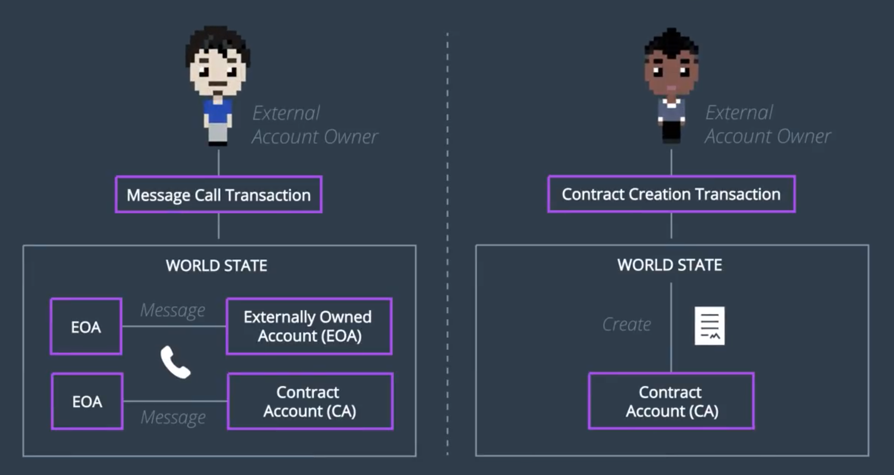

Ganache로 로컬 블록체인도 만들었고, 코드를 통하여 이것에 접근할 수도 있게 되었으니, (by Web3.js)
이제 거래를 생성해볼 차례다!

이번 절에서 배우게 될 것:
1. 이더리움에 존재하는 Transaction의 종류, Transaction 내에 존재하는 필드를 알아본다
2. 2개 Ganache 계좌 간에 오고가는 거래를 생성해본다

------

## Transactions in Ethereum move the state of the account

- 각 계좌마다 상태라는 것이 존재
- 비트코인에서는 상태란 *UTXO Pool* 뿐이었음을 상기하자

## Transaction Types

- 이더리움의 EOA는 아래 두가지 종류의 거래를 모두 발생시킬 수 있다.
- 거래는 사람(EOA) 간에, 또는 스마트 컨트랙트(CA)에게도 이루어질 수 있다.
  - *스마트 컨트랙트도 일종의 계좌와 같은 인스턴스임을 상기하자*



### Message Calls

- Message Call은 *World State* 를 변경시킨다
  - 사용자는 자신의 비밀 키로 거래를 서명하고, 네트워크에 전송한다
  - 거래가 전송되고 나면, 해당 거래에 들어있는 *Message가 실행(Trigger)된다.*

### Contract Creation

- Contract Creation
  - 스마트 컨트랙트를 만드는 데에 사용된다
- 거래의 종류는 `contract` 코드의 필드값들에 의하여 결정된다

## Example of Ethereum Tx
```js
txnCount = web3.eth.getTransactionCount(web3.eth.accounts[0])
const rawTxn = {
  nonce: web3.toHex(txnCount),
  gasPrice: web3.toHex(100000000000),
  gasLimit: web3.toHex(140000),
  to: '0x633296baebc20f33ac2e1c1b105d7cd1f6a0718b',
  value: web3.toHex(0),
  data: '0xcc9ab24952616d610000000000000000000000000000000000000000'
}
```

- Nonce: Transaction count from the sender's account
  - 해당 계좌에서 얼마나 많은 거래를 생성했었는지!
- Gas Price: Price per unit of gas you are willing to pay for executing the code in your smart contract
  - 채굴 비용과 유사한 개념
  - 스마트 컨트랙트를 실행시켜주는 대가로 특정 노드에게 지불하는 비용 (해당 거래를 채굴하는 비용)
- Gas Limit: Specifies the max number of computational steps the transaction is allowed
  - 스마트 컨트랙트가 실행되는 횟수 제한
- To: Recipient's address (EOA 또는 CA)
- Value: 송금되는 ETH의 양 (Wei)
  - 스마트 컨트랙트를 실행하는 경우, 0이 입력됨
- *Data, Init*: Information used to record the creation and execution of smart contracts
  - *다른 블록체인 플랫폼과 구별시켜주는 이더리움의 특징!*
  - 스마트 컨트랙트의 생성 및 실행을 지시하는 정보들이 기록된다
  - 컨트랙트에 대한 조건(Condition), 결과(Consequence) 등을 나열하는 코드가 들어간다

## 거래 만들기

위에 제시된 예시 거래 정보를 토대로 직접 거래를 만들어보자!

> 1. 두 계좌 A, B 설정
> 2. 거래 생성
> 3. 거래 서명
> 4. 서명한 거래를 네트워크로 송신 (A -> B)

### `ethereumjs-tx`?

- 이더리움 거래를 생성하고, 조작하고, 서명하는 데에 사용하는 모듈
- [자세한 사용법]()

### 1. 두 계좌 설정

- 비트코인과 마찬가지로, 보내는 사람의 *비밀 키(Identity)* 가 필요하고, 또한 *받는 사람의 지갑 주소* 가 필요
  - `private key` > `public key` > `wallet address`

### 2. 거래 생성

- 우리는 EOA 간의 거래를 만드므로, `data` 필드는 비운다

### 3. 거래 서명

- 거래를 보내려면, 반드시 *보내는 사람의 비밀 키로* 서명해야 한다.
- 비밀 키는 16진수로 변환되어야 함 (`Buffer()`)
- `ethereumjs-tx` 모듈의 기능들을 사용하여 이더리움 거래를 생성하고, 서명하자

### 4. 거래 송신

- 서명된 거래는 직렬화되어야 한다
- 모두 다 완료되었으면, Ganache 콘솔을 살펴보고 결과를 확인하자
  - GUI를 사용할 경우, 보낸 금액이 너무 작으면 반영이 안 될 수도 있다 (소수점 2자리까지...)
  - 새로 생성하는 거래는 직전 거래의 nonce 값 + 1을 nonce로 가져야 한다; 안 그러면 에러남

```js
/*##########################
       CONFIGURATION
##########################*/

// -- Step 1: Set up the appropriate configuration
var Web3 = require("web3")
var EthereumTransaction = require("ethereumjs-tx")
var web3 = new Web3('HTTP://127.0.0.1:7545')

// -- Step 2: Set the sending and receiving addresses for the transaction.
var sendingAddress = 'ADDRESS FROM GANACHE GOES HERE'
var receivingAddress = 'ANOTHER ADDRESS FROM GANACHE GOES HERE'

// -- Step 3: Check the balances of each address
web3.eth.getBalance(sendingAddress).then(console.log)
web3.eth.getBalance(receivingAddress).then(console.log)

/*##########################
    CREATE A TRANSACTION
##########################*/

// -- Step 4: Set up the transaction using the transaction variables as shown
var rawTransaction = {
  nonce: 0,
  to: receivingAddress,
  gasPrice: 20000000,
  gasLimit: 30000,
  value: 1,
  data: ""
}

// -- Step 5: View the raw transaction rawTransaction

// -- Step 6: Check the new account balances (they should be the same)
web3.eth.getBalance(sendingAddress).then(console.log)
web3.eth.getBalance(receivingAddress).then(console.log)

// Note: They haven't changed because they need to be signed...

/*##########################
    Sign the Transaction
##########################*/

// -- Step 7: Sign the transaction with the Hex value of the private key of the sender
var privateKeySender = 'PRIVATE KEY OF SENDER GOES HERE'
var privateKeySenderHex = new Buffer(privateKeySender, 'hex')
var transaction = new EthereumTransaction(rawTransaction)
transaction.sign(privateKeySenderHex)

/*#########################################
    Send the transaction to the network
#########################################*/

// -- Step 8: Send the serialized signed transaction to the Ethereum network.
var serializedTransaction = transaction.serialize();
web3.eth.sendSignedTransaction(serializedTransaction);
```

## Optional Exercise

### Refactoring Challenge

The code provided has a lot of extra code used for demonstration purposes. Things like console logs, over commenting, and long variable names. See if you can refactor this code down to a concise way to create your future transactions. Then try it out!

### Test network Challenge

Here's a tough challenge you can try! Remember when you got test ether onto an account earlier using Metamask? You can also use these coins to make transactions. Follow the steps below to try making and viewing live testnet transactions.
=> Ganache 대신 Metamask를 이용하여 remote blockchain을 다뤄보자
