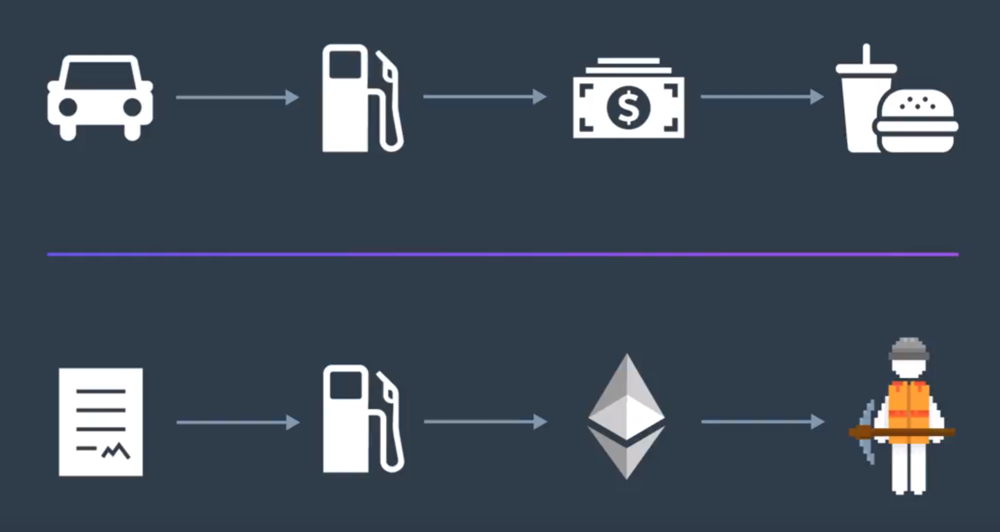

이더리움 네트워크 상의 모든 거래에는 Gas가 필요하다.

이번 절에서 배울 것:
1. 이더리움 네트워크에서 Gas와 Fee가 작동하는 원리
2. 예시 거래를 통하여 Gas Cost와 Fee의 효과를 살펴보기

----

## 이더리움에서 거래를 네트워크에 보낸다는 것

- 네트워크로 하여금, 한 계좌에서 다른 계좌로 ETH를 송금하는 코드를 실행하도록 요청하는 것
- 네트워크를 구성하는 노드 중 누군가가 해당 코드를 실행하게 된다.
  - 여기서 노드의 소유자, 즉 채굴자는 *Gas* 를 통하여 그 대가를 받게 된다.

## 비트코인의 수수료와 이더리움의 Gas Fee

- 양상과 구조는 비슷.
- 이더리움도 마찬가지로 Proof Of Work 방식으로 합의하기 떄문
  - 블록 형성을 위하여 채굴자들에게 주어지는 보상
- *당신이 만든 스마트 컨트랙트 상의 코드를 어떤 채굴자가 실행시켜주는 대가로, 이더리움 네트워크는 해당 채굴자에게 Gas를 보상*

### Gas Fee로 ETH를 사용하지 않는 이유는 뭘까?

- 실제로 ETH를 지불하는 것은 사실
- 그렇지만, *Gas와 ETH를 반드시 구분해야 한다.*

## Gas는 거래를 실행하는 데에 필요한 에너지(cost)의 개념

- 스마트 컨트랙트의 코드 상에서 사칙연산이 등장할 때마다, 거래가 발생시키는 Gas 비용이 증가한다
- 하지만 이것은 실제로 비용을 지불할 때에 사용되는 화폐단위가 아니다.
  - 코드가 실제로 실행될 때에, Gas Fee의 총합이 동등한 가치의 ETH로 변환된다
  - 채굴자는 최종적으로 ETH를 받게 되는 것

## Gas Price

- Price per unit of gas you are willing to pay for executing the code in your smart contract
  - Gas의 단위가격; 얼마로 설정하는지에 따라 최종적인 채굴 보상이 달라질 것
  - 높으면, 채굴자가 해당 거래를 먼저 선택할 확률이 올라감 -> 더 빨리 실행됨

## Gas Limit

- Maximum amount of gas a sender is willing to pay for a given transaction

> ### 가스 상한을 정하는 이유:
> 
> - 예산을 정할 수 있다; 얼마 이상은 가스 비용으로 지출하지 않도록
> - 컨트랙트의 잠재적 오류 위험으로부터 보호해준다 (무한 루프 방지)
>   - 물론, 이로 인하여 필요한 만큼의 실행이 안 이루어질 수도 있음
> - Gas Limit보다 실제 소모된 Gas가 적다면, 잔량은 다시 사용자에게 되돌아감
> - 어떤 상황이든 Gas가 소모되는 것은 동일함 => 미리 잘 설정해야!

- 이후에는 개발 도구를 통하여, Gas Fee를 예측할 수도 있다.

## Gas Cost 확인해보기

- 기존에 작성한 스마트 컨트랙트를 다시 살펴보며, Gas Fee 측면에서 우리가 간과한 점들을 다시 짚어보자

### 송금하려던 양보다 더 지출되었네?

- Gas Fee가 포함되어 함께 차감된 것.
- 이 때문에 Ganache와 같은 로컬 블록체인을 써야 한다
  - Gas Fee가 가랑비에 젖듯이 계속 소모된다...
