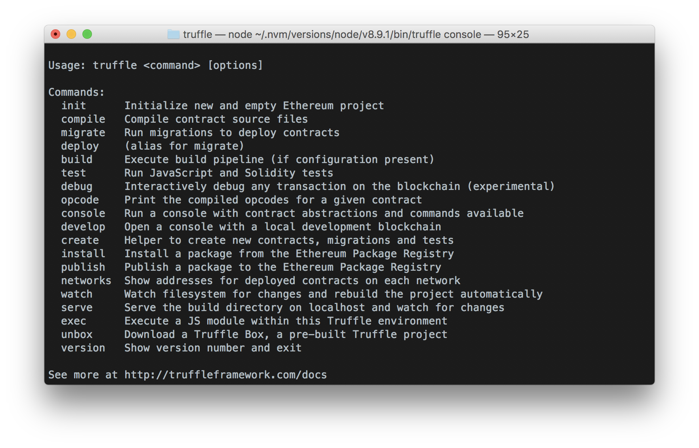

Remix를 사용하는 것 이외에 좀 더 효율적인 컨트랙트 배포 프로세스를 구축해보자!

이번 절에서 배울 것:
1. Truffle의 사용 방법 익히기
2. Truffle 세팅하기
3. Truffle로 배포해보기

----

## 기존 방식의 번거로운 점

- 계좌 설정하기
- ABI 옮겨넣기
- 컨트랙트 주소 옮겨넣기
- 등등...

## [Truffle](here)!

- 테스트, 배포, 에셋 관리 등을 간편하고 한번에
- npm과 유사한 느낌. 하나의 프레임워크.

## 환경 설정하기

> `npm install -g truffle`
> `truffle init`

### Migrate

- 스마트 컨트랙트를 배포한 뒤, abi 등을 포함하는 파일이 생성됨 (`/migrations`)

### configs

- Mac에서는 `truffle.js`
- 네트워크 연결 관련된 설정
  - 개발 중인 경우, Ganache 세팅으로 설정할 수 있음
  - Mainnet / Testnet 으로도 설정 가능
- 설정 관련 자세한 정보는 [여기로](https://truffleframework.com/docs/truffle/reference/configuration)

### compile & migrate

- `/build` 폴더에, `/contracts` 폴더 안에 json파일이 생성된다
  - abi값, 그 외에 Remix 상에서 확인할 수 있었던 다양한 정보/데이터들이 정리되어 들어있음
