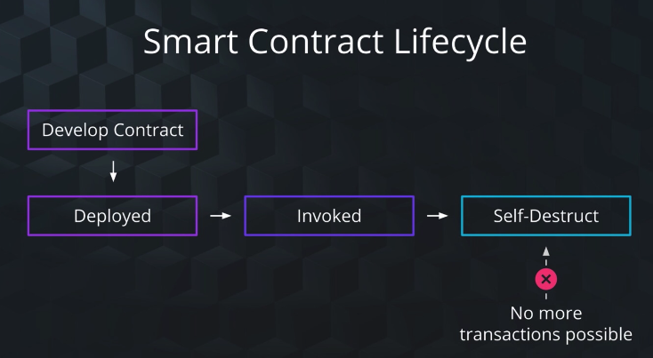
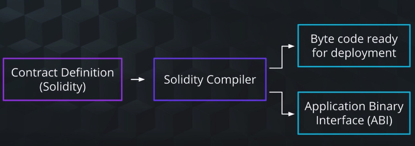
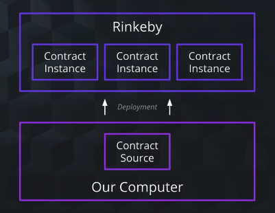
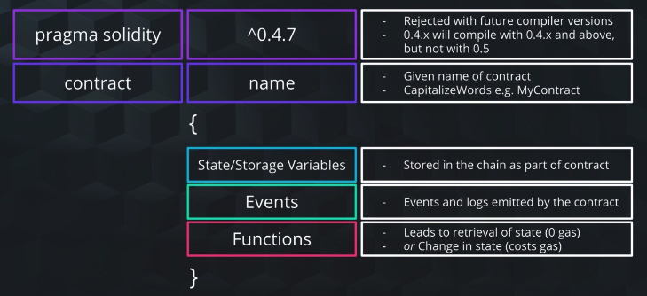

## What is a Smart Contract?

- **Smart contract is an account controlled by code**
- Piece of code that lives on the blockchain
  - 스마트 컨트랙트 코드는 네트워크에 참여하는 어떤 노드 상에서 실행된다
- A self operating computer program that automatically executes when certain conditions are met
- It can be instructed to do certain things:
  - Send money
  - Receive money
  - Transfer assets
- Smart contracts are the absolute core of Etehreum; distinguishes Ethereum from Bitcoin

## Smart Contract Properties


Field|Description
-|-
address|Unique account address
Balance|Amount of ether in Smart Contract Account
Storage|Data Storage for Contract


- Have an account address, like wallet accounts(EOA) or an email address account
- Can hold Ether, like wallet accounts or bank accounts
- Have their own storage
  - 변수, 각종 데이터들이 저장된다

## A Smart Contract Use Case

1. 구매자가 판매자로부터 물건을 구입
2. 구매자가 스마트 컨트랙트로 대금을 ETH로 전송
3. 스마트 컨트랙트가 해당 대금을 중간에서 보관 (에스크로와 유사)
4. 판매자가 구매자에게 물건을 배송, 구매자는 물건을 수령한 뒤 스마트 컨트랙트에게 물건을 수령했다고 통보
5. 스마트 컨트랙트는 이제 판매자에게 대금을 전달

## Smart Contract Languages

- Solidity (**Major**)
- Serpent
- Lisp-like language

## Smart Contract Lifecycle



- **Develop** - Write the contract and compile.
- **Deploy** - Once deployed, the smart contract is un-editable. After deploying on any network (e.g. mainnet, testnet), you get an address specific to where contract was deployed.
- **Invoke** - Use the address created after the smart contract is deployed to invoke contract to call functions on it.
- **Destroy** - Once a contract has finished its purpose, it is important to destroy it so no one can call functions on it anymore. Remember that smart contracts cannot be edited once deployed. Also, often smart contracts are tied to funds, so keeping it around if it is no longer used puts these funds at risk.

### Writing a Smart Contract

- `Solidity`를 사용
- VS Code \w Solidiry Plugin Added / 각자 원하는 에디터 / *Remix*
- `.sol` 확장자 파일
- 강타입 언어
- Javascript와 유사

### Compiling a Smart Contract



- 2가지 출력을 만든다:
  - Bytecode: 네트워크 노드 상에 직접적으로 로드되는 코드; 기계 수준의 코드.
  - ABI(Application Binary Interface)
    - 이미 배포된 컨트랙트와 상호작용하기 위하여 사용됨
    - 해당 컨트랙트에 어떤 변수와 함수가 존재하는지 알 수 있다; 훨씬 human-readable
    - 따라서, ABI를 활용하여 우리의 DApp 상에서 스마트 컨트랙트와 상호작용할 수 있게 된다

### Deploying a Smart Contract



- 마치, 스마트 컨트랙트 코드가 `class`라면, 실제 노드 상에 배포된 스마트 컨트랙트는 `instance`
- 동일한 코드로 여러번 배포한다면, 네트워크 상에도 동일한 컨트랙트를 통하여 생성한 인스턴스가 여러개 존재하게 됨 (*서로 다른 주소*)

### Invoking a Smart Contract

- 스마트 컨트랙트를 배포하고 나면, 해당 컨트랙트에 대한 주소를 반환받게 된다 => *Contract Address*
  - 해당 컨트랙트를 호출하려면 이 주소를 알아야 한다
- 여러가지 방식을 사용하여 배포된 컨트랙트와 상호작용할 수 있다
  - Online Wallet (like an Ethereum wallet)
  - Desktop Wallet
  - Hardware Wallet (Ledger, Trezor)
  - DApp
    - A way to interact with the Blockchain and the Smart Contracts using Web3 Interface
    - Web3 is a **ONLY** programmatic way to interact with the Blockchain

## Smart Contract Layout



- `pragma`: 파일 내의 `solidity` 코드의 버전 명시
  - 이 값을 기반으로 컴파일러가 버전에 일치하는 규칙을 사용하여 컴파일한다
- `contract`: `class`와 유사
  - 이 안에 적는 것들은 해당 컨트랙트의 생명 주기 동안에 존재하게 되는 값과 함수들...
  - 특정 *컨트랙트 인스턴스* 에만 종속되는 값들
- `Storage Variable`
  - 메서드 바깥에 존재하는 변수; 마치 인스턴스 필드
- `Event`
  - 특정 조건이 충족되었을 때에 Event Emit이 일어난다
- `Function`
  - 메서드; 이벤트와 다름

### Sample Smart Contract Code

```sol
pragma solidity ^0.4.25;
contract InboxContract {
  string public name;
  constructor(string _name) public {
    name = _name;
  }
  function getName() public view returns (string _name) {
    return name;
  }
  function setName(string _name) public {
    name = _name;
  }
}
```

- 해당 컨트랙트가 인스턴스를 생성할 때마다 `constructor`는 항상 실행됨
- `public` 변수를 컨트랙트 내에 생성하게 되면, 해당 변수에 대한 getter는 자동으로 생성된다(위의 경우, `getName)`; 즉, 내가 정의 안해도 알아서 만들어줌.
