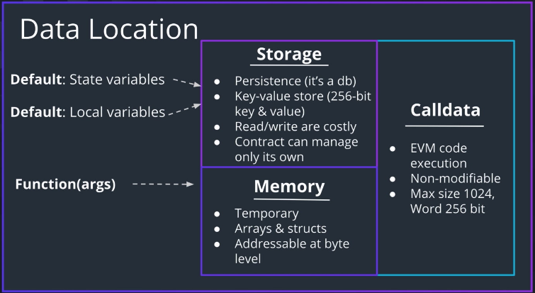

## Memory Management in Solidity



### Storage

- a database layer where contract's data is **stored and persisted**
- costly space

### Memory

- **temporary** storage and is used for call code execution
- `array`, `structure`와 같은 복합 자료구조를 할당할 수 있다
- 실행이 완료된 뒤에 모두 사라지는 데이터들

### Calldata

- 스택과 유사한 곳
- temporary and non-modifiable
- **함수 호출** 에 사용된다
  - 따라서 재귀를 너무 많이 쓰게 되면, 콜 스택 오류로 이어진다

### 강조점:

- `State Variable`은 Storage에 저장된다
  - 함수 바깥에 저장되는 변수들
- 함수 내의 `Local Variable`은 Storage 내의 데이터에 대한 참조값들
- 함수의 인자는 Memory 내에 저장된다
- `storage`, `memory` 등의 키워드를 사용하여 이러한 기본 동작을 변경할 수 있다

### 예제

```sol
contract DataLocaation {
  // Always in storage
  uint count;
  uint[] points;

  function localVariables() {
    // This will give a warning, and
    // Ask you to put the keyword `storage`
    // If you don't declare it with keyword `storage`, it will create it in storage anyway
    uint[] localArray;
    uint[] memory memoryArray;

    // Creates a reference to a storage array
    uint[] pointer = points;
  }
}
```

- `localArray`는 함수 안에 있지만, 무조건 store에 생성됨; 키워드 여부와 무관
- `pointer`는 store의 `points` 배열을 가리키는 참조값
