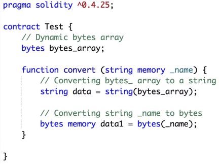
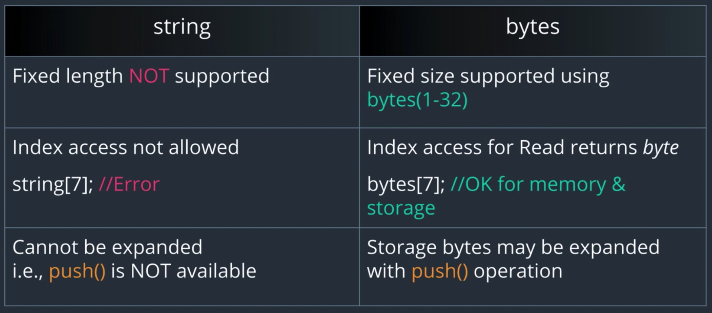
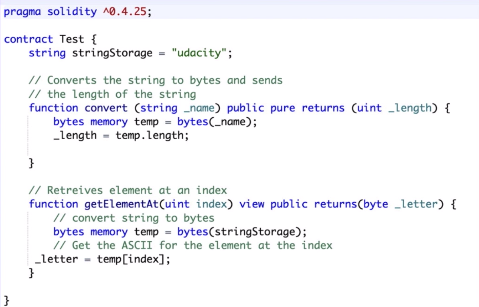
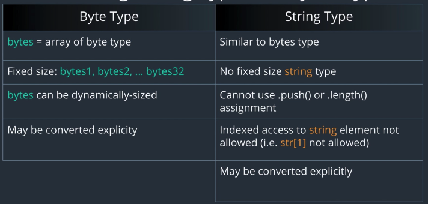

## 특별한 형태의 배열, `String`과 `Byte`

- 둘 다 `byte` 타입의 데이터를 저장하는 배열
- 둘 다 Dynamic / Static 으로 사용 가능
- 둘 다 Storage / Memory 영역에 생성 가능

## 생성 방법

### Static byte 배열

`byte[15] data; == bytes15 data;`

- 방법 1: `byte` 키워드와 `[]`, 배열 크기
- 방법 2: `bytes` 키워드와 배열 크기
- 특이한 첨자 호출 방식을 눈여겨보자:

```sol
bytes1 data; == byte[1] data;
bytes32 data; == byte[32] data;
```

### Dynamic byte 배열

`byte[] data; == bytes[] data;`

- 방법 1: `byte` 키워드와 `[]`
- 방법 2: `bytes` 키워드

## "Static" byte 배열의 제한 사항

- `Static`임을 유!의!
  - Dynamic Bytes과 헷갈리지 말자.
- 크기가 고정된 byte 배열은 *읽기 전용*
- 따라서 첨자를 사용하여 값을 수정하는 것이 불가능. 첨자로 접근한 건 읽기만 가능.
  - 길이 변경도 불가능
  - Dynamic bytes는 첨자 접근 후 수정 가능
- 작은 크기의 byte 배열은 큰 크기의 byte 배열에 대입할 수 있다 (반대는 불가능)
  - 초기화 이후 값 수정을 위한 할당의 이야기가 아니라, *최초 선언시 초기화할 떄의 이야기임.*

----

## String type

- basic type이 아닌 Complex 타입이고, value 타입이 아니다
  - 내부적으로 `dynamic byte` array; byte를 활용하여 파생된 타입
- 즉, *byte 배열과 공통점과 차이점이 존재한다*

## 둘 간의 변환은 자유로움



- 생성자를 사용하면 간단

## 차이점 비교 (Byte 기준)



1. Byte는 고정길이의 타입 선언이 가능 (bytes[1-32] 식으로)
2. 이런 이유로, 실제 코드에서는 String -> Byte 변환이 종종 있다. 특정 첨자로 접근하고자.
3. String에는 `.push()`와 `.length`가 사용 불가. Storage bytes는 사용 가능. *Memory는 불가!*

## 비교 예시



- `String`타입 값의 length를 알 수 없어서, bytes 배열로 변환한 뒤 이것의 길이를 가져옴
- 특정 첨자 접근하기도 마찬가지

## String 타입 더 알아보기

- Solidity에는 String 타입을 위한 *out-of-the-box* 기능이 별로 없다
  - 즉, 스트링 관련 유틸리티 메서드가 별로 없음;
  - 강연자는 `StringUtil` 추천
- 매우 비용이 높은 이유로, 복잡한 String 연산은 피해야 함
- 유사한 작업은 `Bytes` 타입으로 수행 가능
- 더 좋은 방법은 *프론트엔드 단에서 관련 유틸리티 작업을 수행하는 것. EVM 상에서가 아니라.*
  - raw 데이터만 가져오고, 최종 데이터만 다시 저장하기

## 정리



## 예제 코드

```sol
pragma solidity >=0.4.24;

contract StringBytes {
    // Static byte arrays, Both declarations will create array with 3 byte elements
    byte[3]  fixedByteArray; // The type byte[] is an array of bytes, but due to padding rules,
                            //it wastes 31 bytes of space for each element (except in storage).
                            //It is better to use the bytes type instead.
    bytes3   bytes3Array;

    // Dynamic bytes arrays
    byte[] dynamicByteArray;
    bytes bytesArray;

    // String variable
    string   string1 = "testing";

    // Converts the bytes type to string type
    function conversionTest() public pure returns(string memory) {
        bytes   memory string2 = "Udacity"; // dynamic memory bytes type
        string  memory converted = string(string2);
        return converted;
    }

    // Retrieves the element at specified index
    // Cannot do with strings, hence converting to bytes
    // 중요하다고 강조한 함수
    function  getElementAt(uint index) public view returns(byte) {
        // Convert string to bytes
        bytes  memory bytesData = bytes(string1);
        // Get the element at the specified index
        byte   element = bytesData[index];
        return element;
    }

    function  testing() internal pure {
        // uint8 need to be explicitly converted to byte type
        // Converting to byte type,
        // since fixedByteArray is a byte type array
        // Assignment NOT allowed as bytes3 Array is a static Array is readonly
        // bytes3Array[0] = 1;

        // Memory dynamic bytes Array
        // Static byte 배열은 읽기 전용이며, dynamic만 값 수정 가능
        bytes memory memoryBytes; // dynamic memory array
        memoryBytes = new bytes(20); //allocating memory
        memoryBytes[0] = "a";

        // Push will give compiler error as push() allowed for storage only
        //memoryBytes.push('c');
    }

    function stringExamples() public pure returns(string memory) {
        string memory string3 = "abcde";  // string array in memory
        return string3;
    }
}
```
