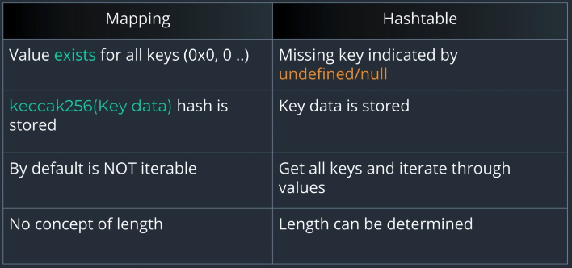
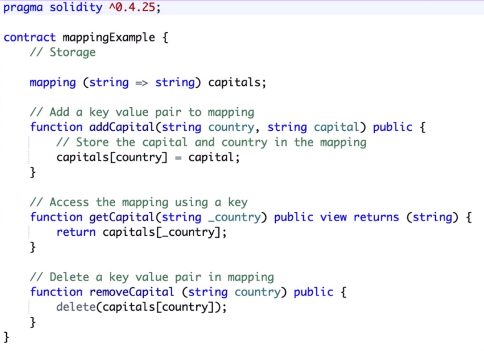

## Mapping Type

- Java의 HashTable, JS의 연관배열과 유사한 것

```js
let arr = []
arr["one"]: "one"
arr["two"]: "two"
```

- EVM 상에서 컨트랙트의 일부로서 저장된다
- *Storage 변수* 로만 생성될 수 있다
  - 즉 *Memory* 변수로 생성될 수 없고, 메서드 내의 지역 변수로서 생성될 수 없다는 의미

```sol
// storage variable
mapping(address => uint) balances;
```

- 위의 예시에서는, key가 `address` 타입이고 이에 대응하는 value가 `uint` 타입인 `mapping` 자료구조가 생성된다
  - key는 `mapping` 이외의 모든 타입이 올 수 있다
  - value는 `mapping`을 포함하여 모든 타입이 올 수 있다

## Java의 HashTable과 비교 (Mapping 기준)



- 기본 초기값이 있음; 0 또는 빈 스트링
- Key로 지정된 것이 그대로 사용되는 것이 아니라, `kecak256` 해시 결과가 Key로 사용됨
- 각 키-벨류 쌍을 순회하는 방법이 제공되지 않음
- 길이를 알 수 없음
  - 별도의 count 변수를 사용하여 저장해야 함

## 예제 코드



- `delete` 연산자를 통하여 키-밸류 쌍을 제거

```sol
pragma solidity >=0.4.24;

contract MappingsContract {
    // Creates in Storage
    mapping(string => string) relations;

    // Add a relation
    function addRelation(string memory name, string memory relation) public {
        // Store the relation
        relations[name] = relation;
    }

    // Returns a Relation
    function getRelation(string memory name) public view returns (string memory){
        return relations[name];
    }

    // Remove the key value pair from the mapping
    function removeRelation(string memory name) public {
        delete(relations[name]);
    }
}
```
