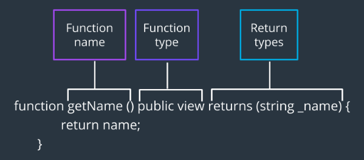
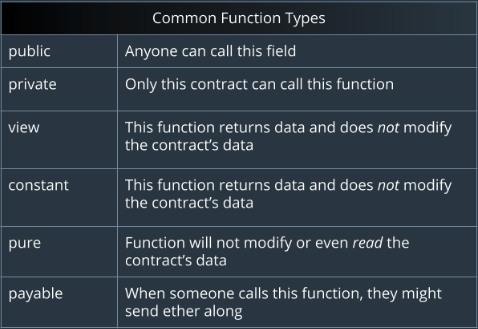
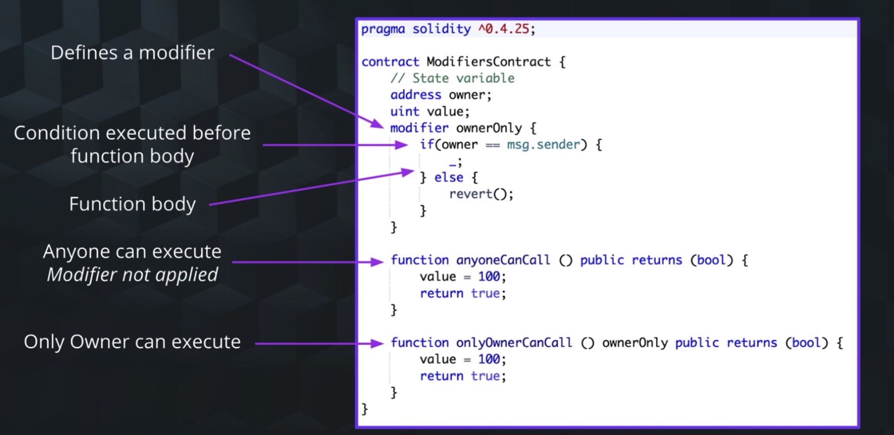

- Function type
- fallback function
- constructor function
- function modifiers

## Function Syntax



- `함수 이름 / 함수 타입 / 반환 타입`
  - `returns`의 괄호 내에는 *반환값의 타입*, *반환할 변수 이름* 등을 적을 수 있다

## Function Types



- `public`은 이더리움 계좌를 보유했다면 누구나 호출 가능
  - 따라서 ABI의 일부로서 포함된다
- `private`는 해당 컨트랙트 내부에서만 호출 가능. *상속도 이루어지지 않는다*
- `constant`와 `view`는 동일하게 동작

## Visibility Overview

- `public`, `private`, `internal`, `external`
- 이 키워드들은 함수뿐 아니라 컨트랙트 변수에도 동일하게 사용 가능

### `external`

- 해당 컨트랙트에 대하여 외부 인터페이스를 형성하는 키워드
- 이것을 사용하면, 외부의 다른 컨트랙트 또는 거래를 통하여 호출되는 것을 허용
- *이 키워드가 선언된 함수를 컨트랙트 내부의 다른 함수에서 호출하려면, `this` 키워드를 사용해야 한다.*
- 단, *Storage Variable* 은 `external`로 선언될 수 없다. 해당 컨트랙트 내부에 저장되고, 컨트랙트에 의하여 사용되어야 하므로...

### `internal`

- 이 키워드를 사용한 함수나 컨트랙트 변수는 *해당 컨트랙트 내부* 또는 *해당 컨트랙트를 상속받은 컨트랙트 내부* 에서만 사용 가능

> - 컨트랙트의 함수는 `해당 컨트랙트 내부`, `외부 컨트랙트에서`, `외부 어플리케이션에서` 호출될 수 있다.
> - 외부에서 이루어지는 함수 호출은 `EVM Message Call`을 통하여 이루어진다

## 더 알아보기

- 함수는 기본적으로 `public`으로 선언된다. 키워드를 따로 표기하지 않으면 컴파일러가 경고를 표시하지만 컴파일에는 문제가 없을 것이다.
- *`public` Storage Varible* 을 선언한다면, 컨트랙트는 해당 변수를 위한 getter 함수를 자동으로 만들어준다

```sol
string ownerName; // getter 함수 생성되지 않음
string public ownerName; // ownerName()이라는 getter 함수가 자동 생성됨
```

- 함수는 여러 반환값을 가질 수 있다; 마치 Swift의 `Tuple`처럼...
- 반환값은 여러 값들의 *배열 형태* 로 전달된다

## 함수 오버로딩 지원

- 동일 함수명, 서로 다른 시그니처

## 정리


----

## Fallback function

- 컨트랙트 내의 어떤 함수와도 시그니처가 대응하는 것이 없을 때에 실행되는 함수
  - i.e. 어떤 함수를 호출했는데, 해당 함수가 컨트랙트 내에 존재하지 않을 때!
- *단 하나만 존재할 수 있다*
- 함수 이름이 없다
- 인자도, 반환값도 없다
- 내부에 반복문을 사용할 수 없다
- 사용 가능한 가스 총량이 2300이다

## Constructor function

- 컨트랙트가 생성될 때에 자동으로 호출된다
- Solidity는 생성자 오버로딩을 지원하지 않는다.
  - 즉, *단 하나의 생성자만 사용 가능*
- 생성자 작성은 필수가 아니므로 생략 가능

## Function Modifiers - Change the behavior of a function

- 이름에서 볼 수 있듯, 함수의 작동 방식을 변경시킨다
  - 해당 함수에 대한 접근 제한을 부여한다



- 필요에 따라 제한자에도 인자를 전달할 수 있다 (예시에는 없음)
- 조건을 충족하면, `_;`로 해당 제한자를 종료
- 조건 충족하지 않으면, `revert()`를 실행하여 제한
- 정의한 제한자를 함수에 키워드로 붙여주면 된다

## 예제 코드

```sol
pragma solidity >=0.4.24;

contract constructorContract {
  uint public amount;

  constructor (uint value) public {
    amount = value;
  }
}

```

- 생성자가 인자를 받는 경우, 컨트랙트를 배포할 때에 인자를 전달해줘야 한다
  - *Remix* 의 경우, `Deploy` 옆에 인자 입력 란이 있다
- `amount`가 `public`으로 선언되었으므로, `amount`라는 이름의 getter 함수가 자동으로 생성된다

```sol
pragma solidity >=0.4.24;

contract FunctionsContract {
    contract FunctionsContract {

        string ownerName;
        uint8  ownerAge;

        // Constructor
        constructor (string memory name, uint8 age) public {
            ownerName = name;
            ownerAge = age;
        }
    }

    // We are changing the owner name and age
    function setOwnerInfo(string memory name, uint8 age) public {
        ownerName = name;
        ownerAge = age;
    }

    function secretFunction() private pure {
        // Not available outside this contract
        // 함수 내에서 컨트랙트 데이터에 대한 읽기/쓰기가 없는 경우, 컴파일러가 `pure` 키워드를 먼저 제안하며 경고한다
    }

    // Get owner name and age
    function  getOwnerInfo() public view returns (string memory name, uint8 age){
        // 반환 값들을 작성하는 방식에 주목하자
        // 결과 반환에 사용되는 변수들을 선언하고 명시하는 역할
        // 이러면 function body에 return 명령을 적을 필요가 없다

        name = ownerName;
        age = ownerAge;
    }

    // Get the name
    // 2 ways to return values from a function
    function getOwnerName() public view returns (string memory) {
        // 바로 위 방식과 대조되는 방식
        return ownerName;
    }

    // Get the age
    function getOwnerAge() public view returns (uint8 age){
        age = ownerAge;
    }
}
```
