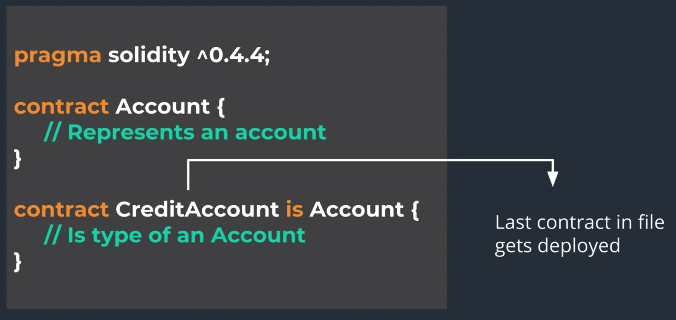
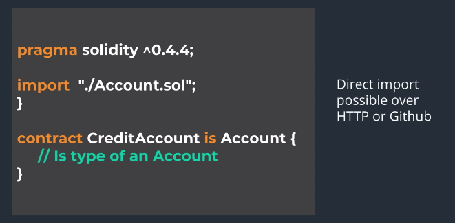

다른 언어와 마찬가지로, Solidity도 상속과 인터페이스를 지원한다.

## Inheritance in Solidity

- 추상 클래스와 다중 상속을 지원
- When a contract inherits from multiple contracts, only a single contract is created on the blockchain.
  - By Copying Code
- 어떤 컨트랙트를 상속할 경우, 여러 컨트랙트가 블록체인에 생성되는 것이 아니라, 부모 컨트렉트의 코드는 자식 컨트랙트에 복사되어서, 결과적으로 하나의 컨트랙트만이 생성된다.

### `interface`

- `interface` 키워드를 사용하여 선언
- function body가 정의되지 않는 *추상 함수* 만을 포함할 수 있다
  - 변수 포함 불가능
- *추상 컨트랙트의 함수는 모두 `external`로 선언되어야 한다*
- *추상 컨트랙트의 함수에는 `private`를 사용할 수 없다.*

```sol
function getValue () public returns (bool) ; // no function body definition
```

- 추상 컨트랙트에 존재하는 각 함수의 실제 구현은 오롯이 상속받는 자식 컨트랙트의 몫; *반드시 모두 구현해야 함.*
  - 표준 토큰이 구현되는 방식이 이러한 방식
- *추상 컨트랙트를 상속받고 모두 구현하지 않으면, 해당 컨트랙트도 추상 컨트랙트 취급된다.*




- `is` 키워드를 사용하여 상속 관계를 표시
- 최종 배포 시점에는 *파일 내의 가장 마지막 컨트랙트* 만이 컴파일되어 네트워크 상에 배포된다



- 부모 컨트랙트는 반드시 동일 파일에 존재하지 않아도 된다
- 로컬 디렉토리 내의 다른 파일, 외부로부터의 파일(HTTP / Github Link 등)로부터 불러올 수 있다
- `import` 키워드를 사용한다

## 예제 코드

```sol
pragma solidity >=0.4.24;

contract MainContract {

    uint internal value;

    constructor (uint amount) public {
        value = amount;
    }

    function deposit (uint amount) public {
        value += amount;
    }

    function withdraw (uint amount) public {
        value -= amount;
    }
}
```

```sol
pragma solidity >=0.4.24;

import "./MainContract.sol";

// We have an ContractInterface, that has a function
// sendmoney...but there is no function body
interface ContractInterface {
    function sendMoney (uint amount, address _address) external returns (bool);
}

// This is a BaseContract, that has its constructor, and deposit and withdraw functions...
contract BaseContract {

    uint public value;

    // Anytime base contract has a constructor, we will need to initialize this using
    // the derived contracts constructor function

    constructor (uint amount) public {
        value = amount;
    }

    function deposit (uint amount) public {
        value += amount;
    }

    function withdraw (uint amount) public {
        value -= amount;
    }
}

// This shows multiple inheritance

// This will give an error...since baseContract has a constructor that we need to initialize
// contract myContract is baseContract, interfaceContract {

contract InheritanceContract is BaseContract(100), ContractInterface, MainContract(100) {

    string public contractName;

    constructor (string memory _n) public {
        contractName = _n;
    }
    function getValue () public view returns (uint) {
        return value;
    }

    // Function that allows you to convert an address into a payable address
    function _make_payable(address x) internal pure returns (address payable) {
        return address(uint160(x));
    }

    // This function has to be implemented, since it is unimplemented in the interfaceContract
    function sendMoney (uint amount, address _address) public returns (bool) {
        _make_payable(_address).transfer(amount);
    }
}
```

- 상속할 때에, `is` 뒤에 각 컨트랙트들을 생성자 호출하는 식으로 표기해주는 것에 유의
  - 다중 상속을 실제로 할 때에는 상당히 헷갈릴 듯하다... 이게 좋은 방식일까?
  - 여기서는 다행히? 상속한 두 컨트랙트(MainContract, BaseContract)가 동일한 구성에 동일한 함수 몸체이지만, 만약에 그게 아니면?
  - 어떤 함수가 상속되는걸까? 둘 다?
- 추상 컨트랙트의 경우 반드시 자식 컨트랙트 측 코드 내에서 각 추상 함수들을 구현해줘야 함
- 추상 컨트랙트는 배포 자체가 오류로 취급된다

## 재미있는 점

- 위의 코드에서, 두 MainContract가 BaseContract 코드가 겹친다.
- 확인 결과 코드 실행은 `is` 이후의 작성 순서가 영향을 준다
  - 즉, 위의 코드에서는 `BaseContract(100), ContractInterface, MainContract(100)`이므로, `MainContract`의 코드가 우선 적용된다. 자리를 바꿔보면 반대로 이루어진다.
  - 그런데, `value`에 대하여 자동 생성된 getter 함수는 초기값만 출력시키는걸까? 함수로 인하여 값이 변경되었음에도 그 내용이 반영되지 않는다.
  - 그런데, `getValue`로 확인한 값은 변경되어있다. 어째서지... 가장 초기값을 상수처럼 부여받는건가?
