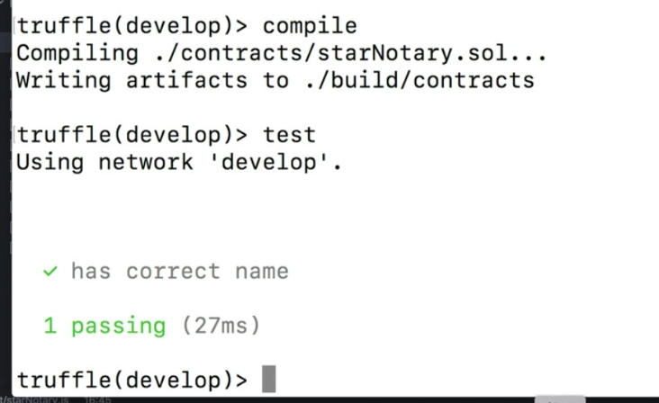
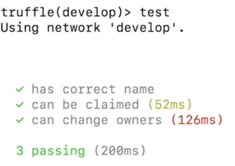

- `starNotary` 컨트랙트의 각 기능들을 테스트하기 위한 테스트 케이스들을 작성해보자.

## 지난 절에서의 내용 짚고 가기

- 블록체인에 배포된 컨트랙트를 실제로 다루는 경우, 함수 실행이 즉시 이루어지는 경우가 별로 없음
  - 따라서 `async` / `await` 를 사용하여 비동기적이지만 순서대로 로직 실행

## 테스트 케이스 1 - 정상 초기화 확인

### 컨트랙트 함수의 두 가지 종류 (1) - Basic function calls(`.call()`)

```js
// Example test case, it will test if the contract is able to return the starName property
// initialized in the contract constructor
it('has correct name', async () => {
    let instance = await StarNotary.deployed(); // Making sure the Smart Contract is deployed and getting the instance.
    let starName = await instance.starName.call(); // Calling the starName property
    assert.equal(starName, "Awesome Udacity Star"); // Assert if the starName property was initialized correctly
});
```

- `오직 상태를 *읽기* 만 하겠다`는 의도로 호출하는 함수
- 네트워크 상의 코드를 실행시키지만, Network의 state를 바꾸지 않는 경우 사용한다
  - 네트워크의 상태를 바꾸지 않는다  - 따라서 gas가 필요하지 않다; 무료!
- 따라서 컨트랙트의 메서드를 `.call()`을 통하여 호출하면, 즉시 반환값을 돌려받게 된다
  - 이번 예제에서는 반환값을 *우리가 미리 정한 값* 과 비교하여, 값이 같은지 비교 (`assert.equal()`)

#### `.call()`을 안 써도 되는 것 같던데...?

- syntax를 잘 보자. `<컨트랙트_인스턴스>.<컨트랙트_메서드>.call()` 식으로 사용한다
- 이렇게 호출하면, 이더리움 네트워크로 하여금 *우리는 불변적인 동작을 요청하는 것* 이라고 명시적으로 알 수 있게 한다
- 이런 식으로 호출하지 않고, 직접 호출하더라도 (`<컨트랙트_인스턴스>.<컨트랙트_메서드>()`) 제대로 작동하긴 한다
  - Truffle이 알아서 실행해줄 것이다
  - 단, 해당 함수가 `pure`해야 함은 필수

#### 하지만 쓰는 것이 좋다

- 명시적인 `.call()` 지정으로 가독성 높여주기
- 없더라도 다르지는 않으며, 사용하지 않는 예제 코드도 인터넷에 많으므로 헷갈리지 말자

### 테스트 실행해보기

- `Truffle console` 실행
- `compile`
- `test`



- 위와 같이 화면이 나오면 제대로 테스트를 통과한 것

## 테스트 케이스 2 - 최초 소유권 주장

### 컨트랙트 함수의 두 가지 종류 (2) - Transaction calls

```js
// Example test case, it will test is the Smart Contract function claimStar assigned the Star to the owner address
it('can be claimed', async () => {
    let instance = await StarNotary.deployed(); // Making sure the Smart Contract is deployed and getting the instance.
    await instance.claimStar({from: owner}); // Calling the Smart Contract function claimStar
    let starOwner = await instance.starOwner.call(); // Getting the owner address
    assert.equal(starOwner, owner); // Verifying if the owner address match with owner of the address
});
```

- 컨트랙트의 어떤 데이터에 대하여 **쓰기/수정** 작업을 하려면 *Transaction Call* 이 필요
- Transaction은 Network State를 변경한다는 사실을 기억하자
  - 여기서 거래는 *ETH의 송금* 과 같은 단순 작업, 또는 *특정 함수의 실행* 등 복잡한 작업일 수 있다
  - 새로운 컨트랙트를 네트워크 상에 추가하는 것도 거래의 일종이다
- 거래는 실행하려면 Gas가 필요하며, 이루어진 거래가 네트워크에 실제로 반영되는 데에 약간의 시간이 소요된다
  - 따라서, 거래를 통하여 컨트랙트 함수를 실행했다면, 그 실행 결과를 바로 받아볼 수 없다. 반영이 즉시 이루어지지 않으므로
  - 따라서, *거래를 통한 컨트랙트 함수의 반환값* 은 어떤 값이 아니라, *해당 거래의 ID(TxID)* 이다.

#### `.claimStar()`는 본래 인자를 요구하지 않았는데...?

- Tx Call은 가장 마지막 인자를 선택적으로 전달할 수 있다
- 여기에는 해당 거래에 대한 설정이 들어갈 수 있다
  - `from`, `gas`, ...
  - 객체 형태로 전달
  - 아래에서 더 자세히 다룰 예정
- 만약 해당 함수를 실행하는 데에 필요한 인자가 있다면, 그 인자들을 모두 써준 뒤 가장 *마지막에* 덧붙여준다

## 테스트 케이스 3 - 2회 이상 소유권 변경

```js
// Example test case, it will test is the Smart Contract function claimStar assigned the Star to the owner address and it can be changed
it('can change owners', async () => {
    let instance = await StarNotary.deployed();
    let secondUser = accounts[1];
    await instance.claimStar({from: owner});
    let starOwner = await instance.starOwner.call();
    assert.equal(starOwner, owner);
    await instance.claimStar({from: secondUser});
    let secondOwner = await instance.starOwner.call();
    assert.equal(secondOwner, secondUser);
 });
```

## 명령어 정리



- `truffle develop` or `sudo truffle develop` to run Truffle Development environment.
- `compile` to compile any changes in the Smart Contract.
- `migrate --reset` to migrate and create a fresh and clean Smart contract session.
- `test` to run the test cases.
