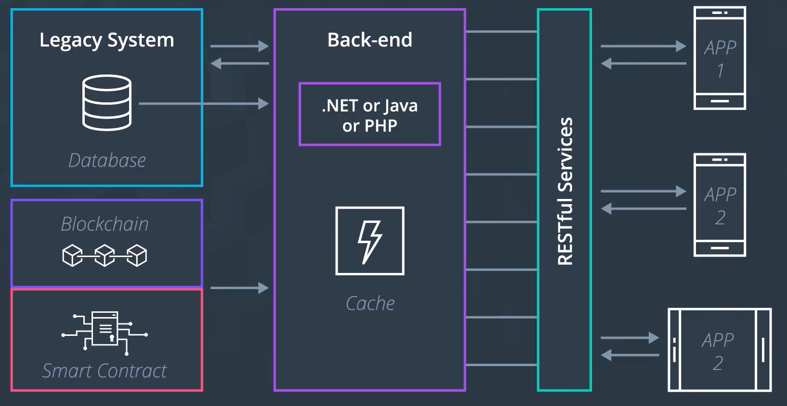

- 블록체인의 구조를 활용하여, 블록체인 기반의 솔루션을 어떻게 만들까?
- 블록체인 구조를 제대로 이해하고, 이를 반영하여 설계하지 않으면, 결과물이 무의미해진다.

## 예시: Medical Record System

- 다층적인 서비스 아키텍처 필요 (블록체인 자체만으로 추가 레이어가 다수 요구)

- 레거시 아키텍처에 대한 호환성 필요

- 여러 이해당사자의 사용이 예상
  - 데이터 보안이 아주 중요
  - 권한의 세분화 및 사용 가능 서비스 제한 필요

## Lesson Topics

- Blockchain Architecture Overview
- Planning how to architect a solution
- Overview to Tools
  - UML: Used for modeling behaviors and structures in Smart Contracts
  - Data Model Diagram: Used to model Smart Contract Relationships
  - Layering Services
