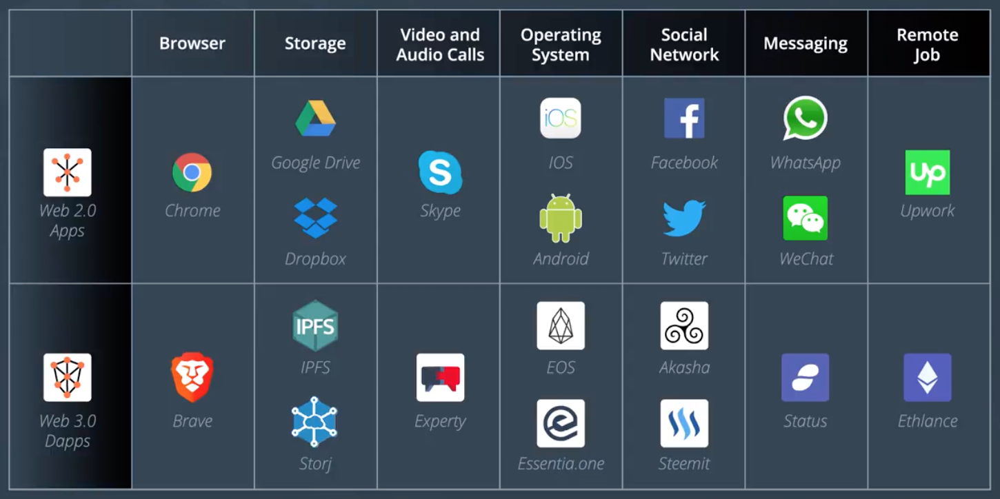

우리가 만들 블록체인 솔루션은 WWW에 연결된다. 우리가 만드는 기반 환경에 대하여 알아보자.

## Index

- Web 1.0 / Web 2.0 / Web 3.0
- 인터넷의 과거, 현재, 미래

## Web 1.0

- 인터넷의 태동
- 사용자는 서버에서 데이터를 *읽기* 만 할 수 있었다
  - 컨텐츠를 만드는 역할은 없었다

## Web 2.0

- 사용자 간의 상호작용이 가능해짐
  - 메시지나 사진 등의 교환
  - 소셜 네트워크 서비스
- 사용자가 컨텐츠를 만들어내기 시작
- 인터넷 서비스의 성장 - Google, Facebook, Uber, Amazon, ...

### 문제: 컨텐츠는 사용자가 만들지만, 그것의 가치는 일부에게...?

- 데이터에 대한 부가가치와 소유권은 *일부 중간자* 가 지배(Dominate)
- 예를 들어, 음원 스트리밍 플랫폼 상에 올라간 음원이 창출하는 부가가치는 온전히 저작권자가 갖지 못한다
  - 플랫폼 운영자/서비스 제공자가 수익의 일부를 가져가기 때문

### 이런 맥락에서 제기되는 Web 2.0의 문제점

- Internet does not hold state outside of service giants
  - 상태를 유지/관리해줄 서비스 제공자가 항상 필요한 상황 (서버, DB 등)
- No *native* mechanisms to transfer state
  - 위의 문제와 연관되는 이야기
  - 인터넷에 연결된 장치에, 인터넷의 역사 혹은 현재 상태를 쿼리하였을 때에, 이를 처리할 수 없다
  - 어떤 상태를 제공받으려면, 결국 (독점적인 위치의) 서비스 제공자가 존재해야 한다

### Web 2.0의 대안: Cookie

- 로컬 장치에 웹앱의 상태를 보관하기 위함
- 하지만, 쿠키 역시 서비스 제공자가 통제하는 자원.
  - 사용자는 서비스 제공자가 쿠키를 어떻게 활용할 수 있는지에 대한 통제를 전혀 갖지 못한다
- 중앙화된 존재가 모든 상태를 보유한다
  - 반드시 서버를 거쳐야만 인터넷 상의 어떠한 변화를 만들어낼 수 있는 구조

## Web 3.0 - Blockchain

- Allow Internet to hold and transfer state and value in digitally native way
- Users directly benefit from the content they create
  - 중앙화된 존재 없이, 참여자 모두에 의하여 데이터가 보존되므로; 배타적으로 데이터를 갖지 않는다
- 스마트 컨트랙트를 통하여 거래가 이루어지고, 토큰화된 상품을 대가로 암호화폐를 지불한다

## 대표적인 Web 3.0의 웹 서비스들

## Resources

- [Article - Why the Web 3.0 Matters and you should know about it](https://medium.com/@matteozago/why-the-web-3-0-matters-and-you-should-know-about-it-a5851d63c949)
- [Article - Understanding Web 3 — A User Controlled Internet](https://blog.coinbase.com/understanding-web-3-a-user-controlled-internet-a39c21cf83f3)
