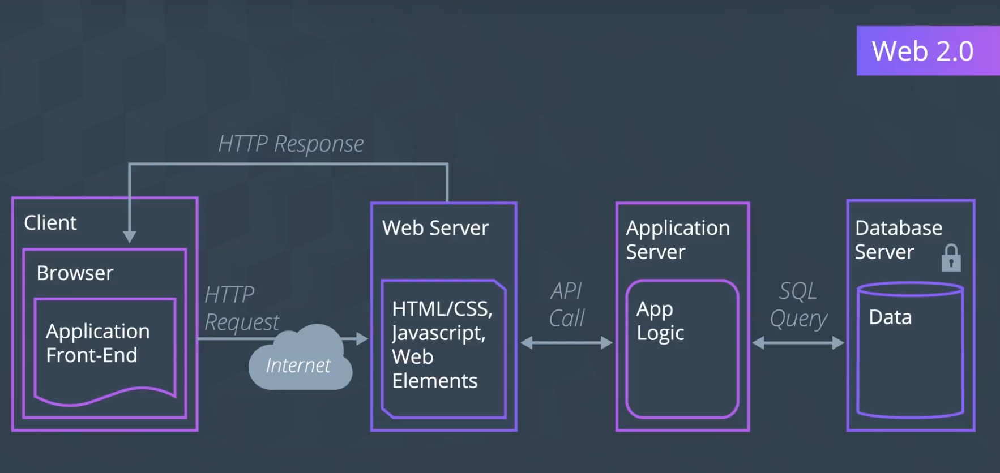

# Architecture and Benefit of Web 3.0

## Current Web 2.0's Architecture

## Web 3.0's Architecture (simplified)

인터넷이 State를 자체적으로 전달할 수 있도록 만들기 위하여, Web 3.0에는 새로운 구성 요소를 도입한다.

### (1) Wallet

- Wallet은 사용자가 Web3 Application과 인터랙션을 갖기 위한 핵심 요소이다
  - 사용자가 개인의 비밀 키를 관리하고, 거래를 서명할 수 있도록 해준다
  - 또한, 프론트엔드 클라이언트와 상호작용하며, Seamless한 User eXperience를 제공하도록 해준다
- Web3.js 호출의 예시는 *결제 요청*
  - (1) 사용자는, 자신의 지갑이 특정 금액 만큼을 특정 어플리케이션의 주소로 송금하는 작업을 승인(Confirm)할 것을 요청받는다
  - (2) 사용자가 이를 승인하면, 프론트엔드에서는 적절한 메시지 출력으로써, 결제가 이루어졌음을 사용자에게 알린다
  - (3) 이제, 지갑은 RPC(Remote Procedure Call) 호출을 한다
    - 블록체인 노드(Remote)가 승인된 거래를 블록체인 네트워크 상에 올리도록(Post; Procedure) 요청(Call)

### (2) Blockchain Server

- 지갑을 통하여 블록체인 네트워크 상에 거래를 보내고자 할 때, 또는 블록체인으로부터 어떤 데이터를 요청하고자 할 때, 블록체인 Node Provider의 역할을 하는 서버에 요청을 보낸다
  - 오늘날 AWS 서비스가 Backend 서비스를 제공하기 위하여 작동하는 원리와 유사;
  - 중간 Gateway 역할을 하게 되는 것

### (3) IPFS(InterPlanetary File System) Node

- P2P 파일 공유 시스템으로, 데이터가 저장되고 분배되는 방식이 기존과 차이가 있다
  - 서버와 클라이언트 간의 가용성에 따라 확장이 가능한 형태 (이후 자세히 배운다)

## 이 또한 아직 태동 단계!

- 아직 완성된 것이 아니다
- 우리가 새로운 모델을 만드는 데에 일조할 수도 있다

## Web 3.0 Questions

- Will Web 3.0 completely take over Web 2.0 or the Two will continue to co-exist? If so, how so?
- Will there be apps that cannot be decentralized?
- What are the privacy and security concerns with these added components?
