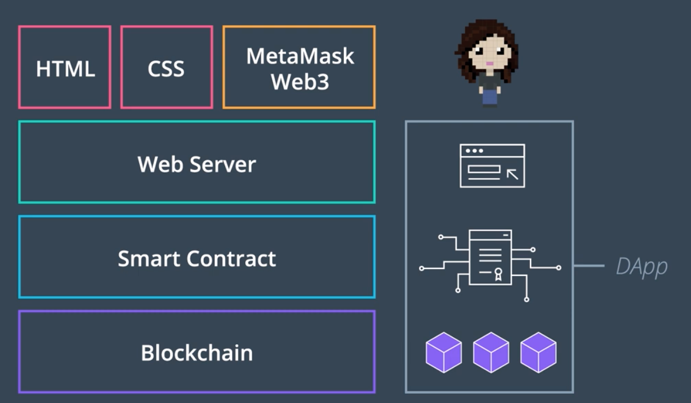
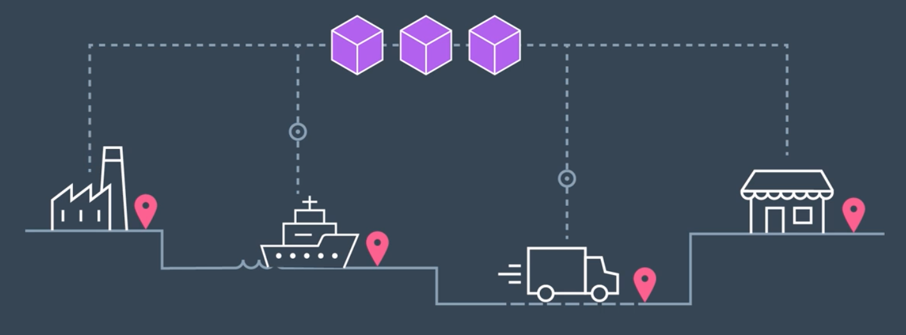
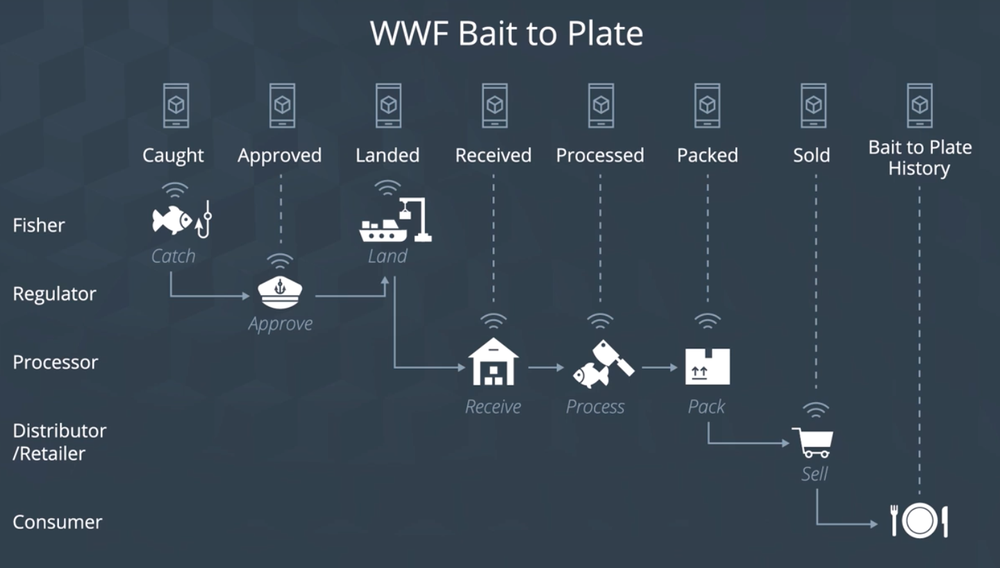

## Index

- Blockchain Solution(Dapp) Layer
- Modeling Blockchain behavior with Structure and Structure
  - Tools to be used

## Blockchain Solution Layer

### Backend

- Blockchain: 실질 데이터가 저장되고, 거래가 유지되는 공간
- Smart Contract: 블록체인 내의 여러 계좌들과 오고가는 데이터에 영향을 줄 수 있는 거래를 발생시키는 프로그램

### Frontend

- DApp에 대하여 CRUD 및 상호작용 가능한 모든 웹 서버는 사용 가능
  - 우리 실습에서는 *Node.js* Stack을 사용
- Metamask: 제3의 사용자가 Ethereum Full Node를 직접 운용하지 않고도 DApp을 사용할 수 있도록 해주는 도구

### 여전히, Frontend는 중앙화된 상태인 듯 한데?

- Backend는 이더리움 스마트 컨트랙트를 쓴다고 해도, 프론트 단은 여전히 전통적인 서버 구조이다
- 여기에서 *IPFS*, *Swarm* 등의 탈중앙화된 스토리지를 사용하게 될 것

## Modeling Blockchain behavior with Structure and Structure

- 우리가 만들 것들은 궁극적으로 *정보와 존재의 기술적인 표현* 에 불과
  - 우리가 만든 DApp Solution이 실제로 직면할 문제 상황 속에서, 어떤 *행위와 구조* 를 보일지 상상해보자

### 예시: 참치 공급 체인

- 공급 체인에서 반드시 고려해야 할 구성 요소들을 살펴보자

### (1) Asset
- Any physical or digital entity that requires tracking (real estate, education, oil/gas, transportation, healthcare)
- 물리적 대상; 여기서는 참치 원재료에 해당

### (2) Attribute
- Attributes of interest: asset (what), ownership (who), time (when), and location (where)
- 언제 어디서 잡혔는지, 누가 가공처리했고 누가 분배했는지 등을 빠짐없이 기록

### (3) Actor
- Users that interact with the asset to perform process actions and transform the asset from one state to next. Users that have ownership or custody of the asset. Users that participate in audit, review and attestation of the asset to validate history.
- 각 자산에 대하여 영향력을 행사할 수 있다 - 평가, 감사 등;
- 이러한 행위들은 모두 기록에 남는다

### (4) Role Permission
- A class of users performing similar actions or functions are grouped into roles. Permissions to perform business actions are assigned by roles. The web interface and smart contracts enforce the permissions, preventing rogue users from tampering
- 각 역할에 따라 사용 가능한 기능들을 제한
- 생명 주기의 어떤 시점인가에 따라 표시되는 정보의 종류가 변화
  - 역할이 무엇이냐에 따라, 관심있는 정보가 달라지므로

### (5) Business Process
- Progression of assets through various steps of a business process recorded for trail of evidence. Smart contracts enforce the business process on chain curbing rogue actions

### (6) Business Actions
- User or machine initiated actions that allows assets to progress from one process state to the next

## 유의

- 한 행위자는 하나 이상의 행위를 할 수 있다
- 자산은 각 행위자 간에 얼마든지 오고갈 수 있다
- 따라서, Breaking down the supply chain into the structure and behavior will help you scope out how to develop the functionality each user needs as well as what data should be saved, and when certian actors should be able to access the data.
