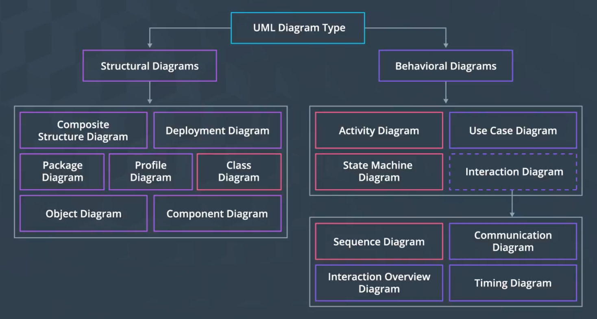
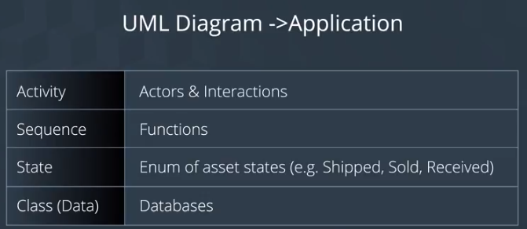

개발하고자 하는 시스템의 디자인을 시각화하고자 할 때에 UML은 유용한 도구이다. UML을 사용하여 블록체인 솔루션을 개발하고 스마트 컨트랙트를 디자인해보자

# Unified Modeling Language

- 핵심 구성 요소: `Actor`, `Role`, `Action`, `Data`
- 4가지 구성 요소가 만드는 시스템을 시각적으로 표현한다
- 본 코스는 UML에 모두가 익숙하다고 가정 (...)

## Index

- UML Background
- Designing Architecture
- Design your own UML Diagrams!

## Why use UML?

- 각 행위자와 자산 간의 Relationship을 모델링하여 표현한다
- 모델링을 통하여, 필요한 데이터를 추상화하고, 데이터베이스의 데이터 저장 모델을 추출해볼 수 있다
  - 대상에 대한 어떤 Attribute가 저장되어야 할지, 특정 시점에는 어떤 권한을 가진 행위자에게 어떤 데이터가 제시되어야 하는지 등
- 각 단계에서 이루어지는 서비스들, 각 행위자들에 의하여 사용되는 여러 절차(Procedure)들을 일목요연하게 확인할 수 있다
- Cross-Team Communication Tool (Software Engineering aspect)



- 서로 다른 것에 초점을 맞춘 다양한 도형들이 존재; 모두 서로 연관되어있다.

## Designing Architecture

- UML 도형은 크게 2개 하위 부류로 나뉜다: Behavior / Structure
- 솔루션을 디자인할 때에는 `Behavior`를 먼저 다루고, 그 다음에 `Structure`를 다룬다.
  - 구체적으로는 `Activity` → `Sequence` → `State` → `Class` 순으로 디자인한다
- 이 설계를 활용하여, 스마트 컨트랙트와 DB 구조를 설계하는 데에 유용하게 활용하자



- Activity
- Sequence: 사용자가 자산에 대하여 취하는 행위를 스마트 컨트랙트 상의 함수로 구현
  ```solidity
  contract SupplyChain {
    // Allows seller to change item state to "shipped"
    function shipItem (uint sku) public {
      // ...
    }
  }
  ```
- State: 자원이 가지는 각 상태
- Class: 자원에 대한 Type

### Assumption

- 몇 가지 가정을 하면서 UML 설계의 예시를 들어보자
  - 이때 작은 규모의 예시를 들면 변수를 최소화하여 설계를 하기 좋다

> - Payment is kept very simple (Owners pays using ETH)
> - Change is kept very simple (Any excess ETH is returned to the buyer)
> - Anyone in the value chain can track authenticity
> - Returns are out of scope

- 앞으로의 UML 설명의 이러한 예시를 중심으로 진행할 것

----

## Definitions
### Different Types of UML

- **Class diagram** : A structure that represents the components of a systems by illustrating the system's classes, attributes, operations, and how the objects may be connected.

- **Object diagram** : A pectoral graph describing instances and their associated objects and data values.

- **State diagram** : - Shows changes from one state to another and usually depicts the creation state and final states if there are any.

- **Activity diagram** : - Flow of one activity to another in the system. Captures dynamic behavior of the system.

- **Sequence diagram** : - Integration between objects in the sequence in which they take place.

### Resources

- [Article & Video | UML Activity Diagram](https://www.lucidchart.com/pages/uml-activity-diagram)
- [Video | UML Sequence Diagram](https://www.youtube.com/watch?v=pCK6prSq8aw)
- [Video | UML Class Diagram](https://www.youtube.com/watch?v=UI6lqHOVHic)
