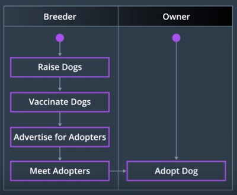

## Activity Diagram

### Purpose

An activity diagrams represents the *flow* from one activity to another in the system. It captures the dynamic behavior of the system.

Activity 도형을 그리는 다양한 방법 가운데 이 강의에서는 위와 같은 *Swimlane* 형식을 채택
  - 어떤 *행위자* 가 어떤 *행위* 에 대하여 책임을 갖는지 명확하게 보여준다

### Quiz

- Think about your own supply chain blockchain situation (Use this as inspiration for your capstone project)
- Design Activity, Sequence, and State Diagrams for that situation
  - 여기서 디자인한 도형들은 이후에 캡스톤 프로젝트에 함께 제출해야할 것

### 의의?

직접 구조를 설계해보는 행위 자체가 아이디어를 명확하게 하고, 설계를 구체화해준다.
