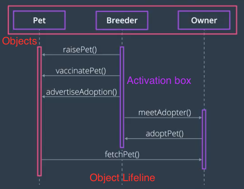

## Sequence Diagram

### Purpose

A Sequence diagram represents interaction between objects in the order or the sequenec in which the interactions take place.

### Components

- **Object** : which are involved in the system; Instances of classes
- **Object Lifeline** : The lifespan of the object doing scenario being modeled
  - To show an object interacting via a method call, draw a horizontal line from one lifeline to another
  - The method name is placed above this arrow line
- **Activation box** : Indicating when the actor or the object is active and processing the methods
