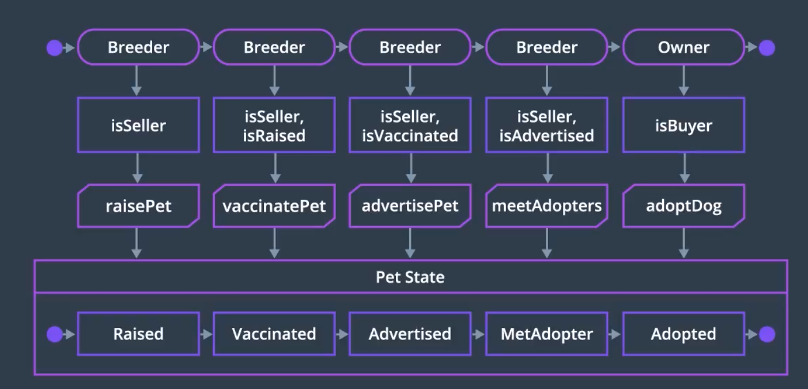

## State Diagram

### Purpose

A State Diagram is a type of behavior diagram that shows how an object moves through various states within its lifetime

Activity 또는 Sequence가 변화를 만들어내는 과정 또는 명령들만을 보여주는 것과 달리, State Diagram은 자산의 *실제 변화* 양상들을 보여준다

- State Diagram을 그릴 때에는, **시작 상태** 과 **끝 상태** 을 명확하게 정의해야 한다
- 그 밖에도 각 Object에게 필요한 *생명 주기의 단계* 가 존재하는지 고려한다
  - 놓친 부분이 있는지...

### 우리의 예시에서

- 우리가 가장 관심있는 것은 *Pet의 상태*
- 이전에 그린 Sequence와 Activity 모형을 참조하면, Breeder와 Owner의 상태도 고안할 수 있다

----

## Resources

- [Draw.io Flowchart Tool](https://www.draw.io/)
