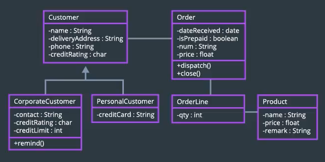
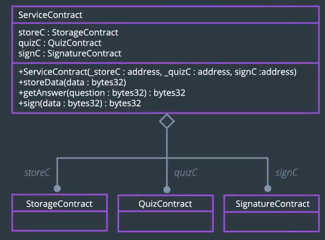
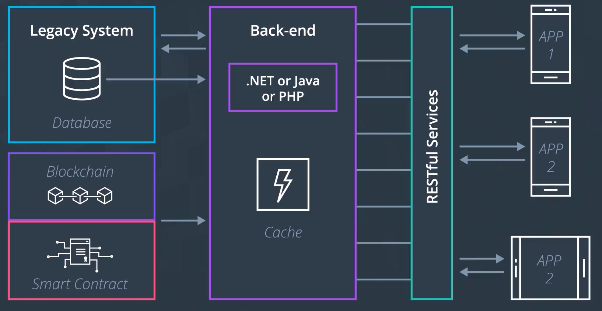
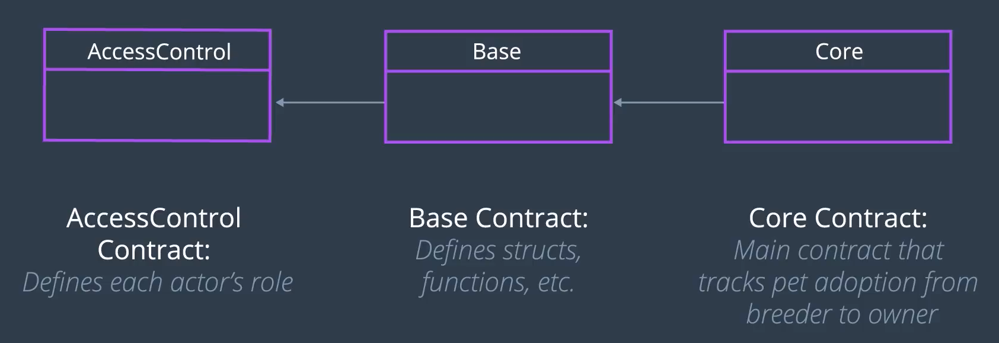
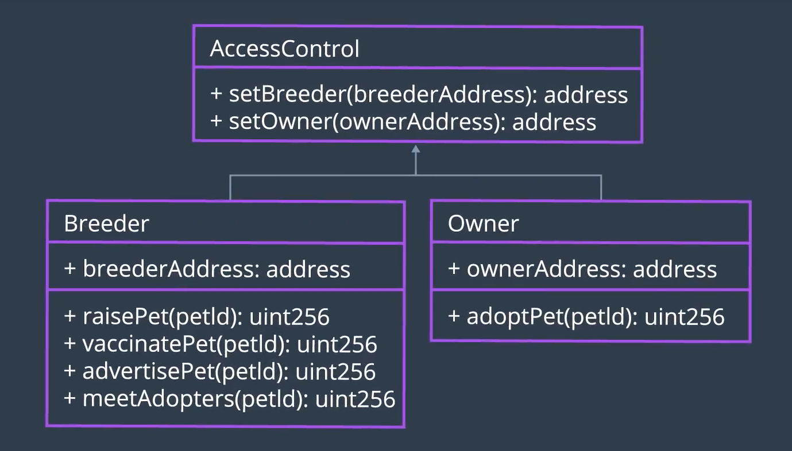
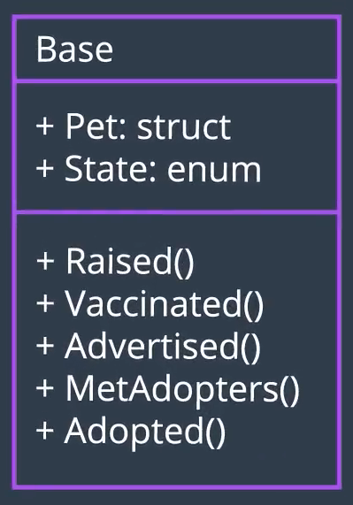
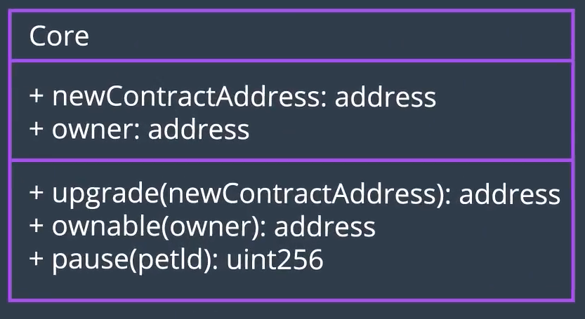
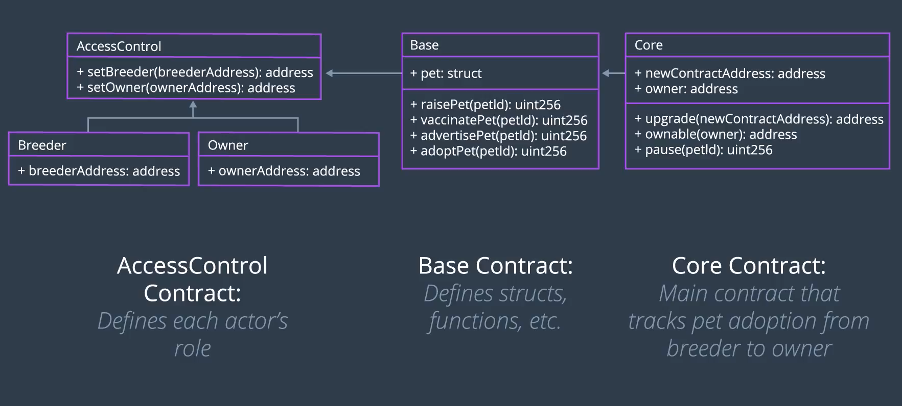

- Behavior Model & Diagram가 완성되었다
  - 여기에는 기존에 만든 `Activity`, `Sequence`, `State` Diagram이 사용되었다
- 이제 Data를 모델링해보자

## Traditional Class Diagram



일반적으로 사용되는 `Class Diagram`은 어떤 시스템에서 사용되는 *Class* 와, *Class* 로 생성한 *Object* 들이 가지는 상호간의 관계들을 모델링하는 것으로 해당 시스템의 구조를 보여준다.



우리가 실제 블록체인 시스템을 구현하기에 앞서, 이 모형을 사용하여 스마트 컨트랙트의 *Attributes* 와 *Relationship* 을 모델링할 것이다. 앞으로 우리는 이것을 `Data Modeling Diagram`이라고 부를 것이다. 우리의 DApp 상의 데이터들을 모델링하여 표현하는 데에 사용하는 모델이므로!



### 그러면... 어떤 Database를 써야 할까요?
- 기존에 사용되던 형태의 DB, 또는 블록체인 기반의 데이터 저장 솔루션?

### 이 데이터(정보)들을 어떻게 효율적으로 조직화할 것인가?
- 사용자가 수백 ~ 수천명이라고 가정해보자.

## 우리가 앞으로 주목할 지점

- Structural: Focus on the common `structure`, `the values`, `classifiers`, and `packages`
- 구조적인 측면을 고려해보자

### 어떤 식으로 스마트 컨트랙트를 구조화할까?

- 한 파일에 모든 코드를 모아놓지 않을 것 → 여러 파일에 분산하고, 의존성을 형성
- 확장에 용이한 형태로 설계 → Actor / Behavior가 추가되더라도 재설계 용이
- 이러한 고려를 반영한 설계가 아래의 것

## Data Model - 3 Contracts



```solidity
contract AccessControl
contract Base is AccessControl
contract Core is Base
```

- **실선**: 연관 관계
- **열린 화살표**: 상속 관계 (향하는 방향이 부모)
- 위의 경우, `Core` 컨트랙트가 실질적으로 블록체인 상에 올라갈 주요 컨트랙트
  - 나머지 컨트랙트들을 모두 모아주는 컨트랙트

### `AccessControl` Contract



- 각 Actor에 대한 접근 권한을 제어하는 스마트 컨트랙트
  - 각 Actor들은 서로 겹치는 역할을 갖지 않으며, `address`를 통하여 조작된다
- `AccessControl`은 모든 Actor가 가지는 공통적인 제어 권한을 가지지만, 역할에 따른 고유한 권한도 존재
  - 상속받아서 형성되는 `Breeder`와 `Owner` 컨트랙트가 이를 담당

### `Base` Contract



- 모든 공통적인 `struct`와 `event`를 가지는 스마트 컨트랙트
  - **`Pet` 구조체**: 애완동물이 가질 수 있는 모든 Attribute를 담당하는 구조체
  - **`event`**: 애완동물의 각 상태가 변화함에 따라 발생하는 이벤트들

### `Core` Contract



- 실질적으로 컴파일된 뒤 블록체인에 배포되어 실행될 컨트랙트
- 앞서 정의한 모든 컨트랙트들을 모두 상속받아 묶어준다
- 정리하면, 2가지 방식으로 구조를 세분화했다:
  - (1) We have several separately instantiated sibling contracts that handle user access control and their actions
  - (2) We break the `Core` contract into multiple files using inheritance and this keeps the related code bundled together, but preventing a giant bloated file containing everything

#### `Core` Contract의 동작

1. `upgrade()`: 버전업이 필요할 때에 새로운 주소를 할당
2. `pause()`: 해당 컨트랙트가 compromising 등인 경우에 기록을 멈춘다
3. `ownable()`: `owner` 주소를 설정하고, 컨트랙트의 소유자를 전송

## 정리


