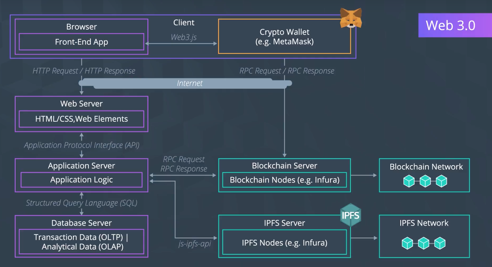

# 우리가 만들 어플리케이션을 위하여, 어떤 Service들을 선택해야 할까?

## Web 3.0에 새로 더해진 Service Layer들

- Wallet
- Blockchain
- IPFS

각각의 부문에는 다양한 플랫폼, 프레임워크가 존재한다. 어떤 것을 골라야 할까? 무엇을 고려해야 할까? 이 질문은 우리가 어떤 규모의 블록체인 앱을 만들든 항상 신중하고 깊게 고민해야 하는 것이다.

## 예시: Vindacity

- 회사와 소비자 모두 와인의 원산지, 제품 보증을 아주 심각하게 따진다
- 최근 연구에 다르면 와인 소비자들은 공정거래 와인을 소비하는 데에 25% 정도를 더 지불할 용의가 있다고 한다 (...정말?)
  - 회사에서 제품에 붙인 공정거래 라벨을 소비자들이 신뢰할 수 있도록 해야 한다
- Vindacity는 수백명 정도의 Actor가 참여하는 중견 규모의 기업
- 매초 1000여 개의 거래를 처리할 정도로 성장할 것으로 예상

## 우리가 의사결정해야 할 고려 사항

- **Platform**
- **Database**
- Supporting Frameworks
- Supporting Libraries

Platform과 Database에 대한 결정이 가장 중요한데, 나머지 둘은 앞선 결정에 따라 결과적으로 결정되기 떄문

### Platform

#### Network

- (1) **Scale**: 어느 정도 규모의 사용량을 예상하는가? 해당 솔루션 내에서 얼마나 많은 참여자가 상호작용할 것으로 예상하는가?
  - 수백 ~ 수천명 규모인가, 또는 얼마 안 되는 규모인가?
- (2) **Trust**: 네트워크 상의 참여자들의 신원을 식별할 수 있어야 하는가? 혹은 그들의 모든 것을 모르더라도 신뢰할 수 있는가?

우리의 예시에서는, 최대 100여 명 정도의 실시간 동시 사용자를 예상하고, 각자가 서로에 대하여 모든 것을 모르더라도 활동에 참여하는 데에 문제가 없어야 한다.

#### Performance

- (1) **Amount of Data for transaction**: 매초 거래량이 얼마 정도로 예상하는가? 한 거래당 데이터를 어느 정도로 예상하는가?
  - 기존의 통계를 활용하여 평균적인 거래 발생량의 근사 정도을 예측할 수 있다
- (2) **Transactional Throughput**: 시간당 거래 처리 가능량
  - Data의 Create and Update
  - Data의 *Read* ← 이것이 압도적으로 많은 것이 일반적이다

#### Business Logic

- (1) **Standalone solution?**: 앱의 비즈니스 로직이 단순한가? 다른 앱과의 복잡한 연동 및 확장이 예상되는가?
- (2) **Data Privacy Considerations**: 내부 데이터가 어느 정도로 일반에 공개되는가?
  - 우리의 예시의 경우, 투명하게 다 공개되어야 한다

#### Consensus

- (1) **Arbitrator needed?**: 분쟁이 발생했을 때에 조정해줄 사람이 필요한가?
  - 우리의 예시는 그렇지 않지만(단순 SCM이므로), 그런 경우라면 아주 중요한 문제
- (2) **Who validates transactions?**: 중앙화? 탈중앙화?
  - 우리의 예시에서는 모든 참여자가 거래 검증에 참여할 수 있어야 한다
- (3) **Immutability of records**: 기존의 거래를 수정하거나 취소할 수 있는가?
  - 우리의 예시에서는, 상황을 단순하게 만들기 위하여, 그런 경우는 없다고 한다

### Database

#### Store Transactional Data
- 어떤 데이터를 보관하는가?
  - 거래 자체에 대한 데이터
  - 제품 품질을 보증하기 위한 원산지 데이터
  - 생산자
  - 병입 날짜
- 우리는 블록 체인을 사용하므로, 데이터는 블록체인 상에만 *독점적으로* 수집되어야 하며, 수집은 거래를 통하여만 저장되어야 한다

#### Private or Public Data
- (아직까지는) 제품의 품질 보증 용도로만 사용하므로, 데이터를 별도 DB에 저장할 필요는 없다
  - 블록체인 만으로 충분
- 그렇다면, 블록체인이 모두에게 공개될 것인지, 일부에게만 공개될 것인지를 정해야 한다
  - 시간당 거래량이 적고, 데이터를 비공개할 필요가 없다면, Public Chain을 사용

## 위와 같은 검토를 해봤을 때, 좋은 플랫폼은 `Ethereum`!

- `Neo`, `Hyperledger`, `CoData` 등의 경쟁 플랫폼도 있다.

## 플랫폼을 골랐으면, 이제 해당 플랫폼을 지원하는 프레임워크와 라이브러리를 선정해야 한다

- `Truffle`, `Ganache`?
- 주로 사용할 언어와, 결과물로서 개발될 Software Application Solution의 종류에 따라 선택이 달라질 것
  - 우리는 웹 앱을 만들 것이므로, Javascript와의 연동이 용이해야 함
- 라이브러리도 마찬가지; Front-end와 Back-end에 따라 다를 것. 개발에 사용할 언어 선정에 따라 달라짐
  - 잘 유지관리되고, 커뮤니티가 성숙한 라이브러리를 고르는 것이 좋다
